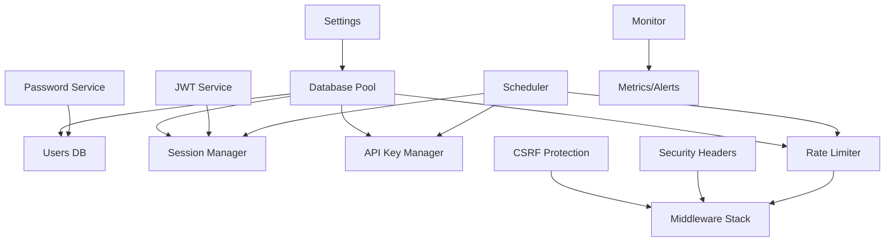
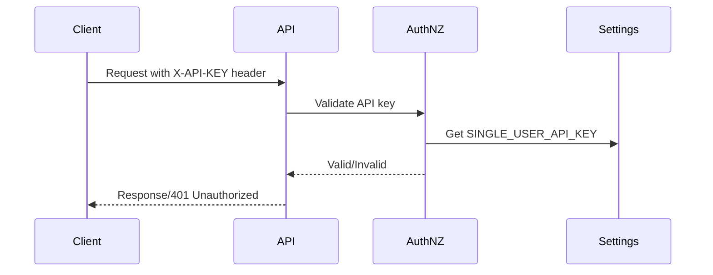
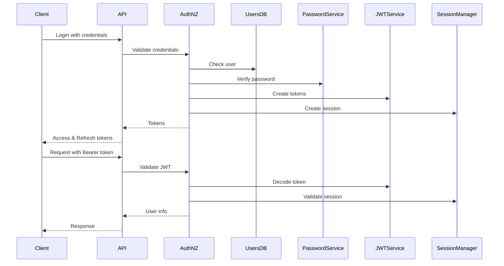

# AuthNZ Developer Guide

## Table of Contents
- [Overview](#overview)
- [Architecture](#architecture)
- [Core Components](#core-components)
- [Authentication Flows](#authentication-flows)
- [Database Schema](#database-schema)
- [Security Features](#security-features)
- [Development](#development)
- [Testing](#testing)
- [Extending AuthNZ](#extending-authnz)

## Overview

The AuthNZ (Authentication and Authorization) module provides enterprise-grade security for the tldw_server platform. It supports both single-user and multi-user deployments with comprehensive security features including JWT authentication, API key management, rate limiting, and session management.

### Key Features
- **Dual-mode operation**: Single-user (API key) and multi-user (JWT)
- **Secure token management**: Encrypted session tokens with automatic rotation
- **API key lifecycle**: Creation, rotation, revocation with audit logging
- **Rate limiting**: Configurable per-user and per-endpoint limits
- **Session management**: Redis-backed sessions with automatic cleanup
- **Database migrations**: Version-controlled schema changes
- **Monitoring**: Real-time metrics and security alerts
- **CSRF protection**: Double-submit cookie pattern
- **Password security**: Argon2 hashing with configurable parameters

## Architecture

### Module Structure
```
app/core/AuthNZ/
├── __Init__.py              # Module initialization
├── settings.py              # Configuration management
├── database.py              # Database connection pooling
├── exceptions.py            # Custom exceptions
├── jwt_service.py           # JWT token management
├── password_service.py      # Password hashing/validation
├── session_manager.py       # Session management with encryption
├── api_key_manager.py       # API key lifecycle management
├── rate_limiter.py          # Rate limiting implementation
├── csrf_protection.py       # CSRF middleware
├── security_headers.py      # Security headers middleware
├── User_DB_Handling.py      # User authentication handling
├── scheduler.py             # Background job scheduling
├── monitoring.py            # Metrics and alerting
├── migrations.py            # Database migrations
├── run_migrations.py        # Migration runner script
└── initialize.py            # First-time setup script
```

### Component Relationships


## Core Components

### 1. Settings Management (`settings.py`)
Centralized configuration using Pydantic with environment variable support.

```python
from tldw_Server_API.app.core.AuthNZ.settings import get_settings

settings = get_settings()
# Access: settings.JWT_SECRET_KEY, settings.AUTH_MODE, etc.
```

Key settings:
- `AUTH_MODE`: "single_user" or "multi_user"
- `JWT_SECRET_KEY`: Secret for JWT signing (multi-user)
- `SINGLE_USER_API_KEY`: API key for single-user mode
- `SESSION_ENCRYPTION_KEY`: Fernet key for session encryption
- `DATABASE_URL`: Database connection string

### 2. Database Management (`database.py`)
Connection pooling with support for PostgreSQL and SQLite.

```python
from tldw_Server_API.app.core.AuthNZ.database import get_db_pool

db_pool = await get_db_pool()
async with db_pool.transaction() as conn:
    # Execute queries
    pass
```

### 3. JWT Service (`jwt_service.py`)
JWT token creation and validation for multi-user mode.

```python
from tldw_Server_API.app.core.AuthNZ.jwt_service import get_jwt_service

# Initialize service (sync) and create/verify an access token
jwt_service = get_jwt_service()
token = jwt_service.create_access_token(user_id=user_id, username=username, role="user")
payload = jwt_service.decode_access_token(token)
```

### 4. Password Service (`password_service.py`)
Argon2-based password hashing with strength validation.

```python
from tldw_Server_API.app.core.AuthNZ.password_service import PasswordService

password_service = PasswordService()
hash = password_service.hash_password(plain_password)
is_valid, needs_rehash = password_service.verify_password(plain_password, hash)
```

### 5. Session Manager (`session_manager.py`)
Encrypted session storage with Redis caching.

```python
from tldw_Server_API.app.core.AuthNZ.session_manager import get_session_manager

session_mgr = await get_session_manager()
session = await session_mgr.create_session(
    user_id=user_id,
    access_token=token,
    refresh_token=refresh_token
)
```

Features:
- Token encryption using Fernet
- Automatic session cleanup
- Redis caching for performance
- Session revocation support

### 6. API Key Manager (`api_key_manager.py`)
Complete API key lifecycle management.

```python
from tldw_Server_API.app.core.AuthNZ.api_key_manager import get_api_key_manager

api_mgr = await get_api_key_manager()

# Create key
key_info = await api_mgr.create_api_key(
    user_id=user_id,
    name="Production Key",
    scope="write",
    expires_in_days=90
)

# Rotate key
new_key = await api_mgr.rotate_api_key(key_id, user_id)

# Validate key
valid = await api_mgr.validate_api_key(api_key, required_scope="read")
```

### 7. Rate Limiter (`rate_limiter.py`)
Token bucket algorithm with database persistence.

```python
from tldw_Server_API.app.core.AuthNZ.rate_limiter import get_rate_limiter

limiter = await get_rate_limiter()
allowed, metadata = await limiter.check_rate_limit(
    identifier="user:123",
    endpoint="/api/v1/chat",
    limit=60,
    burst=10
)
```

### 8. Monitoring (`monitoring.py`)
Real-time metrics collection and alerting.

```python
from tldw_Server_API.app.core.AuthNZ.monitoring import get_authnz_monitor

monitor = await get_authnz_monitor()
await monitor.record_metric(
    MetricType.AUTH_FAILURE,
    labels={'method': 'password'},
    metadata={'ip': request.client.host}
)

dashboard = await monitor.get_security_dashboard()
```

## Authentication Flows

### Single-User Mode Flow


### Multi-User Mode Flow


## Database Schema

### Core Tables

#### users
```sql
CREATE TABLE users (
    id INTEGER PRIMARY KEY,
    username TEXT UNIQUE NOT NULL,
    email TEXT UNIQUE NOT NULL,
    password_hash TEXT NOT NULL,
    is_active INTEGER DEFAULT 1,
    is_superuser INTEGER DEFAULT 0,
    role TEXT DEFAULT 'user',
    created_at TIMESTAMP DEFAULT CURRENT_TIMESTAMP,
    updated_at TIMESTAMP DEFAULT CURRENT_TIMESTAMP,
    last_login TIMESTAMP,
    email_verified INTEGER DEFAULT 0,
    storage_quota_mb INTEGER DEFAULT 5120,
    storage_used_mb INTEGER DEFAULT 0,
    totp_secret TEXT,
    two_factor_enabled INTEGER DEFAULT 0,
    backup_codes TEXT
);
```

#### sessions
```sql
CREATE TABLE sessions (
    id INTEGER PRIMARY KEY,
    user_id INTEGER NOT NULL,
    token_hash TEXT NOT NULL,
    refresh_token_hash TEXT,
    encrypted_token TEXT,        -- New: Encrypted token storage
    encrypted_refresh TEXT,       -- New: Encrypted refresh token
    expires_at TIMESTAMP NOT NULL,
    ip_address TEXT,
    user_agent TEXT,
    device_id TEXT,
    is_revoked INTEGER DEFAULT 0,
    created_at TIMESTAMP DEFAULT CURRENT_TIMESTAMP,
    FOREIGN KEY (user_id) REFERENCES users(id) ON DELETE CASCADE
);
```

#### api_keys
```sql
CREATE TABLE api_keys (
    id INTEGER PRIMARY KEY,
    user_id INTEGER NOT NULL,
    key_hash TEXT UNIQUE NOT NULL,
    key_prefix TEXT NOT NULL,
    name TEXT,
    description TEXT,
    scope TEXT DEFAULT 'read',
    status TEXT DEFAULT 'active',
    expires_at TIMESTAMP,
    last_used_at TIMESTAMP,
    usage_count INTEGER DEFAULT 0,
    rate_limit INTEGER,
    allowed_ips TEXT,
    rotated_from INTEGER REFERENCES api_keys(id),
    rotated_to INTEGER REFERENCES api_keys(id),
    revoked_at TIMESTAMP,
    revoke_reason TEXT,
    FOREIGN KEY (user_id) REFERENCES users(id) ON DELETE CASCADE
);
```

## Security Features

### 1. Password Security
- **Argon2id** hashing with configurable parameters
- Password strength validation
- Sequential/repeated character detection
- Password history to prevent reuse
- Configurable minimum length and complexity

### 2. Token Security
- **JWT tokens** with configurable expiration
- **Session encryption** using Fernet (AES-128)
- **API key hashing** with SHA-256
- Automatic token rotation support

### 3. Rate Limiting
- Per-user and per-endpoint limits
- Token bucket algorithm
- Sliding window implementation
- Fails closed on errors
- Redis caching for performance

### 4. CSRF Protection
- Double-submit cookie pattern
- Automatic token generation
- Configurable exclusions
- SameSite cookie support

### 5. Security Headers
- HSTS (Strict-Transport-Security)
- X-Content-Type-Options: nosniff
- X-Frame-Options: DENY
- X-XSS-Protection: 1; mode=block
- Content-Security-Policy
- Referrer-Policy
- Permissions-Policy

### 6. Monitoring & Alerting
- Failed authentication tracking
- Rate limit violation monitoring
- API key usage patterns
- Security alert generation
- Prometheus metrics integration

## Development

### Setting Up Development Environment

1. **Clone and Install**
```bash
git clone https://github.com/rmusser01/tldw_server
cd tldw_server
python -m venv venv
source venv/bin/activate  # Windows: venv\Scripts\activate
pip install -e .
```

2. **Configure Environment**
```bash
cp .env.authnz.template .env
# Edit .env with your settings
```

3. **Initialize AuthNZ**
```bash
python -m tldw_Server_API.app.core.AuthNZ.initialize
```

4. **Run Migrations**
```bash
python -m tldw_Server_API.app.core.AuthNZ.run_migrations
```

### Adding New Features

#### Adding a New Authentication Method
1. Create new service in `app/core/AuthNZ/`
2. Update `User_DB_Handling.py` to support new method
3. Add migration for any database changes
4. Update settings with new configuration
5. Add tests in `tests/AuthNZ/`

#### Adding New Middleware
1. Create middleware class in `app/core/AuthNZ/`
2. Register in main application startup
3. Add configuration to settings
4. Document in API guide

## Testing

### Running Tests
```bash
# Start ephemeral Postgres for tests
docker compose -f docker-compose.test.yml up -d postgres-test

export TEST_DB_HOST=localhost
export TEST_DB_PORT=5432
export TEST_DB_USER=tldw_user
export TEST_DB_PASSWORD=TestPassword123!
export TEST_DB_NAME=tldw_test
```

```bash
# All AuthNZ tests
pytest tests/AuthNZ/ -v

# Specific test file
pytest tests/AuthNZ/test_jwt_service.py -v

# With coverage
pytest tests/AuthNZ/ --cov=tldw_Server_API.app.core.AuthNZ --cov-report=html
```

### Test Structure
```
tests/AuthNZ/
├── conftest.py                    # Fixtures and configuration
├── test_auth_simple.py            # Basic auth tests
├── test_jwt_service.py            # JWT service tests
├── test_auth_comprehensive.py     # Comprehensive integration tests
├── test_auth_endpoints_integration.py  # API endpoint tests
├── test_user_endpoints.py         # User management tests
└── test_db_setup.py               # Database setup tests
```

### Writing Tests
```python
import pytest
from tldw_Server_API.app.core.AuthNZ.password_service import PasswordService

@pytest.mark.asyncio
async def test_password_hashing():
    service = PasswordService()
    password = "SecurePassword123!"

    # Test hashing
    hash = service.hash_password(password)
    assert hash != password

    # Test verification
    is_valid, needs_rehash = service.verify_password(password, hash)
    assert is_valid
```

## Extending AuthNZ

### Adding OAuth2 Support
```python
# app/core/AuthNZ/oauth2_service.py
from authlib.integrations.fastapi_client import OAuth

class OAuth2Service:
    def __init__(self):
        self.oauth = OAuth()

    def register_provider(self, name, client_id, client_secret, ...):
        # Register OAuth provider
        pass
```

### Adding Two-Factor Authentication
```python
# app/core/AuthNZ/two_factor_service.py
import pyotp

class TwoFactorService:
    def generate_secret(self, user_id: int) -> str:
        return pyotp.random_base32()

    def verify_totp(self, secret: str, token: str) -> bool:
        totp = pyotp.TOTP(secret)
        return totp.verify(token, valid_window=1)
```

### Custom Rate Limiting Strategy
```python
# app/core/AuthNZ/custom_rate_limiter.py
from tldw_Server_API.app.core.AuthNZ.rate_limiter import RateLimiter

class CustomRateLimiter(RateLimiter):
    async def check_rate_limit(self, identifier, endpoint, **kwargs):
        # Custom implementation
        if self.is_premium_user(identifier):
            limit = kwargs.get('limit', 1000)  # Higher limit
        else:
            limit = kwargs.get('limit', 60)

        return await super().check_rate_limit(
            identifier, endpoint, limit=limit, **kwargs
        )
```

## Migration Guide

### From Gradio to FastAPI
If migrating from the old Gradio-based system:

1. **User Data**: Export user data from old system
2. **API Keys**: Generate new API keys using the new system
3. **Sessions**: All sessions will need to be recreated
4. **Database**: Run migrations on existing database

### Upgrading AuthNZ
When upgrading to a new version:

1. **Backup Database**: Always backup before upgrading
2. **Run Migrations**: `python -m tldw_Server_API.app.core.AuthNZ.run_migrations`
3. **Update Configuration**: Check for new settings in `.env.authnz.template`
4. **Test Authentication**: Verify authentication still works

## Troubleshooting

### Common Issues

#### "JWT_SECRET_KEY not set"
- Set `JWT_SECRET_KEY` in your `.env` file
- Generate: `python -c "import secrets; print(secrets.token_urlsafe(32))"`

#### "Rate limit check failed"
- Check database connectivity
- Verify rate_limits table exists
- Check Redis connection if configured

#### "Session expired"
- Normal behavior - sessions expire after `ACCESS_TOKEN_EXPIRE_MINUTES`
- Use refresh token to get new access token
- Adjust expiration in settings if needed

#### "API key not found"
- Verify key hasn't expired
- Check if key was rotated
- Ensure correct header: `X-API-KEY: your-key`

### Debug Mode
Enable debug logging:
```python
# In your .env
LOG_LEVEL=DEBUG

# Or in code
import logging
logging.getLogger("tldw_Server_API.app.core.AuthNZ").setLevel(logging.DEBUG)
```

## Best Practices

1. **Always use environment variables** for sensitive configuration
2. **Rotate keys regularly** - Set up scheduled rotation for API keys
3. **Monitor authentication failures** - Watch for brute force attempts
4. **Use HTTPS in production** - Required for secure cookies
5. **Configure rate limits appropriately** - Balance security and usability
6. **Regular backups** - Backup user and session data regularly
7. **Keep migrations up to date** - Run migrations after updates
8. **Use strong passwords** - Enforce minimum complexity requirements
9. **Enable monitoring** - Set up alerts for security events
10. **Test thoroughly** - Run tests before deploying changes

## Resources

- [OWASP Authentication Cheat Sheet](https://cheatsheetseries.owasp.org/cheatsheets/Authentication_Cheat_Sheet.html)
- [JWT Best Practices](https://tools.ietf.org/html/rfc8725)
- [Argon2 Documentation](https://github.com/P-H-C/phc-winner-argon2)
- [FastAPI Security](https://fastapi.tiangolo.com/tutorial/security/)
- [Redis Security](https://redis.io/topics/security)
