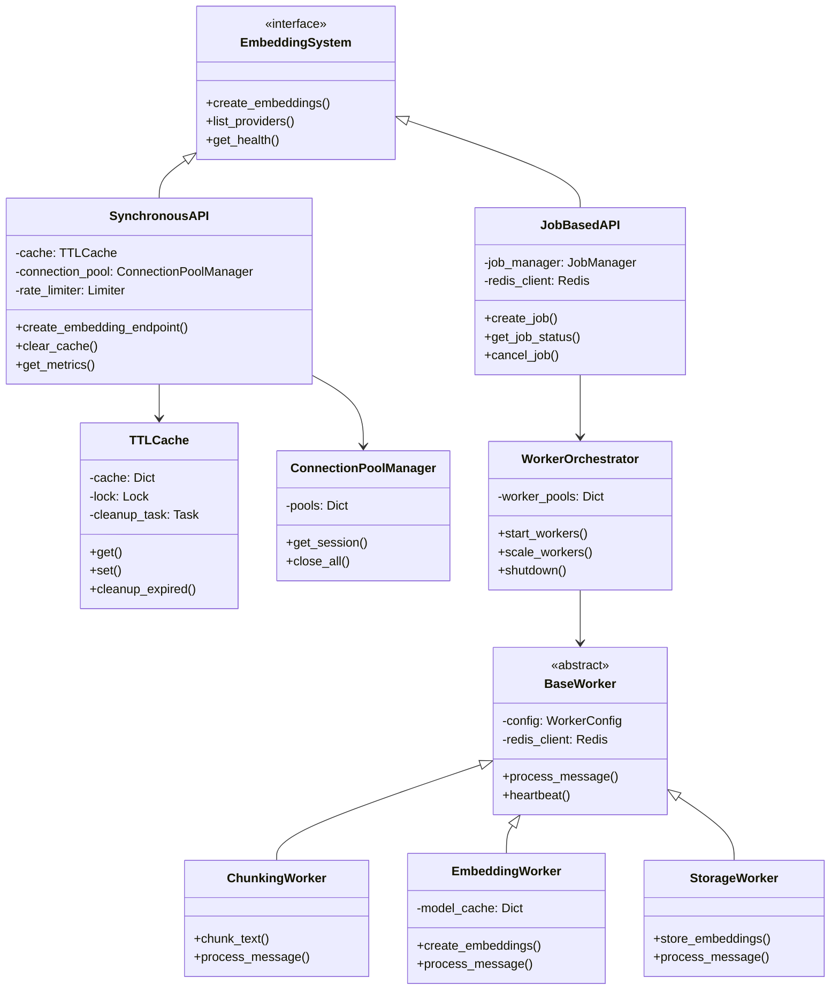
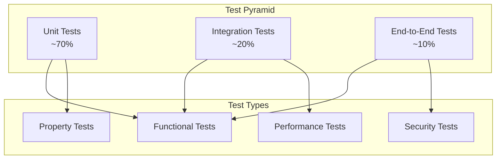

# Embeddings System Developer Guide

## Table of Contents
1. [Introduction](#introduction)
2. [Architecture Overview](#architecture-overview)
3. [Working with the Codebase](#working-with-the-codebase)
4. [Adding New Providers](#adding-new-providers)
5. [Testing Guidelines](#testing-guidelines)
6. [Debugging & Troubleshooting](#debugging--troubleshooting)
7. [Performance Optimization](#performance-optimization)
8. [Monitoring & Observability](#monitoring--observability)

## Introduction

This guide is for developers working on the tldw_server embeddings system codebase. It covers implementation details, best practices, and common development tasks.

## Architecture Overview

### System Components



### File Structure

```
tldw_Server_API/
├── app/
│   ├── api/v1/endpoints/
│   │   ├── embeddings_v5_production_enhanced.py  # Synchronous API with circuit breaker
│   │   ├── media_embeddings.py                   # Media chunking + embeddings storage
│   │   └── vector_stores_openai.py              # Vector store ops that use embeddings
│   │
│   └── core/
│       └── Embeddings/
│           ├── queue_schemas.py                 # Message schemas (WIP for workers)
│           ├── job_manager.py                   # Job management (WIP)
│           ├── worker_orchestrator.py           # Worker coordination (WIP)
│           ├── workers/
│           │   ├── base_worker.py               # Base worker class (WIP)
│           │   ├── chunking_worker.py           # Text chunking (WIP)
│           │   ├── embedding_worker.py          # Embedding generation (WIP)
│           │   └── storage_worker.py            # Storage operations (WIP)
│           └── Embeddings_Server/
│               └── Embeddings_Create.py         # Core embedding logic (OpenAI/HF/ONNX/local)
│
├── tests/Embeddings/                            # If present (naming may vary)
│   └── ...
│
└── Config_Files/
    └── embeddings_production_config.yaml        # Example configuration (if used)
```

## Working with the Codebase

### Setting Up Development Environment

```bash
# Clone repository
git clone https://github.com/your-org/tldw_server.git
cd tldw_server

# Create virtual environment
python -m venv venv
source venv/bin/activate  # On Windows: venv\Scripts\activate

# Install dependencies (with dev extras)
pip install -e ".[dev]"

# Set up pre-commit hooks
pre-commit install
```

### Configuration Management

```python
# Load configuration in your code
from tldw_Server_API.app.core.config import settings

# Access configuration values
api_key = settings.get("OPENAI_API_KEY")
cache_config = settings.get("CACHE_CONFIG")

# Override for testing
test_settings = {
    "CACHE_CONFIG": {
        "max_size": 100,
        "ttl_seconds": 60
    }
}
```

### Using the Synchronous API

```python
from tldw_Server_API.app.api.v1.endpoints.embeddings_v5_production_enhanced import (
    create_embeddings_batch_async,
    TTLCache,
    ConnectionPoolManager
)

# Initialize components
cache = TTLCache(max_size=1000, ttl_seconds=3600)
connection_manager = ConnectionPoolManager()

# Create embeddings
async def generate_embeddings(texts: List[str]):
    embeddings = await create_embeddings_batch_async(
        texts=texts,
        provider="openai",
        model_id="text-embedding-3-small",
        dimensions=1536  # optional; applies to specific providers only
    )
    return embeddings

"""
Notes:
- Token arrays are accepted by the REST API (`POST /api/v1/embeddings`); the service decodes tokens with the model tokenizer or `cl100k_base` fallback.
- Provider fallback is configurable via `EMBEDDINGS_FALLBACK_CHAIN` or defaults (e.g., openai→huggingface→onnx→local_api).
- Policy enforcement can be enabled via `EMBEDDINGS_ENFORCE_POLICY`; admin bypass can be disabled with `EMBEDDINGS_ENFORCE_POLICY_STRICT=true`.
- For non-OpenAI providers, `dimensions` is applied as post-processing based on `EMBEDDINGS_DIMENSION_POLICY` (reduce|pad|ignore).
"""
```

### Using the Job-Based System

```python
from tldw_Server_API.app.core.Embeddings.job_manager import (
    EmbeddingJobManager,
    JobManagerConfig
)

# Initialize job manager
config = JobManagerConfig(
    redis_url="redis://localhost:6379",
    daily_quota_per_user={
        "free": 1000,
        "premium": 10000
    }
)
job_manager = EmbeddingJobManager(config)

# Create and monitor job
async def process_large_batch(texts: List[str]):
    job = await job_manager.create_job(
        user_id="user123",
        media_id=456,
        content="\n".join(texts),
        priority=50
    )

    # Poll for status
    while True:
        status = await job_manager.get_job_status(job.job_id)
        if status.status in ["completed", "failed"]:
            break
        await asyncio.sleep(1)

    return status
```

## Adding New Providers

### Step 1: Define Provider Configuration

```python
# In embeddings_v5_production_enhanced.py

class EmbeddingProvider(str, Enum):
    # ... existing providers ...
    NEWPROVIDER = "newprovider"

PROVIDER_MODELS = {
    # ... existing models ...
    EmbeddingProvider.NEWPROVIDER: [
        "newprovider-model-1",
        "newprovider-model-2"
    ]
}
```

### Step 2: Implement Provider Configuration Builder (endpoint)

```python
def build_provider_config(
    provider: EmbeddingProvider,
    model: str,
    api_key: Optional[str] = None,
    api_url: Optional[str] = None,
    dimensions: Optional[int] = None
) -> Dict[str, Any]:
    # ... existing providers ...

    elif provider == EmbeddingProvider.NEWPROVIDER:
        return {
            "provider": "newprovider",
            "model_name_or_path": model,
            "api_key": api_key or settings.get("NEWPROVIDER_API_KEY"),
            "api_url": api_url or "https://api.newprovider.com/v1",
            "dimensions": dimensions
        }
```

### Step 3: Implement Embedding Creation (engine)

```python
# In Embeddings_Create.py

class NewProviderCfg(BaseModelCfg):
    provider: str = "newprovider"
    api_url: str
    api_key: Optional[str] = None

class NewProviderEmbedder(BaseEmbedder):
    def __init__(self, config: NewProviderCfg):
        self.config = config
        self.client = self._init_client()

    def create_embeddings(self, texts: List[str]) -> np.ndarray:
        # Implement provider-specific logic
        response = self.client.embeddings.create(
            input=texts,
            model=self.config.model_name_or_path
        )
        return np.array([e.embedding for e in response.data])
```

Also add a branch handling `provider == "newprovider"` in `create_embeddings_batch(...)`.

### Step 4: Add Tests

```python
# In test_embeddings_v5_unit.py

@pytest.mark.unit
def test_newprovider_configuration():
    config = build_provider_config(
        EmbeddingProvider.NEWPROVIDER,
        "newprovider-model-1",
        api_key="test-key"
    )
    assert config["provider"] == "newprovider"
    assert config["api_key"] == "test-key"

@pytest.mark.unit
async def test_newprovider_embeddings():
    with patch('newprovider.client') as mock_client:
        mock_client.embeddings.create.return_value = Mock(
            data=[Mock(embedding=[0.1, 0.2, 0.3])]
        )

        embeddings = await create_embeddings_batch_async(
            texts=["test"],
            provider="newprovider",
            model_id="newprovider-model-1"
        )

        assert len(embeddings) == 1
        assert len(embeddings[0]) == 3
```

## Testing Guidelines

### Test Structure



### Running Tests

```bash
# Run all tests
pytest

# Run specific test file
pytest tests/Embeddings/test_embeddings_v5_unit.py

# Run with coverage
pytest --cov=tldw_Server_API --cov-report=html

# Run only unit tests
pytest -m unit

# Run only integration tests (requires services)
RUN_INTEGRATION_TESTS=true pytest -m integration

# Run property tests
pytest tests/Embeddings/test_embeddings_v5_property.py

# Run with verbose output
pytest -v

# Run specific test
pytest -k test_cache_ttl_expiration
```

### Writing Tests

#### Unit Test Example

```python
@pytest.mark.unit
class TestCacheOperations:
    async def test_cache_set_and_get(self):
        cache = TTLCache(max_size=10, ttl_seconds=60)

        # Test set
        await cache.set("key1", [1.0, 2.0])

        # Test get
        value = await cache.get("key1")
        assert value == [1.0, 2.0]

        # Test non-existent key
        value = await cache.get("nonexistent")
        assert value is None
```

#### Integration Test Example

```python
@pytest.mark.integration
@pytest.mark.skipif(
    not os.getenv("RUN_INTEGRATION_TESTS"),
    reason="Integration tests require RUN_INTEGRATION_TESTS=true"
)
async def test_real_openai_embeddings(client):
    response = await client.post(
        "/api/v1/embeddings",
        json={
            "input": "Real test with OpenAI",
            "model": "text-embedding-3-small"
        }
    )

    assert response.status_code == 200
    data = response.json()
    assert len(data["data"][0]["embedding"]) == 1536
```

#### Property Test Example

```python
from hypothesis import given, strategies as st

@given(
    max_size=st.integers(min_value=1, max_value=100),
    num_items=st.integers(min_value=0, max_value=200)
)
async def test_cache_never_exceeds_max_size(max_size, num_items):
    cache = TTLCache(max_size=max_size)

    for i in range(num_items):
        await cache.set(f"key_{i}", [float(i)])

    stats = cache.stats()
    assert stats['size'] <= max_size
```

## Debugging & Troubleshooting

### Common Issues and Solutions

#### 1. Import Errors

```python
# Problem: ImportError: cannot import name 'create_embeddings_batch'

# Solution: Check Python path
import sys
sys.path.append('/path/to/tldw_server')

# Or set PYTHONPATH
export PYTHONPATH=/path/to/tldw_server:$PYTHONPATH
```

#### 2. Provider Connection Issues

```python
# Add debug logging
import logging
logging.basicConfig(level=logging.DEBUG)

# Or use loguru
from loguru import logger
logger.add("debug.log", level="DEBUG")

# Test provider connection
async def test_provider_connection():
    try:
        embeddings = await create_embeddings_batch_async(
            texts=["test"],
            provider="openai",
            model_id="text-embedding-3-small"
        )
        logger.info("Provider connection successful")
    except Exception as e:
        logger.error(f"Provider connection failed: {e}")
```

#### 3. Cache Issues

```python
# Debug cache operations
cache = TTLCache(max_size=100, ttl_seconds=60)

# Enable cache statistics
async def debug_cache():
    stats = cache.stats()
    logger.info(f"Cache stats: {stats}")

    # Check specific key
    key = get_cache_key("text", "provider", "model")
    value = await cache.get(key)
    logger.info(f"Cache value for {key}: {value}")

    # Clear cache if needed
    await cache.clear()
```

#### 4. Memory Issues

```python
# Monitor memory usage
import psutil
import gc

def check_memory():
    process = psutil.Process()
    mem_info = process.memory_info()
    logger.info(f"Memory usage: {mem_info.rss / 1024 / 1024:.2f} MB")

    # Force garbage collection
    gc.collect()

    # Check for memory leaks
    import tracemalloc
    tracemalloc.start()
    # ... run operations ...
    snapshot = tracemalloc.take_snapshot()
    top_stats = snapshot.statistics('lineno')
    for stat in top_stats[:10]:
        logger.info(stat)
```

### Debugging Tools

#### Using pdb

```python
import pdb

async def debug_function():
    # Set breakpoint
    pdb.set_trace()

    # Or use breakpoint() in Python 3.7+
    breakpoint()

    # Inspect variables
    result = await some_operation()
    return result
```

#### Using IPython

```python
# Install IPython
pip install ipython

# Use IPython for debugging
from IPython import embed

async def debug_with_ipython():
    result = await some_operation()
    embed()  # Drops into IPython shell
    return result
```

#### Performance Profiling

```python
import cProfile
import pstats
from io import StringIO

def profile_function():
    profiler = cProfile.Profile()
    profiler.enable()

    # Run code to profile
    result = expensive_operation()

    profiler.disable()

    # Print statistics
    stream = StringIO()
    stats = pstats.Stats(profiler, stream=stream)
    stats.sort_stats('cumulative')
    stats.print_stats(10)

    logger.info(stream.getvalue())
    return result
```

## Performance Optimization

### Caching Strategies

```python
# 1. Multi-level caching
class MultiLevelCache:
    def __init__(self):
        self.l1_cache = {}  # In-memory
        self.l2_cache = Redis()  # Redis

    async def get(self, key):
        # Check L1
        if key in self.l1_cache:
            return self.l1_cache[key]

        # Check L2
        value = await self.l2_cache.get(key)
        if value:
            self.l1_cache[key] = value
        return value

# 2. Preemptive cache warming
async def warm_cache(popular_texts: List[str]):
    for text in popular_texts:
        key = get_cache_key(text, "openai", "text-embedding-3-small")
        if not await cache.get(key):
            embedding = await create_embedding(text)
            await cache.set(key, embedding)
```

### Batching Optimizations

```python
# Optimal batch sizes per provider
OPTIMAL_BATCH_SIZES = {
    "openai": 100,
    "huggingface": 32,
    "cohere": 96
}

async def optimize_batching(texts: List[str], provider: str):
    batch_size = OPTIMAL_BATCH_SIZES.get(provider, 50)

    results = []
    for i in range(0, len(texts), batch_size):
        batch = texts[i:i + batch_size]
        embeddings = await create_embeddings_batch_async(
            texts=batch,
            provider=provider
        )
        results.extend(embeddings)

    return results
```

### Connection Pool Tuning

```python
# Tune connection pool per provider
CONNECTION_CONFIGS = {
    "openai": {
        "limit": 100,
        "limit_per_host": 30,
        "ttl_dns_cache": 300
    },
    "huggingface": {
        "limit": 50,
        "limit_per_host": 10,
        "keepalive_timeout": 30
    }
}

async def create_optimized_session(provider: str):
    config = CONNECTION_CONFIGS.get(provider, {})
    connector = aiohttp.TCPConnector(**config)
    timeout = aiohttp.ClientTimeout(total=30)

    return aiohttp.ClientSession(
        connector=connector,
        timeout=timeout
    )
```

### Database Optimizations

```python
# Use connection pooling
from sqlalchemy.pool import QueuePool

engine = create_engine(
    DATABASE_URL,
    poolclass=QueuePool,
    pool_size=20,
    max_overflow=40,
    pool_timeout=30,
    pool_recycle=3600
)

# Batch inserts
async def batch_insert_embeddings(embeddings: List[Dict]):
    async with engine.begin() as conn:
        await conn.execute(
            embeddings_table.insert(),
            embeddings
        )
```

## Monitoring & Observability

### Metrics Implementation

```python
from prometheus_client import Counter, Histogram, Gauge

# Define metrics
embedding_requests = Counter(
    'embedding_requests_total',
    'Total embedding requests',
    ['provider', 'model', 'status']
)

embedding_latency = Histogram(
    'embedding_latency_seconds',
    'Embedding request latency',
    ['provider', 'model']
)

cache_hit_rate = Gauge(
    'cache_hit_rate',
    'Cache hit rate percentage'
)

# Use metrics
async def track_request(provider: str, model: str):
    with embedding_latency.labels(provider, model).time():
        try:
            result = await create_embeddings()
            embedding_requests.labels(provider, model, 'success').inc()
            return result
        except Exception as e:
            embedding_requests.labels(provider, model, 'error').inc()
            raise
```

### Logging Best Practices

```python
from loguru import logger
import contextvars

# Request ID for tracing
request_id = contextvars.ContextVar('request_id', default=None)

# Configure structured logging
logger.add(
    "logs/embeddings.log",
    format="{time} {level} {message} {extra}",
    rotation="100 MB",
    retention="30 days",
    compression="zip"
)

# Log with context
async def process_request(request):
    req_id = str(uuid.uuid4())
    request_id.set(req_id)

    logger.info(
        "Processing embedding request",
        extra={
            "request_id": req_id,
            "provider": request.provider,
            "model": request.model,
            "input_count": len(request.input)
        }
    )

    try:
        result = await create_embeddings(request)
        logger.info(
            "Request completed successfully",
            extra={"request_id": req_id, "duration": elapsed}
        )
        return result
    except Exception as e:
        logger.error(
            f"Request failed: {e}",
            extra={"request_id": req_id, "error": str(e)}
        )
        raise
```

### Health Checks

```python
async def comprehensive_health_check():
    health = {
        "status": "healthy",
        "checks": {},
        "timestamp": datetime.utcnow().isoformat()
    }

    # Check cache
    try:
        await cache.get("health_check_key")
        health["checks"]["cache"] = "healthy"
    except Exception as e:
        health["checks"]["cache"] = f"unhealthy: {e}"
        health["status"] = "degraded"

    # Check providers
    for provider in ["openai", "huggingface"]:
        try:
            await test_provider(provider)
            health["checks"][provider] = "healthy"
        except Exception as e:
            health["checks"][provider] = f"unhealthy: {e}"
            health["status"] = "degraded"

    # Check database
    try:
        await db.execute("SELECT 1")
        health["checks"]["database"] = "healthy"
    except Exception as e:
        health["checks"]["database"] = f"unhealthy: {e}"
        health["status"] = "unhealthy"

    return health
```

### Distributed Tracing

```python
from opentelemetry import trace
from opentelemetry.exporter.jaeger import JaegerExporter
from opentelemetry.sdk.trace import TracerProvider
from opentelemetry.sdk.trace.export import BatchSpanProcessor

# Setup tracing
trace.set_tracer_provider(TracerProvider())
tracer = trace.get_tracer(__name__)

# Setup Jaeger exporter
jaeger_exporter = JaegerExporter(
    agent_host_name="localhost",
    agent_port=6831,
)

span_processor = BatchSpanProcessor(jaeger_exporter)
trace.get_tracer_provider().add_span_processor(span_processor)

# Use tracing
async def traced_operation():
    with tracer.start_as_current_span("create_embeddings") as span:
        span.set_attribute("provider", "openai")
        span.set_attribute("model", "text-embedding-3-small")

        try:
            result = await create_embeddings()
            span.set_attribute("success", True)
            return result
        except Exception as e:
            span.set_attribute("success", False)
            span.set_attribute("error", str(e))
            raise
```

## Best Practices

### Code Style

- Follow PEP 8
- Use type hints
- Write comprehensive docstrings
- Keep functions focused and small
- Use async/await consistently

### Error Handling

```python
class EmbeddingError(Exception):
    """Base exception for embedding errors"""
    pass

class ProviderError(EmbeddingError):
    """Provider-specific errors"""
    pass

class QuotaExceededError(EmbeddingError):
    """User quota exceeded"""
    pass

async def handle_errors():
    try:
        result = await create_embeddings()
    except ProviderError as e:
        logger.error(f"Provider error: {e}")
        # Try fallback provider
        result = await create_embeddings(provider="fallback")
    except QuotaExceededError as e:
        logger.warning(f"Quota exceeded: {e}")
        raise HTTPException(status_code=429, detail=str(e))
    except Exception as e:
        logger.error(f"Unexpected error: {e}")
        raise HTTPException(status_code=500, detail="Internal error")

    return result
```

### Security

- Never log sensitive data (API keys, user data)
- Validate all inputs
- Use parameterized queries
- Implement rate limiting
- Keep dependencies updated

### Documentation

- Document all public APIs
- Include examples in docstrings
- Keep README updated
- Document configuration options
- Maintain changelog

---

For API usage documentation, see [Embeddings API Guide](./Embeddings-API-Guide.md)
