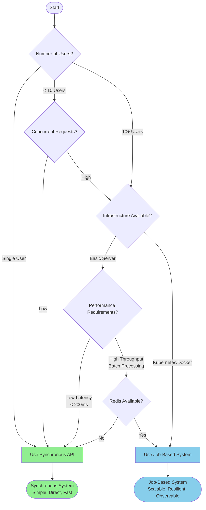
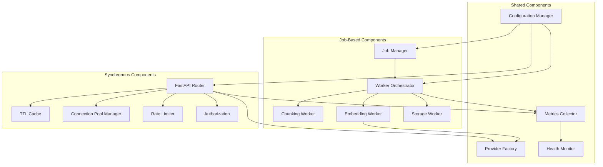
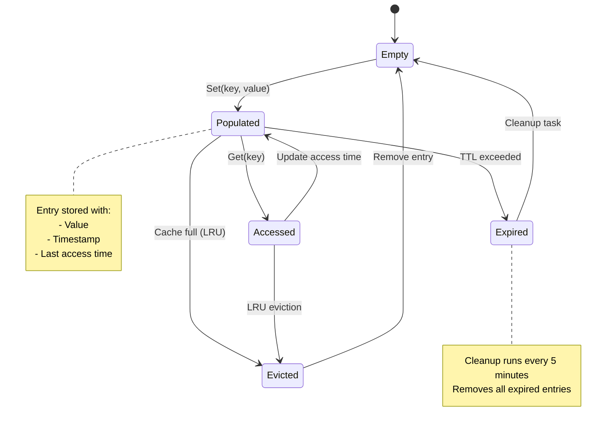
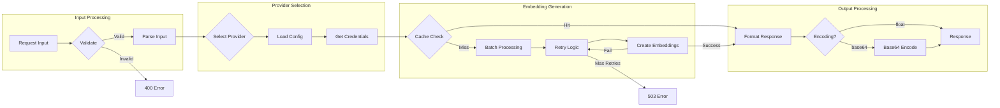
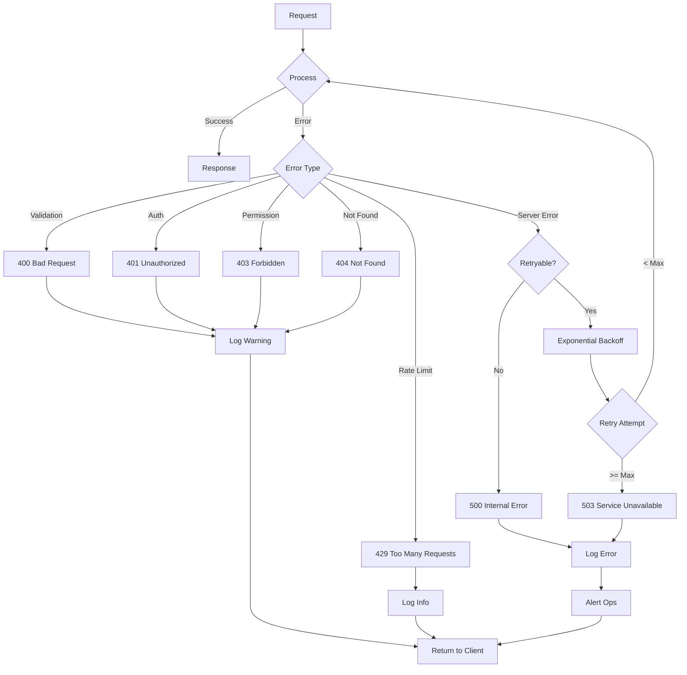
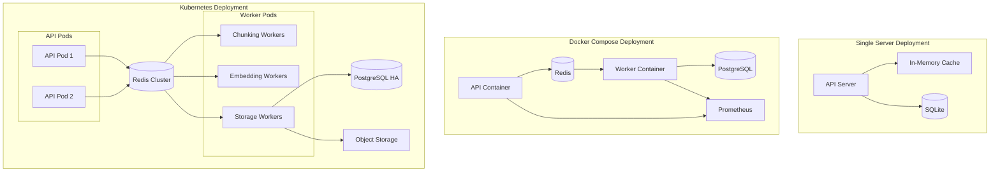
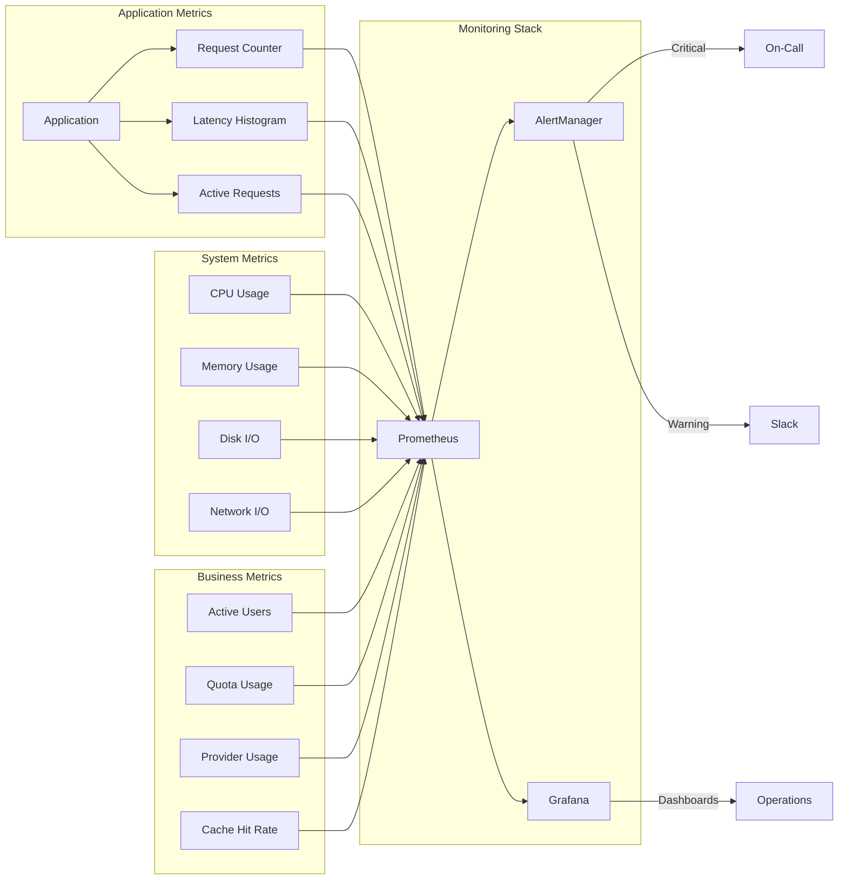
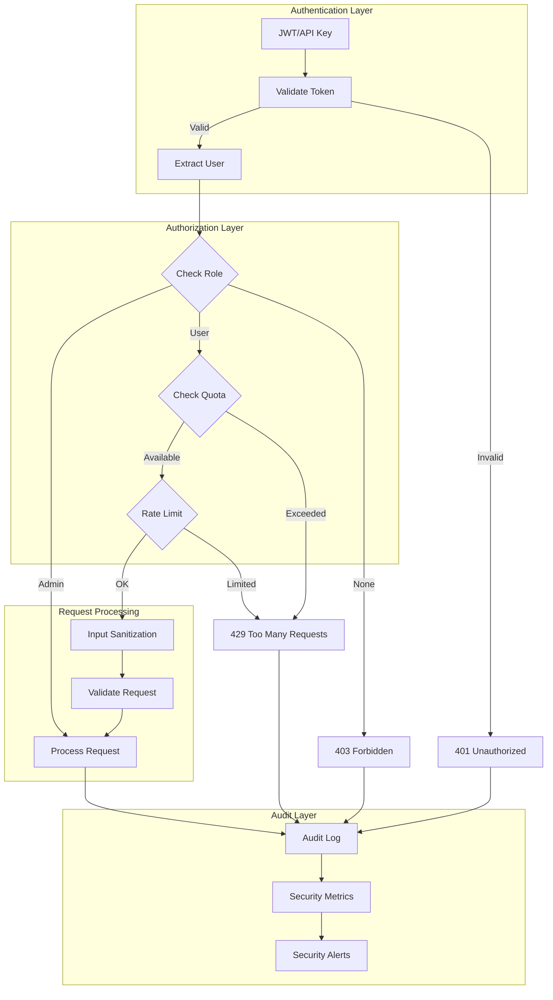
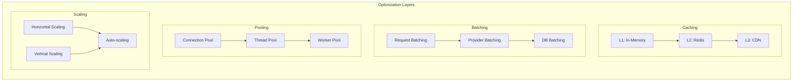

# Embeddings System Documentation

## Table of Contents
1. [System Overview](#system-overview)
2. [Architecture](#architecture)
3. [System Selection Guide](#system-selection-guide)
4. [Components](#components)
5. [Data Flow](#data-flow)
6. [Deployment Options](#deployment-options)
7. [Monitoring & Operations](#monitoring--operations)

## System Overview

The tldw_server Embeddings System provides a comprehensive solution for generating text embeddings through multiple providers. The system offers two distinct paths to accommodate different use cases:

1. **Synchronous API** (`embeddings_v5_production_enhanced.py`) - Direct request-response model with circuit breaker, ideal for single-user and small deployments
2. **Worker Architecture (Orchestrated)** - Distributed, queue-based processing for enterprise/multi-tenant deployments via `core/Embeddings/worker_orchestrator.py` and `core/Embeddings/workers/*` (uses Redis streams)

### Key Features (Production Path)
- 🌐 Providers: OpenAI and HuggingFace supported today; ONNX and Local API supported by the core engine. Additional providers (Cohere, Google, Mistral, Voyage) are present in configuration but not fully wired in the embedding call path yet.
- ⚡ High-performance TTL cache (default 3600s, size 5000) with background cleanup and metrics.
- 🛡️ Circuit breaker and resilient connection handling around provider calls.
- 📊 Prometheus metrics for requests, durations, cache, and active requests.
- 🔒 Authorization integrated with existing AuthNZ; admin-only management endpoints (warmup/download/cache/metrics/circuit breakers).
- 🔁 Provider fallback chain with model mapping (configurable via `EMBEDDINGS_FALLBACK_CHAIN` and mapping), and dimension policy (`reduce`/`pad`/`ignore`) controlled by `EMBEDDINGS_DIMENSION_POLICY`.

## Architecture

### Overall System Architecture

```mermaid
graph TB
    subgraph "Client Applications"
        CA[Client App]
        SDK[SDK/Library]
        CLI[CLI Tool]
    end

    subgraph "API Gateway"
        AUTH[Authentication]
        RL[Rate Limiter]
        ROUTE[Router]
    end

    subgraph "Embeddings System"
        direction TB
        subgraph "Synchronous Path"
            SYNC[Synchronous API<br/>embeddings_v5]
            CACHE1[TTL Cache]
            POOL1[Connection Pool]
        end

        subgraph "Asynchronous Path"
            JOBS[Job API<br/>embeddings_jobs]
            REDIS[(Redis Queue)]
            WORKERS[Worker Pool]
            CACHE2[Distributed Cache]
        end

        CONFIG[Configuration<br/>Manager]
    end

    subgraph "Embedding Providers"
        OPENAI[OpenAI API]
        HF[HuggingFace]
        COHERE[Cohere API]
        LOCAL[Local Models]
        OTHER[Other Providers]
    end

    subgraph "Storage"
        DB[(PostgreSQL/<br/>SQLite)]
        CHROMA[(ChromaDB)]
        S3[Object Storage (optional)]
    end

    subgraph "Monitoring"
        PROM[Prometheus]
        GRAF[Grafana]
        LOGS[Log Aggregation]
    end

    CA --> AUTH
    SDK --> AUTH
    CLI --> AUTH

    AUTH --> RL
    RL --> ROUTE

    ROUTE -->|Small Request| SYNC
    ROUTE -->|Large Request| JOBS

    SYNC --> CACHE1
    CACHE1 --> POOL1
    POOL1 --> OPENAI
    POOL1 --> HF
    POOL1 --> COHERE
    POOL1 --> LOCAL
    POOL1 --> OTHER

    JOBS --> REDIS
    REDIS --> WORKERS
    WORKERS --> CACHE2
    CACHE2 --> OPENAI
    CACHE2 --> HF
    CACHE2 --> COHERE

    SYNC --> DB
    WORKERS --> DB
    WORKERS --> CHROMA

    SYNC --> PROM
    WORKERS --> PROM
    PROM --> GRAF

    CONFIG -.->|Configure| SYNC
    CONFIG -.->|Configure| JOBS
    CONFIG -.->|Configure| WORKERS
```

### Synchronous System Architecture (embeddings_v5_production_enhanced)

```mermaid
sequenceDiagram
    participant Client
    participant API
    participant Auth
    participant Cache
    participant Pool
    participant Provider
    participant Metrics

    Client->>API: POST /embeddings
    API->>Auth: Validate Token
    Auth-->>API: User Context

    API->>Cache: Check Cache
    alt Cache Hit
        Cache-->>API: Return Embeddings
        API-->>Client: 200 OK (from cache)
    else Cache Miss
        API->>Pool: Get Connection
        Pool->>Provider: Create Embeddings
        Provider-->>Pool: Embeddings
        Pool-->>API: Embeddings

        par Cache Update
            API->>Cache: Store Result
        and Metrics
            API->>Metrics: Record Request
        end

        API-->>Client: 200 OK

    Note over API
      - Input: string | list[str] | token arrays (List[int] | List[List[int]])
      - Max 2048 inputs per request
      - Enforces per-model token limits
      - Optional base64 output; float output is L2-normalized
      - Endpoint batches inputs in chunks of 100
    end note
    end
```

### Worker Architecture (Orchestrated)

```mermaid
graph LR
    subgraph "Client Layer"
        C[Client]
    end

    subgraph "API Layer"
    API[Job API (media embeddings endpoints)]
        WS[WebSocket]
    end

    subgraph "Queue Layer"
        JM[Job Manager]
        RQ[(Redis Queues)]
        PUB[Pub/Sub]
    end

    subgraph "Worker Layer"
        subgraph "Chunking Workers"
            CW1[Worker 1]
            CW2[Worker 2]
        end

        subgraph "Embedding Workers"
            EW1[Worker 1]
            EW2[Worker 2]
            EW3[Worker 3]
        end

        subgraph "Storage Workers"
            SW1[Worker 1]
            SW2[Worker 2]
        end
    end

    subgraph "Storage Layer"
        JDB[(Jobs DB)]
        CDB[(ChromaDB)]
    end

    C -->|1. Submit Job| API
    API -->|2. Create Job| JM
    JM -->|3. Queue| RQ

    RQ -->|4. Chunk Task| CW1
    CW1 -->|5. Chunks| RQ

    RQ -->|6. Embed Task| EW1
    EW1 -->|7. Embeddings| RQ

    RQ -->|8. Store Task| SW1
    SW1 -->|9. Save| CDB
    SW1 -->|10. Update| JDB

    JDB -->|11. Status| API
    API -->|12. Updates| WS
    WS -.->|Real-time| C

    PUB -.->|Events| WS
    SW1 -.->|Complete| PUB

Note: Embedding job endpoints are currently exposed under the media namespace (`/api/v1/media/...`) for document/media chunk embeddings (e.g., start job, list jobs). A generic embeddings jobs API may be introduced later.
```

## System Selection Guide



## Components

### Core Components



### Cache Lifecycle



## Data Flow

### Request Processing Flow



### Error Handling Flow



## Deployment Options

### Deployment Architecture Comparison



## Monitoring & Operations

### Metrics Collection Flow



### Health Check System

```mermaid
stateDiagram-v2
    [*] --> Initializing

    Initializing --> Healthy: All checks pass
    Initializing --> Degraded: Some checks fail
    Initializing --> Unhealthy: Critical checks fail

    Healthy --> Degraded: Non-critical failure
    Healthy --> Unhealthy: Critical failure

    Degraded --> Healthy: Issues resolved
    Degraded --> Unhealthy: More failures

    Unhealthy --> Degraded: Partial recovery
    Unhealthy --> Healthy: Full recovery
    Unhealthy --> [*]: Service shutdown

    note right of Healthy
        - All providers accessible
        - Cache operational
        - Database connected
        - Queue accessible (if job-based)
    end note

    note right of Degraded
        - Some providers unavailable
        - Cache issues (non-critical)
        - High latency
        - Queue backlog
    end note

    note right of Unhealthy
        - Database unreachable
        - All providers down
        - Redis disconnected (if job-based)
        - OOM conditions
    end note

Implementation notes:
- When the embeddings implementation is unavailable (e.g., optional deps missing), the `/api/v1/embeddings/health` endpoint responds with HTTP 503 and `status: "degraded"`.
```

## Security Model



## Performance Optimization



---

## Vector Stores

OpenAI-compatible vector store endpoints are available and backed by ChromaDB. Key routes:

- Create store: `POST /api/v1/vector_stores`
- List stores: `GET /api/v1/vector_stores`
- Get store: `GET /api/v1/vector_stores/{store_id}`
- Update store: `PATCH /api/v1/vector_stores/{store_id}`
- Delete store: `DELETE /api/v1/vector_stores/{store_id}`
- Upsert vectors: `POST /api/v1/vector_stores/{store_id}/vectors`
- List vectors: `GET /api/v1/vector_stores/{store_id}/vectors`
- Delete vector: `DELETE /api/v1/vector_stores/{store_id}/vectors/{vector_id}`
- Query: `POST /api/v1/vector_stores/{store_id}/query`
- Batches: `POST /api/v1/vector_stores/{store_id}/vectors/batches`, `GET /api/v1/vector_stores/{store_id}/vectors/batches/{batch_id}`
- Create from media: `POST /api/v1/vector_stores/create_from_media`
- Admin (users overview): `GET /api/v1/vector_stores/admin/users`

Note: The OpenAPI tag is `vector-stores`, but the actual paths use underscores (`/vector_stores`).

Implementation reference:
- `tldw_Server_API/app/api/v1/endpoints/vector_stores_openai.py`
- `tldw_Server_API/app/core/RAG/rag_service/vector_stores/chromadb_adapter.py`

### Example Payloads

Create store
```json
{
  "name": "docs-index",
  "dimensions": 1536,
  "embedding_model": "text-embedding-3-small",
  "metadata": { "project": "acme" }
}
```

Upsert vectors (server-embeds content)
```json
{
  "records": [
    { "id": "doc-1#0", "content": "First paragraph...", "metadata": { "source": "doc-1", "chunk_index": 0 } },
    { "id": "doc-1#1", "content": "Second paragraph...", "metadata": { "source": "doc-1", "chunk_index": 1 } }
  ]
}
```

Upsert vectors (raw values)
```json
{
  "records": [
    { "id": "vec-1", "values": [0.01, -0.02, 0.03, 0.04], "content": "optional text", "metadata": { "source": "manual" } }
  ]
}
```

Query (text)
```json
{
  "query": "retrieval augmented generation",
  "top_k": 5,
  "filter": { "source": "doc-1" }
}
```

Query (vector)
```json
{
  "vector": [0.1, 0.2, -0.3, 0.4],
  "top_k": 10
}
```

Notes:
- If the store is non-empty and has a specific dimension (not 1536), upserted vectors must match that length; server-embedded content uses the default embedding model, which must match the store’s dimension.
- Batch upserts reuse the same payload at `POST /api/v1/vector_stores/{store_id}/vectors/batches` and expose status at `GET /api/v1/vector_stores/{store_id}/vectors/batches/{batch_id}`.

## Next Steps

For detailed implementation guidance, see:
- Development guide: `Docs/Development/Embeddings-Developer-Guide.md`
- API reference: `Docs/API-related/Embeddings_API_Documentation.md`

Vector stores (OpenAI-compatible) are covered under:
- API design overview: `Docs/API-related/API_Design.md` (see Embeddings & Vector Stores)

For specific deployment scenarios, refer to:
- `Docs/Deployment/single-server.md`
- `Docs/Deployment/docker-compose.md`
- `Docs/Deployment/kubernetes.md`
