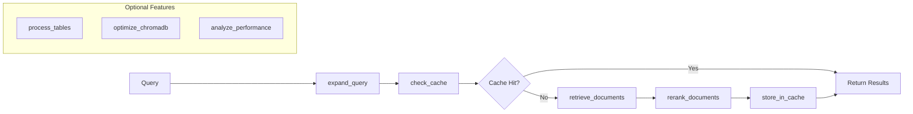

# RAG Module Developer Guide

## Table of Contents
1. [Overview](#overview)
2. [Architecture](#architecture)
3. [Core Components](#core-components)
4. [Database Integration](#database-integration)
5. [Embedding System](#embedding-system)
6. [Extending the RAG Module](#extending-the-rag-module)
7. [Testing](#testing)
8. [Configuration](#configuration)
9. [Performance Optimization](#performance-optimization)
10. [Troubleshooting](#troubleshooting)

## Overview

The RAG (Retrieval-Augmented Generation) module is a production-ready system using a **functional pipeline architecture** that provides intelligent search and question-answering capabilities across multiple data sources.

### Key Features
- **Functional Pipeline Architecture**: Composable pure functions instead of object-oriented design
- **Multi-source retrieval**: Search across media, notes, characters, and chat history
- **Hybrid search**: Combines FTS5 full-text and vector similarity search
- **Query Expansion**: Automatic enhancement with synonyms, acronyms, and domain terms
- **Smart Caching**: Semantic cache with adaptive thresholds
- **Production Ready**: Optional resilience features (circuit breakers, retries)
- **Performance Monitoring**: Built-in metrics and timing analysis

## Architecture

The RAG module uses a functional pipeline architecture where pure functions are composed into workflows:



### Pipeline Types
- **minimal_pipeline**: Retrieve → Rerank (fastest)
- **standard_pipeline**: Expand → Cache → Retrieve → Rerank → Store
- **quality_pipeline**: All features enabled for maximum accuracy
- **enhanced_pipeline**: Advanced chunking and parent retrieval
- **custom**: Build your own by composing functions

### Directory Structure
```
tldw_Server_API/app/
├── api/v1/
│   ├── endpoints/
│   │   └── rag_api.py             # Single unified API endpoint
│   └── schemas/
│       └── rag_schemas_simple.py  # Request/response models
└── core/
    └── RAG/
        ├── rag_service/
        │   ├── functional_pipeline.py    # Core pipeline functions
        │   ├── database_retrievers.py    # Database retrieval strategies
        │   ├── query_expansion.py        # Query enhancement
        │   ├── semantic_cache.py         # Semantic caching
        │   ├── advanced_reranking.py     # Document reranking
        │   ├── resilience.py             # Fault tolerance
        │   ├── performance_monitor.py    # Performance tracking
        │   ├── config.py                 # Configuration
        │   └── types.py                  # Type definitions
        └── __init__.py                   # Module exports
```

## Core Components

### 1. Functional Pipeline (`functional_pipeline.py`)

The core of the RAG module - composable pure functions:

```python
from tldw_Server_API.app.core.RAG import (
    standard_pipeline,
    build_pipeline,
    RAGPipelineContext
)

# Use pre-built pipeline
result = await standard_pipeline(
    "machine learning concepts",
    config={"enable_cache": True, "top_k": 10}
)

# Or build custom pipeline
my_pipeline = build_pipeline(
    expand_query,
    check_cache,
    retrieve_documents,
    rerank_documents
)

# Execute with context
context = RAGPipelineContext(
    query="your query",
    original_query="your query",
    config={"sources": ["media_db", "notes"]}
)
result = await my_pipeline(context)
```

### 2. Pipeline Functions

Core functions that compose into pipelines:

#### Query Processing
```python
@timer("query_expansion")
@with_resilience("query_expansion", expand_query_fallback)
async def expand_query(context: RAGPipelineContext,
                       strategies: List[str] = None) -> RAGPipelineContext:
    """Expand query with synonyms, acronyms, entities"""
    # Applies multiple expansion strategies
    # Updates context.expanded_queries
    return context
```

#### Document Retrieval
```python
@timer("retrieval")
@with_resilience("retrieval", retrieve_fallback)
async def retrieve_documents(context: RAGPipelineContext) -> RAGPipelineContext:
    """Retrieve from configured databases"""
    retriever = MultiDatabaseRetriever(context.config.get("databases", {}))
    context.documents = await retriever.retrieve(
        context.query,
        sources=context.config.get("sources", ["media_db"]),
        config=RetrievalConfig(**context.config)
    )
    return context
```

#### Reranking
```python
@timer("reranking")
@with_resilience("reranking", rerank_fallback)
async def rerank_documents(context: RAGPipelineContext) -> RAGPipelineContext:
    """Reorder documents by relevance"""
    strategy = context.config.get("reranking_strategy", "hybrid")
    reranker = get_reranker(strategy)
    context.documents = await reranker.rerank(
        context.documents,
        context.query
    )
    return context
```

### 3. Database Retrievers (`database_retrievers.py`)

Specialized retrievers for each data source:

```python
# Media database retriever
retriever = MediaDBRetriever("/path/to/media.db")
documents = await retriever.retrieve(query, media_type="video")

# Multi-database retriever
retriever = MultiDatabaseRetriever({
    "media_db": "/path/to/media.db",
    "notes_db": "/path/to/notes.db"
})
documents = await retriever.retrieve(
    query,
    sources=[DataSource.MEDIA_DB, DataSource.NOTES],
    config=RetrievalConfig(max_results=20)
)
```

## Database Integration

### MediaDatabase Integration

The RAG module integrates with the Media_DB_v2 system:

```python
from tldw_Server_API.app.core.DB_Management.Media_DB_v2 import MediaDatabase

# Initialize database connection
media_db = MediaDatabase(db_path="user_media_library.sqlite", client_id="rag_service")

# Search with FTS5
results = media_db.fts_search(
    query="machine learning",
    limit=10,
    fields=["title", "content", "transcription"]
)
```

### CharactersRAGDB Integration

For notes and character cards:

```python
from tldw_Server_API.app.core.DB_Management.ChaChaNotes_DB import CharactersRAGDB

# Initialize notes database
notes_db = CharactersRAGDB(db_path="user_chacha_notes.sqlite")

# Search notes
notes = notes_db.search_notes(
    query="important concepts",
    limit=10,
    include_keywords=True
)
```

### ChromaDB Vector Store

For semantic search capabilities:

```python
import chromadb
from chromadb.config import Settings

# Initialize ChromaDB client
client = chromadb.PersistentClient(
    path="./chroma_db",
    settings=Settings(
        anonymized_telemetry=False,
        allow_reset=True
    )
)

# Create or get collection
collection = client.get_or_create_collection(
    name="media_embeddings",
    metadata={"description": "Media content embeddings"}
)
```

## Embedding System

The RAG module uses the production embedding service for vector operations:

### RAGEmbeddingsIntegration

```python
from tldw_Server_API.app.core.RAG.rag_embeddings_integration import RAGEmbeddingsIntegration

# Initialize embeddings integration
embeddings = RAGEmbeddingsIntegration(
    embedding_provider="huggingface",
    embedding_model="sentence-transformers/all-MiniLM-L6-v2",
    cache_embeddings=True
)

# Embed query
query_embedding = await embeddings.embed_query("machine learning concepts")

# Embed documents
doc_embeddings = await embeddings.embed_documents(documents)

# Get embedding dimension
dimension = embeddings.get_embedding_dimension()  # Returns 384 for MiniLM
```

### ProductionEmbeddingFunction

For ChromaDB integration:

```python
from tldw_Server_API.app.core.RAG.rag_embeddings_integration import ProductionEmbeddingFunction

# Create embedding function for ChromaDB
embedding_function = ProductionEmbeddingFunction(
    provider="huggingface",
    model_id="sentence-transformers/all-MiniLM-L6-v2"
)

# Use with ChromaDB collection
collection = client.create_collection(
    name="documents",
    embedding_function=embedding_function
)
```

## Extending the RAG Module

### Adding a New Pipeline Function

1. Create a new async function that accepts and returns `RAGPipelineContext`:

```python
from tldw_Server_API.app.core.RAG.ARCHIVE.functional_pipeline import (
    RAGPipelineContext,
    timer,
    with_resilience
)


@timer("custom_processing")
@with_resilience("custom_processing", custom_fallback)  # Optional
async def custom_processing(context: RAGPipelineContext) -> RAGPipelineContext:
    """
    Custom processing function for the pipeline.

    Args:
        context: The pipeline context containing query, documents, config

    Returns:
        Modified context with processed documents
    """
    # Your custom logic here
    for doc in context.documents:
        doc.metadata["custom_score"] = calculate_custom_score(doc, context.query)

    # Sort by custom score
    context.documents.sort(
        key=lambda d: d.metadata.get("custom_score", 0),
        reverse=True
    )

    return context


# Fallback function for resilience
async def custom_fallback(context: RAGPipelineContext) -> RAGPipelineContext:
    logger.warning("Custom processing failed, returning original documents")
    return context
```

2. Use in a custom pipeline:

```python
from tldw_Server_API.app.core.RAG import build_pipeline

# Build pipeline with custom function
my_pipeline = build_pipeline(
    expand_query,
    retrieve_documents,
    custom_processing,  # Your custom function
    rerank_documents
)

# Execute pipeline
result = await my_pipeline(context)
```

### Adding a New Retriever

1. Create a new retriever class inheriting from `BaseRetriever`:

```python
from tldw_Server_API.app.core.RAG.rag_service.database_retrievers import BaseRetriever
from tldw_Server_API.app.core.RAG.rag_service.types import Document, DataSource

class CustomRetriever(BaseRetriever):
    def __init__(self, connection_string: str):
        self.connection = connection_string
        self.source = DataSource.CUSTOM  # Add to enum

    async def retrieve(
        self,
        query: str,
        limit: int = 10,
        **kwargs
    ) -> List[Document]:
        # Your retrieval logic
        raw_results = await self._query_database(query, limit)

        # Convert to Document objects
        return [
            Document(
                id=result["id"],
                content=result["content"],
                metadata=result.get("metadata", {}),
                source=self.source,
                score=result.get("score", 0.0)
            )
            for result in raw_results
        ]
```

2. Use in the pipeline:

```python
# Add to MultiDatabaseRetriever configuration
config = {
    "databases": {
        "media_db_path": "/path/to/media.db",
        "custom_db": "postgresql://localhost/custom"
    },
    "sources": ["media_db", "custom"]
}

result = await standard_pipeline(query, config)
```

## Testing

The RAG module has comprehensive test coverage. All tests are located in `tldw_Server_API/tests/RAG/`.

### Running Tests

```bash
# Run all RAG tests
python -m pytest tldw_Server_API/tests/RAG/ -v

# Run functional pipeline tests
python -m pytest tldw_Server_API/tests/RAG/test_functional_pipeline.py -v
python -m pytest tldw_Server_API/tests/RAG/test_rag_refactored.py -v

# Run with coverage
python -m pytest tldw_Server_API/tests/RAG/ --cov=tldw_Server_API.app.core.RAG --cov-report=html
```

### Test Structure

```
tests/RAG/
├── test_functional_pipeline.py         # Core pipeline tests
├── test_rag_refactored.py             # Comprehensive refactored tests
├── test_database_retrievers.py        # Retriever tests
├── test_query_expansion.py            # Query expansion tests
├── test_resilience.py                 # Fault tolerance tests
└── test_rag_endpoints_integration.py  # API endpoint tests
```

### Writing Tests

Example test for a custom pipeline function:

```python
import pytest
from tldw_Server_API.app.core.RAG import (
    RAGPipelineContext,
    build_pipeline,
    custom_processing  # Your custom function
)
from tldw_Server_API.app.core.RAG.rag_service.types import Document

@pytest.mark.asyncio
async def test_custom_pipeline_function():
    """Test custom processing function"""
    # Create test context
    context = RAGPipelineContext(
        query="test query",
        original_query="test query",
        config={"enable_custom": True}
    )

    # Add test documents
    context.documents = [
        Document(
            id="1",
            content="Test content",
            metadata={},
            source="test",
            score=0.5
        )
    ]

    # Test function
    result = await custom_processing(context)

    # Assertions
    assert result.documents[0].metadata.get("custom_score") is not None
    assert len(result.documents) == 1

@pytest.mark.asyncio
async def test_custom_pipeline_integration():
    """Test custom pipeline end-to-end"""
    # Build pipeline with custom function
    pipeline = build_pipeline(
        retrieve_documents,
        custom_processing,
        rerank_documents
    )

    # Create context
    context = RAGPipelineContext(
        query="machine learning",
        original_query="machine learning",
        config={
            "databases": {"media_db_path": "test.db"},
            "sources": ["media_db"],
            "top_k": 5
        }
    )

    # Execute pipeline
    result = await pipeline(context)

    # Verify custom processing was applied
    assert all(
        "custom_score" in doc.metadata
        for doc in result.documents
    )
```

### Important Test Considerations

1. **CSRF Protection**: Tests must disable CSRF for testing:

```python
@pytest.fixture(scope="module", autouse=True)
def disable_csrf():
    """Disable CSRF for testing"""
    from tldw_Server_API.app.core.config import settings
    original_csrf = settings.get("CSRF_ENABLED", None)
    settings["CSRF_ENABLED"] = False
    yield
    if original_csrf is not None:
        settings["CSRF_ENABLED"] = original_csrf
```

2. **Database Fixtures**: Use temporary databases for testing:

```python
@pytest.fixture
def temp_media_db():
    """Create temporary media database"""
    with tempfile.TemporaryDirectory() as temp_dir:
        db_path = Path(temp_dir) / "test_media.db"
        db = MediaDatabase(db_path, "test_client")
        # Add test data
        yield db
        db.close_connection()
```

## Configuration

### Configuration Examples

```python
# Basic configuration
config = {
    "pipeline": "standard",  # or minimal, quality, enhanced, custom
    "enable_cache": True,
    "enable_monitoring": True,
    "sources": ["media_db", "notes"],
    "top_k": 10
}

# Advanced configuration with resilience
config = {
    "pipeline": "quality",
    "databases": {
        "media_db_path": "/path/to/media.db",
        "notes_db_path": "/path/to/notes.db"
    },
    "expansion_strategies": ["acronym", "synonym", "domain"],
    "reranking_strategy": "cross_encoder",
    "enable_resilience": True,
    "resilience": {
        "retry": {
            "enabled": True,
            "max_attempts": 3,
            "initial_delay": 0.5
        },
        "circuit_breaker": {
            "enabled": True,
            "failure_threshold": 5,
            "timeout": 60
        }
    },
    "cache_threshold": 0.85,
    "use_adaptive_cache": True
}

# Use configuration
result = await standard_pipeline(query, config)
```

### TOML Configuration File

```toml
# rag_config.toml
[rag]
default_pipeline = "standard"
enable_monitoring = true

[rag.retrieval]
default_top_k = 10
min_score = 0.0
use_fts = true
use_vector = false

[rag.expansion]
enabled = true
strategies = ["acronym", "synonym"]
max_expansions = 5

[rag.cache]
enabled = true
threshold = 0.85
adaptive = true
ttl = 3600

[rag.reranking]
enabled = true
strategy = "hybrid"
diversity = 0.3

[rag.resilience]
enabled = false
retry_attempts = 3
circuit_breaker_threshold = 5
```

### Environment Variables

```bash
# Embedding configuration
EMBEDDING_PROVIDER=huggingface
EMBEDDING_MODEL=sentence-transformers/all-MiniLM-L6-v2

# Database paths
USER_DB_BASE_DIR=/path/to/user/databases
CHROMA_DB_PATH=/path/to/chroma

# API configuration
OPENAI_API_KEY=your-api-key
ANTHROPIC_API_KEY=your-api-key

# Performance tuning
RAG_NUM_WORKERS=4
RAG_CACHE_SIZE=1000
RAG_TIMEOUT_SECONDS=30
```

### Loading Configuration

```python
from tldw_Server_API.app.core.RAG.rag_service.config import RAGConfig
import toml

# Load from TOML file
with open("rag_config.toml", "r") as f:
    toml_config = toml.load(f)
    config = toml_config.get("rag", {})

# Or create programmatically
config = RAGConfig(
    pipeline="standard",
    enable_cache=True,
    cache_threshold=0.85,
    expansion_strategies=["acronym", "synonym"],
    reranking_strategy="hybrid",
    top_k=10
)

# Use with pipeline
result = await standard_pipeline(query, config.to_dict())
```

## Performance Optimization

### 1. Caching Strategy

The RAG module implements multi-level caching:

```python
# Query result caching
@lru_cache(maxsize=1000)
async def cached_search(query_hash: str, sources: tuple, limit: int):
    return await rag_service.search(query_hash, list(sources), limit)

# Embedding caching
embedding_cache = {}
def get_cached_embedding(text: str):
    if text not in embedding_cache:
        embedding_cache[text] = embed(text)
    return embedding_cache[text]
```

### 2. Parallel Retrieval

Use asyncio for parallel operations:

```python
async def parallel_search(query: str, sources: List[DataSource]):
    tasks = [
        retriever.retrieve(query)
        for retriever in retrievers
        if retriever.source in sources
    ]
    results = await asyncio.gather(*tasks)
    return merge_results(results)
```

### 3. Connection Pooling

For database operations:

```python
from contextlib import asynccontextmanager

class DatabasePool:
    def __init__(self, max_connections: int = 10):
        self._pool = []
        self._max = max_connections

    @asynccontextmanager
    async def get_connection(self):
        conn = await self._acquire()
        try:
            yield conn
        finally:
            await self._release(conn)
```

### 4. Batch Processing

For embedding operations:

```python
async def batch_embed_documents(documents: List[str], batch_size: int = 32):
    embeddings = []
    for i in range(0, len(documents), batch_size):
        batch = documents[i:i + batch_size]
        batch_embeddings = await embed_batch(batch)
        embeddings.extend(batch_embeddings)
    return embeddings
```

## Troubleshooting

### Common Issues and Solutions

#### 1. Import Errors

**Problem**: `ModuleNotFoundError` for RAG components.

**Solution**: Import from the correct module:
```python
# Correct imports
from tldw_Server_API.app.core.RAG import (
    standard_pipeline,
    build_pipeline,
    RAGPipelineContext
)

# NOT from old paths like:
# from app.core.RAG.rag_service.integration import RAGService  # OLD
```

#### 2. Embedding Dimension Mismatch

**Problem**: Different embedding models produce different dimensions.

**Solution**: Ensure consistent model usage:
```python
# Check embedding dimension
dimension = embeddings.get_embedding_dimension()
assert dimension == expected_dimension, f"Expected {expected_dimension}, got {dimension}"
```

#### 3. Database Lock Errors

**Problem**: SQLite database locks during concurrent access.

**Solution**: Use write-ahead logging (WAL) mode:
```python
conn.execute("PRAGMA journal_mode=WAL")
conn.execute("PRAGMA busy_timeout=5000")
```

#### 4. Memory Issues with Large Result Sets

**Problem**: Out of memory when processing large documents.

**Solution**: Use streaming and pagination:
```python
async def stream_results(query: str, batch_size: int = 10):
    offset = 0
    while True:
        batch = await retrieve(query, limit=batch_size, offset=offset)
        if not batch:
            break
        for doc in batch:
            yield doc
        offset += batch_size
```

#### 5. Slow Vector Search

**Problem**: ChromaDB queries are slow.

**Solution**: Use the optimize_chromadb_search function:
```python
from tldw_Server_API.app.core.RAG import quality_pipeline

# Quality pipeline includes ChromaDB optimization
result = await quality_pipeline(
    query,
    config={
        "enable_chromadb": True,
        "chromadb_top_k": 50,  # Retrieve more, then rerank
        "final_top_k": 10      # Return top 10 after reranking
    }
)
```

#### 6. Resilience Not Working

**Problem**: Circuit breakers and retries not activating.

**Solution**: Ensure resilience is enabled in config:
```python
config = {
    "enable_resilience": True,  # Must be True
    "resilience": {
        "retry": {"enabled": True, "max_attempts": 3},
        "circuit_breaker": {"enabled": True, "failure_threshold": 5}
    }
}
```

**Problem**: ChromaDB queries are slow.

**Solution**: Optimize collection settings:
```python
collection = client.create_collection(
    name="optimized",
    metadata={
        "hnsw:space": "cosine",
        "hnsw:construction_ef": 200,
        "hnsw:M": 48
    }
)
```

### Debugging Tips

1. **Enable Debug Logging**:
```python
import logging
from loguru import logger

logger.level("DEBUG")
```

2. **Monitor Query Performance**:
```python
from tldw_Server_API.app.core.RAG.rag_service.metrics import MetricsCollector

metrics = MetricsCollector()
with metrics.measure("search_operation"):
    results = await rag_service.search(query)
logger.info(f"Search took {metrics.get_timing('search_operation')}ms")
```

3. **Trace Retrieval Path**:
```python
# Add to retriever
logger.debug(f"Retrieving from {self.source}: query='{query}', limit={limit}")
results = await self._retrieve_internal(query, limit)
logger.debug(f"Retrieved {len(results)} documents from {self.source}")
```

## Best Practices

### 1. Pipeline Selection

Choose the right pipeline for your use case:

```python
# Fast lookup for simple queries
result = await minimal_pipeline(query)

# Balanced for most use cases
result = await standard_pipeline(query, config)

# Maximum accuracy for complex queries
result = await quality_pipeline(query, config)

# Custom for specific requirements
my_pipeline = build_pipeline(
    expand_query,
    retrieve_documents,
    custom_processing,
    rerank_documents
)
```

### 2. Error Handling

Pipelines handle errors gracefully with optional resilience:

```python
try:
    result = await standard_pipeline(query, config)
except Exception as e:
    logger.error(f"Pipeline failed: {e}")
    # Fallback to minimal pipeline
    result = await minimal_pipeline(query)
```

### 3. Performance Optimization

```python
# Enable caching for repeated queries
config = {
    "enable_cache": True,
    "cache_threshold": 0.85,
    "use_adaptive_cache": True
}

# Use minimal pipeline for speed
if need_fast_response:
    result = await minimal_pipeline(query)
else:
    result = await standard_pipeline(query, config)

# Monitor performance
if config.get("enable_monitoring"):
    logger.info(f"Query took {sum(result.timings.values()):.2f}s")
    for component, timing in result.timings.items():
        logger.debug(f"{component}: {timing:.3f}s")
```

### 4. Type Hints

Always use type hints for clarity:

```python
from typing import List, Optional, Dict, Any
from tldw_Server_API.app.core.RAG.rag_service.types import Document, DataSource

async def search(
    query: str,
    sources: List[DataSource],
    limit: int = 10,
    filters: Optional[Dict[str, Any]] = None
) -> List[Document]:
    pass
```

### 5. Documentation

Document your custom pipeline functions:

```python
async def custom_processing(context: RAGPipelineContext) -> RAGPipelineContext:
    """
    Apply custom scoring based on domain-specific rules.

    This function adds a custom score to each document based on
    business logic and reorders documents accordingly.

    Args:
        context: Pipeline context with documents to process

    Returns:
        Context with documents sorted by custom score

    Example:
        >>> pipeline = build_pipeline(
        ...     retrieve_documents,
        ...     custom_processing,
        ...     rerank_documents
        ... )
        >>> result = await pipeline(context)
    """
    # Implementation
    pass
```

## Conclusion

The RAG module's functional pipeline architecture provides a flexible, performant foundation for retrieval-augmented generation. With composable functions, optional resilience features, and comprehensive testing, it's production-ready and easily extensible.

## Related Documentation

- [RAG Module Overview](/app/core/RAG/README.md)
- [RAG Service Implementation](/app/core/RAG/rag_service/README.md)
- [RAG API Documentation](../API-related/RAG_API_Documentation.md)
- [Functional Pipeline Guide](./RAG-Functional-Pipeline-Guide.md)
