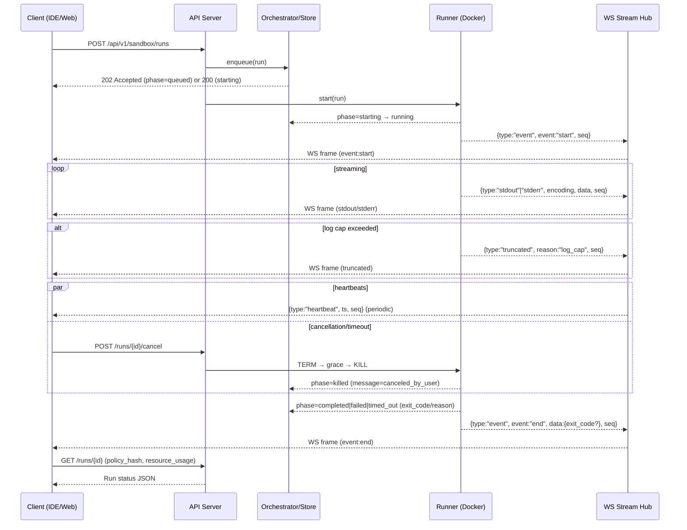

# PRD: Code Interpreter Sandbox & LSP

Owner: tldw_server Core Team
Status: v0.2
Last updated: 2025-10-28

## Table of Contents
- [Revision History](#revision-history)
- [1) Summary](#1-summary)
 - [Implementation Status (v0.2)](#implementation-status-v02)
 - [1) Summary](#1-summary)
- [2) Problem Statement](#2-problem-statement)
- [3) Goals and Non-Goals](#3-goals-and-non-goals)
- [4) Personas](#4-personas)
- [Glossary](#glossary)
- [7) Requirements](#7-requirements)
- [8) Architecture Overview](#8-architecture-overview)
- [9) API Design (MVP)](#9-api-design-mvp)
  - [Runtimes Defaults](#runtimes-defaults-quick-reference)
  - [Runtime Limits Normalization](#runtime-limits-normalization)
  - [Spec Versioning](#spec-versioning)
  - [WebSocket Protocol Details](#websocket-protocol-details)
  - [State Machine (Runs)](#state-machine-runs)
- [10) LSP Integration](#10-lsp-integration)
- [11) MCP Integration](#11-mcp-integration)
- [12) Security Model](#12-security-model)
  - [Security Defaults](#security-defaults-quick-reference)
  - [Policy Hash](#policy-hash)
- [14) Storage & Artifacts](#14-storage--artifacts)
- [15) Observability](#15-observability)
- [16) Performance Targets](#16-performance-targets-mvp)
- [17) Admin & Policy](#17-admin--policy)
- [30) Admin API (Implemented)](#30-admin-api-implemented)
- [28) Client Integration Notes](#28-client-integration-notes-idetools)
- [33) v0.3 Plan (Draft)](#33-v03-plan-draft)

## Revision History
- v0.3 (Draft): Firecracker runner GA (parity with Docker), persistent store + multi-worker (Postgres/Redis) with shared artifacts, limited interactive runs over WS stdin (opt-in, capped), egress allowlist policy (opt-in, DNS pinning), Admin/observability expansions, resume logs via seq, spec_version 1.1 (backward-compatible) exposing optional fields and runtime capabilities.
- v0.2: Protocol/schema refinements (final WS envelope + seq on all frames; oneOf session vs one-shot; startup vs execution timeouts; cancel TERM→grace→KILL + single end frame), runtimes discovery fields (caps: max_cpu/max_mem_mb/max_log_bytes, queue_max_length/queue_ttl_sec, workspace_cap_mb, artifact_ttl_hours, supported_spec_versions), Admin API list/details examples, policy_hash in sessions/runs, Security Defaults table, observability metrics/audit, and vNext outline.
- v0.1: Initial draft of Sandbox PRD (endpoints, flows, and constraints).

## 1) Summary

Build a secure, configurable code execution service that lets users, agents, and workflows run untrusted code snippets and full applications in isolated sandboxes. Provide an IDE-friendly LSP integration to surface diagnostics, logs, and results inline. Support both Docker containers (Linux/macOS/Windows hosts) and Firecracker microVMs (Linux-only) to balance broad compatibility with stronger isolation where available.

## Implementation Status (v0.2)

Implemented
- Endpoints: POST `/sessions` (idempotent), POST `/sessions/{id}/files` (safe extract + caps), POST `/runs` (idempotent; oneOf session vs one‑shot), GET `/runs/{id}` (includes `policy_hash` and `resource_usage`), GET `/runtimes` (caps including queue fields), artifacts list and single‑range download, POST `/runs/{id}/cancel` (TERM→grace→KILL).
- WebSocket logs: stdout/stderr/event/heartbeat/truncated frames with `seq` on all frames; backpressure, log caps, and heartbeats implemented.
- Docker runner: non‑root UID/GID, read‑only root, tmpfs workdir (`noexec,nodev,nosuid`), `cap_drop=ALL`, `no‑new‑privileges`, pids/nofile ulimits, deny‑all egress by default.
- Idempotency: TTL window, conflict handling (409) with `prior_id` and key echo.
- Policy hash: returned on sessions/runs and included in run status; excludes test‑only toggles.
- Queue/backpressure: queue length + TTL enforced; 429 with `Retry‑After` when full.
- Admin API: list and details implemented; includes `resource_usage`, `policy_hash`, and `image_digest` when available.
- Metrics: counters/histograms with `reason` label (e.g., `startup_timeout`, `execution_timeout`); WS heartbeats/disconnects/log truncations and queue drop metrics.

Not yet (planned v0.3 unless noted)
- Interactive runs over WS stdin and related limits (`stdin_*`).
- Signed WS URLs tokens + `resume_from_seq` behavior; current servers may return unsigned `log_stream_url` (use auth headers).
- Egress allowlist policy (domain/IP/CIDR with DNS pinning).
- Firecracker runner.
- Persistent shared store (Postgres/Redis) and cluster‑wide admin aggregates; current backends: memory (default) or SQLite.
- `/runtimes` capability flags (`interactive_supported`, `egress_allowlist_supported`) and top‑level `store_mode` field.

Clarifications
- Artifact downloads: single‑range supported; multi‑range returns 416.
- `supported_spec_versions`: default advertises `["1.0"]`; spec 1.1 fields are documented for v0.3.

Primary use cases:
- Validate LLM-generated code safely, before running it locally.
- Run tests, scripts, and small apps against a provided workspace snapshot.
- Provide a standard API for agents/workflows to execute and verify code.
- Stream logs and results back to IDEs and the tldw web UI; store artifacts.


## 2) Problem Statement

Developers increasingly rely on LLMs to generate code. Executing untrusted snippets locally risks compromise, dependency pollution, and state corruption. There’s no unified, policy-controlled way to check code in-context and get actionable diagnostics inside IDEs and chat UIs. We need a safe, consistent, and observable mechanism to run code in isolation with guardrails, and to surface results where developers work.


## 3) Goals and Non-Goals

### Goals
1. Provide a sandboxed code execution service with clear isolation guarantees.
2. Offer two runtimes: Docker (broad support) and Firecracker (stronger isolation on Linux).
3. Expose a clean REST + WebSocket API for runs, logs, and artifacts.
4. Provide an LSP bridge so IDEs can trigger runs and show diagnostics inline.
5. Support agent/workflow invocation (incl. MCP tool) with policy and approvals.
6. Capture execution metadata for auditing, reproducibility, and debugging.

### Non-Goals (Initial)
- Full interactive remote desktops. (Future: optional Jupyter/shell sessions.)
- Long-running services with inbound ports. (Initial runs are batch-like.)
- Arbitrary outbound network access. (Default: locked down; allowlist later.)
- Managing user VPCs or complex cloud resource brokers in v0.


## 4) Personas

- Individual Developer: Uses IDE + tldw chat; wants to validate code safely.
- Agent Builder: Needs a standard tool to execute code during agent workflows.
- Team Lead / Admin: Enforces policies, quotas, and audit requirements.
- CI/Automation Engineer: Leverages API to run quick validations pre-commit.

## Glossary
- Session: An ephemeral workspace and runtime context (image + limits) with a TTL; can accept uploads and run multiple commands. See: [API Design (MVP)](#9-api-design-mvp).
- Run: A single execution (command + env) either one-shot or within a session; produces stdout/stderr, exit_code, and optional artifacts; progresses through phases. See: [State Machine (Runs)](#state-machine-runs).
- Artifact: A captured file produced during a run, stored under the run’s artifacts root, subject to size caps and retention TTL; symlinks are not dereferenced. See: [Storage & Artifacts](#14-storage--artifacts).
- policy_hash: SHA-256 of canonicalized sandbox policy/config inputs used for reproducibility; included in session/run responses and run status. See: [Policy Hash](#policy-hash).
- spec_version: API/spec version string required in POST `/sessions` and `/runs`, validated against `SANDBOX_SUPPORTED_SPEC_VERSIONS`. See: [Spec Versioning](#spec-versioning).

## 5) User Stories (MVP → vNext)

MVP
- As a developer, I can submit a snippet + dependencies to run in a sandbox and get logs, exit code, and artifacts.
- As a developer, I can stream stdout/stderr while the snippet runs.
- As an IDE user, I can trigger “Run in Sandbox” and see diagnostics inline.
- As an admin, I can choose runtime (Docker/Firecracker) defaults per environment.
- As an agent, I can call sandbox.run with a command and receive outputs.

vNext
- As a developer, I can open an interactive session (Jupyter/shell) with a TTL.
- Support limited interactive runs via WS with a `stdin` channel (opt-in, TTL-bound).
- As an admin, I can define egress policies (deny by default, allowlist).
- As a user, I can mount a read-only workspace snapshot into the sandbox.
- As a team, we can reuse cached environments (warm pools) for lower latency.
- As a CI engineer, I can gate runs on approvals and budgets/quotas.


## 6) Scope

In Scope (MVP)
- Docker and Firecracker runtimes (selectable via policy or request).
- Language base images: Python, Node.js, Go, Java, .NET, plus a generic image.
- One-shot runs with tar/zip uploads or remote git clone + patch.
- Resource controls: CPU, memory, disk, wall-clock timeout.
- Default no-network; optional allowlist for essential package mirrors (future).
- REST endpoints for session/run management; WS for streaming logs.
- Artifact capture: files produced during run (size/quota limits).
- Audit logs with user, model, prompt/context, runtime, policy, and outcome.
- RBAC based on existing AuthNZ (JWT/API key) + per-user quotas + rate limits.

Out of Scope (MVP)
- GPU support, nested virtualization, or privileged containers.
- Persistent volumes beyond run TTL; long-term package caches.
- Arbitrary background daemons or exposed network services inside runs.


## 7) Requirements

### Functional Requirements
1. Runtimes
   - Docker runtime using rootless mode where possible, with seccomp/AppArmor profiles.
   - Firecracker runtime via direct Firecracker SDK/CLI; ignite is EOL. Use prebuilt microVM images/snapshots.

2. Execution
   - Create a session (ephemeral or short-lived) → upload code (tar/zip or files) → start run with command/args/env → stream logs → retrieve status and artifacts → destroy.
   - One-shot runs without persistent session (convenience path).
   - Entry command is explicit; no default execution of arbitrary scripts.

3. Inputs/Artifacts
   - Accept uploads up to configurable size; verify archive and path safety.
   - Support git clone with optional shallow depth + patch application.
   - Cloning occurs server-side (by the orchestrator) prior to sandbox start; default deny-all egress inside the sandbox prevents outbound fetches from the run environment.
   - Artifact capture with per-run quotas and retention policies.

4. LSP Integration
   - Provide a small LSP-side service/extension that calls sandbox APIs.
   - Map results and logs to diagnostics (file/line) when possible using language-aware stack trace parsers (Python/Node/Go/Java).
   - Expose custom `workspace/executeCommand` actions: `tldw.sandbox.run`, `tldw.sandbox.configure`, `tldw.sandbox.openArtifacts`.

5. Agent/Workflow Integration
   - MCP tool: `sandbox.run` with arguments (image, command, files, timeout).
   - Policy guardrails: deny/approve flows; admin-configurable runtime defaults.

6. Admin/Policy
   - Global and per-user quotas: concurrent runs, CPU/mem limits, total runtime/day.
   - Runtime policy: choose Docker or Firecracker; enable/disable networking; allowlist domains (vNext); secrets injection policy.
   - Audit and compliance logs for every run.

### Non-Functional Requirements
- Security/Isolation: Strong default isolation; zero host mounts; read-only base images; immutable root where possible; ephemeral writable layer; no privileged containers.
- Reliability: Orphan reaper for stuck sessions; idempotent cleanup; retries for transient runtime errors.
- Performance: P95 run start < 2s for Docker warm image, < 5s for Firecracker warm microVM; log latency < 200ms.
- Scalability: Pooling/warm images; horizontal workers; bounded queues with backpressure.
- Observability: Structured logs; metrics (runs, latency, failures, resource usage); trace IDs for correlation with chat/agents.
- Usability: Clear error messages; human-readable run summaries.


## 8) Architecture Overview

Components
- Sandbox API Service (FastAPI): REST + WS endpoints, AuthNZ, rate limits, policy checks.
- Orchestrator/Queue: Enqueues runs, assigns workers, enforces quotas.
- Runtimes:
  - Docker Runner: manages images, containers, resource limits, seccomp/AppArmor.
  - Firecracker Runner: manages microVM images/snapshots, networking policy, block devices.
- Storage:
  - Input store (uploads, git snapshots); ephemeral per-run workspace.
  - Artifact store with TTL and size quotas.
- Streaming/Logs: WebSocket for stdout/stderr; server-side ring buffer fallback.
- Policy Engine: Evaluate org/user/runtime policies (network, secrets, quotas).
- Audit/Telemetry: Persist run metadata and outcomes; export Prometheus metrics.
- Integrations: LSP bridge, MCP tool, Web UI panel.

Runtime Modes
- One-shot run: No persistent session; run starts immediately with inputs.
- Short session: Allows multiple runs against same ephemeral workspace (TTL, max runs).

Isolation
- Docker: rootless preferred; seccomp profile, no host mounts, read-only root, tmpfs overlays for writable paths, memory/cpu quotas.
- Firecracker: microVM per run/session; read-only root FS image + writable scratch; optional tap interface disabled by default; limited devices; cgroup quotas.


## 9) API Design (MVP)

Base path: `/api/v1/sandbox`

Auth: Reuse existing AuthNZ (JWT for multi-user or API key for single-user). Apply rate limits and quotas via shared dependency. Unless specified, request/response bodies use `application/json`.

Endpoints
- POST `/sessions`
  - Create a session. Body: `spec_version`, runtime (`docker`|`firecracker`), base_image, cpu/mem limits, timeout, network_policy, env (non-secret), labels.
  - Returns: `session_id`, `expires_at`, runtime info, `policy_hash`.

- POST `/sessions/{session_id}/files`
  - Upload a tar/zip or individual files. Server verifies and expands into session workspace.

- POST `/runs`
  - Start a run (one-shot or for existing session). Body: `spec_version`, session_id? base_image? command[], env, `startup_timeout_sec` (image pull/VM boot), `timeout_sec` (execution), resource overrides, network_policy, files? (optional inline small files), capture_patterns. Request shape enforces `oneOf`: either `{ session_id, command }` or `{ base_image, command }`; when `session_id` is omitted, `base_image` is required. Supports `Idempotency-Key` header to dedupe client retries.
  - Returns: `run_id`, `session_id?`, `log_stream_url?` (pre-signed or unsigned WS URL).
  - v0.3 / spec 1.1: optional fields for limited interactivity and WS resume:
    - `interactive` (bool; default false)
    - `stdin_max_bytes`, `stdin_max_frame_bytes`, `stdin_bps`, `stdin_idle_timeout_sec` (limits; finalized names)
    - `resume_from_seq` (number; start WS stream from seq; for reconnect/resume)

- GET `/runs/{run_id}`
  - Status: phase (queued|starting|running|completed|failed|killed|timed_out), exit_code, started_at, finished_at, runtime, base_image, image_digest (when available), policy_hash, spec_version, and `resource_usage` with keys: `cpu_time_sec`, `wall_time_sec`, `peak_rss_mb`, `log_bytes`, `artifact_bytes` (plus optional `pids`, `max_open_files`, and `limits`).
  - Resource usage caveats:
    - `cpu_time_sec`: On Linux hosts, measured via cgroup CPU accounting when available (v1 `cpuacct.usage` or v2 `cpu.stat usage_usec`); otherwise approximated from a `docker stats` CPU% sample multiplied by `wall_time_sec`.
    - `peak_rss_mb`: Best-effort memory snapshot derived from a single `docker stats --no-stream` sample. This is not a true peak over time; treat as an approximate high-water mark at collection time.

- WS `/runs/{run_id}/stream`
  - Server→client stream of stdout/stderr and structured events. Message envelope:
    - `{ "type": "stdout"|"stderr", "encoding": "utf8"|"base64", "data": "<payload>", "seq": n }`
    - `{ "type": "event", "event": "phase"|"start"|"end"|"error", "data": { ... }, "seq": n }`
    - `{ "type": "heartbeat", "ts": "ISO", "seq": n }`
    - `{ "type": "truncated", "reason": "log_cap", "seq": n }`
  - Limits: max message size 64KB; server enforces per-run log cap (e.g., 10 MB) and backpressure with buffered ring. Implemented.
  - Compatibility note: Earlier drafts used alternative shapes (e.g., `channel`, `chunk`, or `data_b64`). Those are deprecated in v1.0. Clients MUST use the final envelope with fields `type`, `encoding`, `data`, and `seq`.
  - Test-only behavior: when `SANDBOX_WS_SYNTHETIC_FRAMES_FOR_TESTS=true`, the server MAY emit synthetic `start` and `end` events to ensure immediate frames for CI; sockets may stay open after `end` so clients can close cleanly. This flag is disabled by default and MUST NOT be used in production.

- GET `/runs/{run_id}/artifacts`
  - List artifact files with sizes and signed download URLs (or direct GET with auth).

- POST `/runs/{run_id}/cancel`
  - Request cancellation. Semantics: send SIGTERM, wait a grace period, then SIGKILL if still running. Defaults: `SANDBOX_CANCEL_GRACE_SECONDS` (e.g., 5s). Final state on success: `phase=killed`, `message=canceled_by_user`. Returns best-effort confirmation when run already finished.
  - WS end event: the server emits exactly one final `{ "type": "event", "event": "end", "seq": n }` frame per run upon terminal transition.

- DELETE `/sessions/{session_id}`
  - Early destroy; reclaims resources and workspace.

- GET `/runtimes`
  - Feature discovery for host: which runtimes available, default images (with digests when possible), and the following caps/fields:
    - Per-runtime maxima: `max_cpu`, `max_mem_mb`
    - Logging: `max_log_bytes`
    - Uploads/workspace/artifacts: `max_upload_mb`, `workspace_cap_mb`, `artifact_ttl_hours`
    - Versioning: `supported_spec_versions`
    - Queue/backpressure: `queue_max_length`, `queue_ttl_sec`
    Implemented.
  - v0.3 / spec 1.1 (Draft) capability flags:
    - `interactive_supported` (bool)
    - `egress_allowlist_supported` (bool)
    - `store_mode` (string: `memory|sqlite|postgres|redis`)

### Runtimes Defaults (quick reference)

  | Field | Default | Config Key |
  |---|---|---|
  | `max_cpu` | 4.0 | `SANDBOX_MAX_CPU` |
  | `max_mem_mb` | 8192 | `SANDBOX_MAX_MEM_MB` |
  | `max_log_bytes` | 10 MB | `SANDBOX_MAX_LOG_BYTES` |
  | `queue_max_length` | 100 | `SANDBOX_QUEUE_MAX_LENGTH` |
  | `queue_ttl_sec` | 120 | `SANDBOX_QUEUE_TTL_SEC` |
  | `workspace_cap_mb` | 256 | `SANDBOX_WORKSPACE_CAP_MB` |
  | `artifact_ttl_hours` | 24 | `SANDBOX_ARTIFACT_TTL_HOURS` |
  | `supported_spec_versions` | ["1.0"] | `SANDBOX_SUPPORTED_SPEC_VERSIONS` |

Error Model
- All error responses use a standard envelope:
  - `{ "error": { "code": "string", "message": "human readable", "details": {"...": "..."} } }`
- Common codes: `invalid_request`, `not_found`, `unauthorized`, `forbidden`, `rate_limited`, `quota_exceeded`, `timeout`, `canceled`, `runtime_unavailable`.
 - Additional: `idempotency_conflict` when `Idempotency-Key` is replayed with a different request body.
 - Optional compatibility: if client sets `Accept: application/problem+json`, the server MAY return RFC 7807 responses mapping `code`→`type` and `message`→`title`/`detail`; `details` is preserved via problem `extensions`.

Error Matrix (examples)

| code | HTTP | message (example) | details (keys) |
|---|---|---|---|
| `invalid_spec_version` | 400 | Unsupported spec_version '0.9' | `supported` (array), `provided` (string) |
| `idempotency_conflict` | 409 | Idempotency-Key replay with different body | `prior_id` (string), `key` (string), `prior_created_at` (ISO) |
| `runtime_unavailable` | 503 | Requested runtime 'firecracker' is not available | `runtime` (string), `available` (bool), `suggested` (array) |

Examples
```
{ "error": { "code": "invalid_spec_version", "message": "Unsupported spec_version '0.9'", "details": { "supported": ["1.0"], "provided": "0.9" } } }

{ "error": { "code": "idempotency_conflict", "message": "Idempotency-Key replay with different body", "details": { "prior_id": "a1b2c3...", "key": "5c2d1a9a-...", "prior_created_at": "2025-10-28T12:00:00Z" } } }

{ "error": { "code": "runtime_unavailable", "message": "Requested runtime 'firecracker' is not available", "details": { "runtime": "firecracker", "available": false, "suggested": ["docker"] } } }
```

 Idempotency Semantics

- Endpoints: POST `/sessions` and POST `/runs` accept `Idempotency-Key` to dedupe client retries.
- Window/TTL: Requests with the same key are considered the same for a configurable window (default 600 seconds via `SANDBOX_IDEMPOTENCY_TTL_SEC`). Within the TTL, the server returns the original response without re-executing.
- Body mismatch: If a request reuses the same key but the canonicalized body differs, the server returns `409 idempotency_conflict` with `details.prior_id` (the original object id), `key`, and `prior_created_at`.
- Expiry: After TTL expiry, a reused key is treated as new and may create a new object.
- Scope: Idempotency keys are scoped per endpoint and per user; the same key value may be reused across `/sessions` and `/runs` without conflict.

 Examples
 - Sessions (replay within TTL returns original)
 ```http
 POST /api/v1/sandbox/sessions
 Idempotency-Key: 11111111-2222-3333-4444-555555555555
 Content-Type: application/json

 { "spec_version": "1.0", "runtime": "docker", "base_image": "python:3.11-slim" }
 ```
 Response (first call)
 ```json
 { "session_id": "3a9e0e5e-...", "policy_hash": "9f86d0..." }
 ```
 Response (second call, same key/body within TTL)
 ```json
 { "session_id": "3a9e0e5e-...", "policy_hash": "9f86d0..." }
 ```

 - Runs (conflict on mismatched body with same key)
 ```http
 POST /api/v1/sandbox/runs
 Idempotency-Key: 77777777-8888-9999-aaaa-bbbbbbbbbbbb
 Content-Type: application/json

 { "spec_version": "1.0", "base_image": "python:3.11-slim", "command": ["python", "-c", "print('hi')"] }
 ```
 Replay with changed body (different command) using same key within TTL yields:
 ```json
 { "error": { "code": "idempotency_conflict", "message": "Idempotency-Key replay with different body", "details": { "prior_id": "a1b2c3...", "key": "77777777-8888-9999-aaaa-bbbbbbbbbbbb", "prior_created_at": "2025-10-28T12:00:00Z" } } }
 ```

Timeout Semantics

See Timeouts & Defaults under Content Types & Limits for consolidated rules.

### Spec Versioning

- Field: `spec_version` (string) is required in POST `/sessions` and `/runs`.
- Initial value: `"1.0"`.
- Semantics:
  - Minor (1.x): backward-compatible; server may accept a range (e.g., `1.0`-`1.2`).
  - Major (2.0): potentially breaking; server rejects unsupported majors with `invalid_spec_version`.
- Discovery: GET `/runtimes` includes `supported_spec_versions` (e.g., `["1.0"]` in v0.2; future versions may add `"1.1"`).
- Validation errors include `details.supported` with accepted versions.
 - Config: Controlled via `SANDBOX_SUPPORTED_SPEC_VERSIONS` (comma- or JSON-list). The server validates `spec_version` against this list and rejects mismatches with `invalid_spec_version` including `details.supported` and `details.provided`.

  v0.3 (Spec 1.1 additions — Finalized)
  - Backward‑compatible: 1.1 only adds optional fields; 1.0 clients remain supported.
  - POST `/runs` optional fields:
    - `interactive` (bool; default false)
    - `stdin_max_bytes` (integer; total stdin bytes allowed for the run)
    - `stdin_max_frame_bytes` (integer; per-frame max for client→server `stdin` frames)
    - `stdin_bps` (integer; max aggregate input bytes per second)
    - `stdin_idle_timeout_sec` (integer; server closes stdin on idle)
    - `resume_from_seq` (integer; start WS logs from this sequence if available)
  - GET `/runtimes` capability flags:
    - `interactive_supported` (bool)
    - `egress_allowlist_supported` (bool)
    - `store_mode` (string: `memory|sqlite|postgres|redis`)

### Runtime Limits Normalization

- `resources.cpu` maps to:
  - Docker: `--cpus=<float>` (CPUQuota/CPUPeriod). Example: `cpu=1.5` ≈ 1.5 cores.
  - Firecracker: rounded-up vCPUs. Example: `cpu=1.5` → `vCPU=2`.
- `resources.memory_mb` maps to:
  - Docker: `--memory=<bytes>`; swap disabled.
  - Firecracker: microVM RAM size (rounded to supported increment).
 - Example normalization:
  - Request: `{ "cpu": 0.75, "memory_mb": 512 }`
  - See Content Types & Limits → Normalization note for per-runtime examples.

Admin (future)
- GET `/policies` | PUT `/policies`
- GET `/quotas` | PUT `/quotas`

Content Types & Limits

| Endpoint | Method | Content-Type | Max Upload | Max Files | Max Depth | Notes |
|---|---|---|---|---|---|---|
| `/sessions` | POST | `application/json` | n/a | n/a | n/a | Accepts `spec_version`, runtime/image, limits, policies |
| `/sessions/{id}/files` | POST | `multipart/form-data` (files[]) or `application/x-tar` | configurable (default 64 MB) | configurable (default 1,000) | configurable (default 10) | Safe extraction: no `..`, no absolute paths, symlinks/hardlinks/device nodes rejected |
| `/runs` | POST | `application/json` | inline files only (base64) up to 1 MB total | n/a | n/a | Supports `Idempotency-Key` header; `spec_version`, startup/execution timeouts |
| `/runs/{id}` | GET | `application/json` | n/a | n/a | n/a | Returns status and `resource_usage` block |
| `/runs/{id}/stream` | WS | text frames (UTF-8 JSON envelopes) | n/a | n/a | n/a | Max message 64 KB; server log cap (default 10 MB); heartbeats every 10s |
| `/runs/{id}/artifacts` | GET | `application/json` | n/a | n/a | n/a | Lists artifacts with sizes and types |
| `/runs/{id}/artifacts/{path}` | GET | varies (by file) | n/a | n/a | n/a | Supports HTTP Range; content-type detection; path normalized |
| `/runs/{id}/cancel` | POST | `application/json` | n/a | n/a | n/a | Graceful cancel with SIGTERM→SIGKILL |
| `/runtimes` | GET | `application/json` | n/a | n/a | n/a | Returns: `max_cpu`, `max_mem_mb`, `max_log_bytes`, `queue_max_length`, `queue_ttl_sec`, `workspace_cap_mb`, `artifact_ttl_hours`, `supported_spec_versions` |

Normalization note
- Runtime limits are normalized per runtime. Examples:
  - Docker: `--cpus=0.75`, `--memory=512m`
  - Firecracker: `vCPU=1`, `RAM=512MiB`
- See also: [Runtime Limits Normalization](#runtime-limits-normalization)

Timeouts & Defaults

| Timeout | Scope | Default | Counts Toward | Outcome (reason_code) | Notes |
|---|---|---|---|---|---|
| `startup_timeout_sec` | Provisioning (image pull, container/VM start) | 20s | Not counted toward `timeout_sec` | `timed_out` (`startup_timeout`) | Policy-controlled; server may clamp values |
| `timeout_sec` | Process execution | 60s | n/a | `timed_out` (`execution_timeout`) | Starts when command begins |

Timeout Outcomes (quick reference)

| Trigger | Final phase | `reason_code` |
|---|---|---|
| Startup exceeded `startup_timeout_sec` | `timed_out` | `startup_timeout` |
  | Execution exceeded `timeout_sec` | `timed_out` | `execution_timeout` |

  Cancellation semantics
  - On user cancel: the server sends SIGTERM, waits `SANDBOX_CANCEL_GRACE_SECONDS`, then SIGKILL if still running. Final phase is `killed` with `message=canceled_by_user`. Exactly one WS `end` event is emitted per run.

### WebSocket Protocol Details
- Auth: same bearer/JWT or API key as REST. Optionally a short-lived signed token via `?token=...` may be provided.
- Endpoint: `WS /runs/{run_id}/stream` with `run_id` path param; no additional subprotocol required.
- Frames: always UTF-8 text frames carrying JSON envelopes. For `stdout`/`stderr` payloads, set `encoding` to `base64` and base64-encode `data` when output is binary; use `encoding`=`utf8` only when `data` is valid UTF-8. Binary WS frames are not used.
  - Sequence numbers: all WS frames include a per-run monotonically increasing `seq` starting at 1. Clients SHOULD use `seq` for ordering, dedup across reconnects, and resuming tails.
  - Heartbeats: server sends `{ "type": "heartbeat", "ts": "ISO", "seq": n }` every ~10s; clients should disconnect after ~30s of silence unless keepalive traffic observed.
  - Interactive (spec 1.1): client→server frames when `interactive=true`:
    - `{ "type": "stdin", "encoding": "utf8"|"base64", "data": "<payload>" }`
    - Server enforces `stdin_max_frame_bytes`, `stdin_max_bytes`, `stdin_bps`, and `stdin_idle_timeout_sec`. On violation, server emits `{ "type":"event", "event":"stdin_closed", "data": { "reason":"<limit>" }, "seq": <current> }` and closes stdin.

 Signed WS URLs (spec)
 - Server MAY return a pre-signed `log_stream_url` in responses (e.g., POST `/runs`, Admin details) containing a short-lived `token` and an `exp` timestamp. Example:
   - `ws://host/api/v1/sandbox/runs/{run_id}/stream?token=eyJhbGci...&exp=2025-10-28T12:01:00Z`
 - Token semantics: scoped to `run_id`; expires at `exp`; bearer headers not required when `token` is present. Default TTL: 60 seconds (policy-controlled via `SANDBOX_WS_SIGNED_URL_TTL_SEC`).
- Clients SHOULD prefer `log_stream_url` when present; otherwise construct the WS URL and use standard auth headers.
 - Servers MAY also return an unsigned `log_stream_url` (no token) when using header-based auth; in that case, clients MUST send the normal auth headers when connecting.

 Resume from sequence (spec)
 - Goal: resume logs after reconnects using `seq`.
 - Client can request resume via either:
   - POST `/runs` optional field `resume_from_seq` (spec 1.1) to hint initial stream start; or
   - Query param on WS: `GET .../stream?from_seq=<n>` to start from a specific sequence (inclusive).
  - Server behavior:
   - If buffered frames contain `from_seq`, stream from that sequence; otherwise stream from earliest retained and emit a resume note event before the first delivered frame:
     - `{ "type": "event", "event": "resume", "data": { "requested_from_seq": n, "delivered_from_seq": m, "lost_count": m - n }, "seq": m }`
   - When neither provided, stream from the current tail.
 - Buffering limits are policy-controlled; clients SHOULD handle gaps and reorder using `seq`.

Deprecated envelopes: any WS shapes that omit `seq` or use `data_b64`, `channel`, or `chunk` fields are no longer supported.
  Example: Start a one-shot Python run
```json
POST /api/v1/sandbox/runs
{
  "runtime": "docker",
  "base_image": "python:3.11-slim",
  "spec_version": "1.0",
  "command": ["python", "-c", "print('hello')"],
  "startup_timeout_sec": 20,
  "timeout_sec": 20,
  "resources": {"cpu": 1, "memory_mb": 512},
  "network_policy": "deny_all"
}
```

Schema excerpt (oneOf: session-based vs one-shot)
```json
{
  "type": "object",
  "properties": {
    "spec_version": {"type": "string"},
    "runtime": {"enum": ["docker", "firecracker"]},
    "session_id": {"type": "string"},
    "base_image": {"type": "string"},
    "command": {"type": "array", "items": {"type": "string"}},
    "env": {"type": "object"},
    "startup_timeout_sec": {"type": "integer"},
    "timeout_sec": {"type": "integer"}
  },
  "required": ["spec_version", "command"],
  "oneOf": [
    { "required": ["session_id", "command"] },
    { "required": ["base_image", "command"] }
  ]
}
```
Rule: when `session_id` is not provided, `base_image` is required. When `session_id` is provided, `base_image` is derived from the session.

### State Machine (Runs)

- Phases: `queued` → `starting` → `running` → `completed` | `failed` | `timed_out` | `killed`.
- Transitions:
  - `queued` → `starting`: worker assigned; provisioning begins (image pull/VM boot).
  - `starting` → `running`: command launched; stdout/stderr available via WS.
  - `running` → `completed`: exit_code == 0.
  - `running` → `failed`: exit_code != 0 or unrecoverable runtime error.
  - `starting|running` → `timed_out`: startup or execution timeout exceeded (reason_code=`startup_timeout`|`execution_timeout`).
  - `starting|running` → `killed`: user cancel or policy kill; message=`canceled_by_user` or reason code.
  - Failure `reason_code` examples: `image_pull_failed`, `provision_failed`, `policy_denied`, `exec_failed`, `oom_killed`, `log_cap_exceeded`.

### Sequence Diagram (Run + WS Stream)



Note: The above Mermaid diagram requires a Mermaid-capable renderer.

  Timeout outcomes
- See consolidated table in Timeouts & Defaults above.

Resource Usage Reporting

- GET `/runs/{run_id}` includes:
  - `resource_usage`: {
    - `cpu_time_sec`: total CPU time used (sum across processes),
    - `wall_time_sec`: execution duration,
    - `peak_rss_mb`: peak resident set size,
    - `max_open_files`: peak file descriptors used,
    - `log_bytes`: total bytes streamed to logs,
    - `artifact_bytes`: total bytes of captured artifacts,
    - `pids`: peak concurrent processes/threads,
    - `limits`: { `cpu`, `memory_mb`, `pids`, `nofile`, `startup_timeout_sec`, `timeout_sec` }
  - }
  - On denial or early failures, `resource_usage` may be partial or omitted.
  - Units: seconds for `*_sec`, megabytes for `*_mb`, raw bytes for `*_bytes` fields.

Idempotency

- POST `/runs` and `/sessions` honor `Idempotency-Key` (opaque, up to 128 chars).
- TTL window: 10 minutes (configurable). Within window, replays with same key and identical body return the original response.
- Mismatch behavior: same key with different body returns 409 Conflict with details referencing original `id`.
- Responses include `idempotency_key_echo` and `idempotency_status` in `details` for audit.


## 10) LSP Integration

Approach: Provide a thin IDE extension that communicates with the Sandbox API and maps results to LSP diagnostics. Where custom actions are needed, use `workspace/executeCommand` with well-known command IDs.

Key UX
- “Run in Sandbox” from editor/codelens.
- Inline diagnostics: exit code summary; diagnostics derive file/line from stack traces.
  - Frame prioritization: pick the first failure frame that resolves under the current workspace root; ignore language runtime and vendor dirs (e.g., `site-packages/`, `node_modules/`).
  - Fallback: when no frame maps to workspace, show a sandbox path with a “reveal in artifacts” link.
- Log panel streaming; “Open in tldw” deep link; artifacts browser.

Protocol Hooks
- `tldw.sandbox.run`
  - Args: file list or tar stream reference, working directory, runtime/image, command, env, startup_timeout_sec, timeout_sec, capture patterns.
  - Resp: run_id, initial status, optional `log_stream_url`; client opens WS to stream logs. Note: URL may be unsigned when header-based auth is used-include auth headers.
- `tldw.sandbox.configure`
  - Configure defaults (runtime/image, policy hints) per workspace.
- `tldw.sandbox.openArtifacts`
  - Open artifacts panel for last run or by run_id.

Workspace Sync
- Preferred: client sends tar stream of changed files since last run; fallback: list of individual files with base64 content.
- Path mapping: sandbox CWD mirrors workspace root; relative paths preserved.
- Client caches last run spec to enable quick re-run with minor edits.
- Ignore patterns: `.gitignore`-style patterns exclude VCS, build artifacts, and binary files by default; additional denylist includes common binary extensions and large generated assets. Uploading binaries is blocked unless explicitly whitelisted in capture/allowlist.

Diagnostics Mapping
- Prioritize the first stack frame that maps to a workspace file; otherwise show a sandbox path with a “reveal in artifacts” link.

Large Logs
- IDE truncates long logs locally (e.g., first 100KB per stream) and shows a “View full logs in Web UI” deep link to `/webui/sandbox/runs/{id}`. The server separately enforces a per-run log cap per PRD.

VS Code/JetBrains: initial extension(s) scaffolded with minimal UI, leveraging existing auth from tldw session or API key.

End-to-End Example (Session → Upload → Run → Artifact)

1) Create session
```
POST /api/v1/sandbox/sessions
Content-Type: application/json

{
  "spec_version": "1.0",
  "runtime": "docker",
  "base_image": "python:3.11-slim",
  "timeout_sec": 60,
  "network_policy": "deny_all"
}
```
Response
```
{
  "session_id": "3a9e0e5e-...",
  "expires_at": "2025-10-27T12:00:00Z",
  "runtime": "docker",
  "policy_hash": "9f86d081884c7d659a2feaa0c55ad015"
}
```

2) Upload files (multipart)
```
POST /api/v1/sandbox/sessions/3a9e0e5e-.../files
Content-Type: multipart/form-data; boundary=---BOUNDARY

-----BOUNDARY
Content-Disposition: form-data; name="files"; filename="main.py"
Content-Type: text/x-python

print("Hello from sandbox")
-----BOUNDARY--
```
Response
```
{ "session_id": "3a9e0e5e-...", "bytes_received": 29, "file_count": 1 }
```

3) Start run (referencing session)
```
POST /api/v1/sandbox/runs
Idempotency-Key: 5c2d1a9a-...
Content-Type: application/json

{
  "spec_version": "1.0",
  "session_id": "3a9e0e5e-...",
  "command": ["python", "main.py"],
  "timeout_sec": 20
}
```
Response
```
{
  "run_id": "a1b2c3d4-...",
  "phase": "starting",
  "log_stream_url": "ws://host/api/v1/sandbox/runs/a1b2c3d4-.../stream?token=eyJhbGciOi...&exp=2025-10-28T12:01:00Z"
}
```

  4) Stream logs (WS)
```
GET ws://host/api/v1/sandbox/runs/a1b2c3d4-.../stream
```
  Messages
  ```
  { "type": "stdout", "encoding": "base64", "data": "SGVsbG8gZnJvbSBzYW5kYm94XG4=", "seq": 1 }
  { "type": "event", "event": "end", "data": { "exit_code": 0 }, "seq": 2 }
  { "type": "heartbeat", "ts": "2025-10-28T12:00:00Z", "seq": 3 }
  { "type": "truncated", "reason": "log_cap", "seq": 4 }
  ```

  4b) Stream logs (signed URL + resume)
  ```
  GET ws://host/api/v1/sandbox/runs/a1b2c3d4-.../stream?token=eyJhbGciOi...&exp=2025-10-28T12:01:00Z&from_seq=42
  ```
  Note: In header-based auth mode, servers may return an unsigned `log_stream_url` (no token). Include the normal auth headers when connecting.

  4a) Get run status
  ```
  GET /api/v1/sandbox/runs/a1b2c3d4-...
  ```
  Response
  ```json
  {
    "id": "a1b2c3d4-...",
    "phase": "completed",
    "exit_code": 0,
    "spec_version": "1.0",
    "policy_hash": "9f86d081884c7d659a2feaa0c55ad015"
  }
  ```

5) List artifacts
```
GET /api/v1/sandbox/runs/a1b2c3d4-.../artifacts
```
Response
```
{ "items": [ { "path": "results.json", "size": 42, "download_url": "/api/v1/sandbox/runs/a1b2c3d4-.../artifacts/results.json" } ] }
```

  6) Download artifact (with Range)
```
GET /api/v1/sandbox/runs/a1b2c3d4-.../artifacts/results.json
Range: bytes=0-1023
```
  Response headers include `206 Partial Content`, `Content-Type`, and `Content-Range`.
  Example
  ```http
  HTTP/1.1 206 Partial Content
  Content-Type: application/json
  Content-Range: bytes 0-1023/12345
  Content-Length: 1024
  ```

  Notes
  - Path normalization is enforced: absolute paths and any `..` segments are rejected; downloads are scoped to the run's artifacts root.
  - Symlinks are not dereferenced; artifact listings show symlink metadata only.
  - Content type is detected server-side using MIME sniffing; unknown types fall back to `application/octet-stream`.

  Multi-Range behavior
  - v0.2 does not support multi-range requests. When a `Range` header specifies multiple ranges, the server returns `416 Range Not Satisfiable`.
  - Example
  ```http
  HTTP/1.1 416 Range Not Satisfiable
  Content-Range: bytes */12345
  Content-Type: application/problem+json

  { "error": { "code": "invalid_request", "message": "Multi-range not supported", "details": { "ranges": 2 } } }
  ```


## 11) MCP Integration

Expose an MCP tool named `sandbox.run` with schema:
```json
{
  "name": "sandbox.run",
  "input_schema": {
    "type": "object",
    "properties": {
      "runtime": {"enum": ["docker", "firecracker"]},
      "session_id": {"type": "string"},
      "base_image": {"type": "string"},
      "command": {"type": "array", "items": {"type": "string"}},
      "files": {"type": "array", "items": {"type": "object", "properties": {"path": {"type": "string"}, "content_b64": {"type": "string"}}}},
      "timeout_sec": {"type": "integer"},
      "env": {"type": "object"}
    },
    "oneOf": [
      { "required": ["session_id", "command"] },
      { "required": ["base_image", "command"] }
    ]
  }
}
```
Policy and RBAC are enforced server-side; agent invocations are auditable. When `session_id` is not provided, `base_image` is required; when `session_id` is provided, `base_image` is derived from the session. Responses include `run_id`, optional `log_stream_url` (WS), and may include `policy_hash` for reproducibility across environments.

Implementation (stub)
- MCP Unified module now exposes `sandbox.run` (management tool) via a stub Sandbox module.
- Tool schema with `oneOf` is returned by MCP; module validates arguments (session vs one-shot) and executes via internal SandboxService.
- Result includes `run_id`, `log_stream_url` (when streaming is enabled), `policy_hash`, and `image_digest` when available. Logs stream over WebSocket; for artifacts, use REST endpoints directly.
- Enable module at runtime with `MCP_ENABLE_SANDBOX_MODULE=1`.


## 12) Security Model

Threats
- Malicious code attempts container/VM breakout, disk exhaustion, CPU/mem DoS, egress to internal services, secrets exfiltration.

Controls (MVP)
- Default deny egress; no inbound network; optional allowlist (future) with explicit domain/IP rules; DNS resolution pinned at run start.
- No host mounts; ephemeral workspace only; read-only root FS where possible; writable tmpfs workdir mounted with `noexec,nodev,nosuid`.
- Resource quotas per run and per user; hard wall-clock timeouts; pids limit; enforced `ulimit` values (`nofile`, `nproc`); swap disabled; optional per-process CPU time cap.
- Docker: rootless engine if supported; hardened seccomp profile; AppArmor; drop all capabilities; `no-new-privileges`; read-only root.
- Firecracker: one microVM per run/session; minimal device exposure; cgroups; snapshot-based immutable root; no tap interface by default.
- Secrets: Not injected by default. If enabled later, mount via tmpfs at well-known path `/run/secrets`; scoped to run; lifecycle-bound; redact values in logs; denylist `/run/secrets/**` from artifact capture.
- Validation: verify archives; prevent path traversal; enforce max files, max depth; block symlinks/hardlinks/device nodes; defend against zip/tar bombs.

Docker Hardening (summary)
- Read-only root filesystem; no host mounts.
- Writable paths mounted as tmpfs with `noexec,nodev,nosuid` (e.g., `/workspace`, `/tmp`).
- Non-root, randomized UID/GID per run; no supplemental groups.
- cap_drop=ALL and `--security-opt no-new-privileges`; ulimits: `nofile`, `nproc`; `--pids-limit` and memory/CPU quotas.
- Deny-all egress (`--network none`). When git cloning is requested, the orchestrator performs clones server-side before container start; the sandbox itself has no egress during execution.
- Optional default security profiles enabled when present: seccomp and AppArmor (see Profiles below).

Uploads & Workspace Safety (recap)
- Safe tar/zip extraction with traversal defenses; reject absolute paths, `..`, symlinks, hardlinks, and device entries.
- Enforce file-count and directory-depth limits, plus total upload cap (see Content Types & Limits table for defaults).
- Artifact capture is by allowlist globs; symlinks are not dereferenced; per-run and per-user artifact byte caps are enforced.

Operational Safeguards
- Orphaned resource reaper; periodic cleanup; rate limiting; backpressure.
- Comprehensive audit logs with user, origin (IDE/agent), and model context.

User Identity & Default Limits
- Processes run as non-root random UID/GID per run; no supplemental groups.
- Default hard limits (configurable): `pids=256`, `nofile=1024`, `nproc=512`, `max_log_bytes=10MB`.
  - Docker runner enforces `--ulimit nofile=1024:1024`, `--ulimit nproc=512:512`, and `--ulimit core=0:0`.
- CPU time cap: enforce RLIMIT_CPU ≈ `timeout_sec + 2s grace` when available.

Profiles
- Default profiles are shipped and enabled by default when present:
  - Seccomp: `tldw_Server_API/Config_Files/sandbox/seccomp_default.json` (hardened baseline). Enable via `SANDBOX_DOCKER_SECCOMP` (path) - enabled by default when the file exists.
  - AppArmor: `tldw_Server_API/Config_Files/sandbox/apparmor/tldw-sandbox.profile` (example profile). Load with `apparmor_parser` and set `SANDBOX_DOCKER_APPARMOR_PROFILE=tldw-sandbox`.
- Development opt-out (not recommended for production): unset `SANDBOX_DOCKER_SECCOMP` and/or set `SANDBOX_DOCKER_APPARMOR_PROFILE` to a non-enforcing profile. Document deviations in audit logs.


## 13) Images, Languages, and Environments

Curated base images (initial)
- `python:3.11-slim`, `node:20-alpine` (Node.js), `golang:1.22-alpine`, `eclipse-temurin:17-jre`, `mcr.microsoft.com/dotnet/sdk:8.0`.
- A generic BusyBox/Ubuntu image for shell scripts.

Image hardening
- Read-only root; essential build tools optional via build variants; pinned digests where feasible; vulnerability scanning in CI; signed images where supported.

Workspace inputs
- Tar/zip upload, safe extract; optional git clone (shallow) + patch; server-side `.dockerignore`-like filtering.
 - Artifact capture never follows symlinks; symlinks are listed as zero-length metadata entries, not dereferenced.

Docker runner implementation notes (MVP)
- Flow: `docker create` → `docker cp` (workspace and inline files) → `docker start` → `docker logs -f` (attached via WS) → `docker wait` → `docker cp` (artifacts allowlist) → `docker rm`.
- Isolation flags: non-root UID/GID, read-only root FS, tmpfs mounts for `/workspace` and `/tmp` (mounted `noexec,nodev,nosuid`), `--pids-limit`, `--memory`, `--cpus`, `--ulimit nofile=<N>:<N>`, `--security-opt no-new-privileges`, drop all capabilities, custom seccomp/AppArmor profiles when configured; no host mounts.
- Networking: `--network none` by default (deny-all egress). When git clone is requested, cloning occurs server-side in the orchestrator context before container start; the sandbox never has egress during execution.


## 14) Storage & Artifacts

- Per-run ephemeral workspace with size cap (e.g., 256 MB by default, configurable).
- Artifact capture by glob allowlist (e.g., `dist/**`, `coverage/**`, `results.json`).
- Persistence: artifacts are copied back and stored on disk under `tmp_dir/sandbox/<user_id>/runs/<run_id>/artifacts/`.
- Byte caps: per-run and per-user total artifact bytes enforced via `SANDBOX_MAX_ARTIFACT_BYTES_PER_RUN_MB` and `SANDBOX_MAX_ARTIFACT_BYTES_PER_USER_MB`.
- Retention policy: default 24h; admin-configurable; hard max size per user/day.
- Download via authorized URLs; support HTTP Range for resumable/partial downloads; server-side streaming for large artifacts; gzip-compress text artifacts on the fly when accepted by client. Path normalization on artifact download: reject absolute paths and any `..` segments after normalization; requests resolve strictly under the per-run artifacts root; symlinks are not followed.

Storage Layout (reference)
- Root: `<sandbox_root>/` (configurable)
- Per-user: `<sandbox_root>/<user_id>/`
- Per-session: `<sandbox_root>/<user_id>/sessions/<session_id>/workspace/`
- Per-run: `<sandbox_root>/<user_id>/runs/<run_id>/{inputs,workspace,artifacts,logs}/` (inputs may store original tar/zip when applicable)
- GC: periodic sweeper deletes expired sessions/runs on a configurable interval (default 15 minutes); deletes are scoped strictly to these roots with path normalization and safeguards.

-Store & Metadata (current)
- MVP default store: `memory` (`SANDBOX_STORE_BACKEND=memory`) suitable for dev/tests and simple single-node deployments.
- Optional persistent store: SQLite (`SANDBOX_STORE_BACKEND=sqlite`) to persist runs and idempotency across restarts; recommended for durability.
- SQLite path defaults to `<PROJECT_ROOT>/tmp_dir/sandbox/meta/sandbox_store.db` (override with `SANDBOX_STORE_DB_PATH`).
- Stored fields: run id, owner, spec_version, runtime, runtime_version, base_image, image_digest, phase, exit_code, timestamps, message, policy_hash; idempotency fingerprints with TTL.


## 15) Observability

Metrics
- What: runs started/completed/failed; queue wait time; start latency; runtime; resource usage; cancellations; timeouts; artifact sizes; per-runtime breakdown.
- When recorded:
  - On POST `/sessions`: increment sessions created; record policy_hash presence.
  - On POST `/runs`: increment runs started; record requested runtime, base_image, and spec_version; record queue wait time when transitioned from queued → starting.
  - On phase changes: update gauges/counters for queued, starting, running; histogram for start latency (queued→running) and execution duration (running→terminal).
  - On terminal states: increment completed/failed/timed_out/killed; observe duration histograms; record exit_code distribution.
  - On WS streaming: increment log bytes and truncation events; track heartbeat count and disconnects.
- Suggested metrics (prefix `sandbox_`):
  - `sandbox_sessions_created_total{runtime}`
  - `sandbox_runs_started_total{runtime}`
  - `sandbox_runs_completed_total{runtime,outcome,reason}`
  - `sandbox_run_duration_seconds{runtime,outcome,reason}` (histogram)
  - `sandbox_queue_wait_seconds{runtime}` (histogram)
  - `sandbox_queue_full_total{component,runtime,reason}`
  - `sandbox_queue_ttl_expired_total{component,runtime,reason}`
  - `sandbox_upload_bytes_total{kind}` and `sandbox_upload_files_total{kind}`
  - `sandbox_log_bytes_total{runtime}` and `sandbox_log_truncations_total{component,reason}`
  - `sandbox_ws_connections_opened_total{component}`
  - `sandbox_ws_heartbeats_sent_total{component}` and `sandbox_ws_disconnects_total{component}`
  - `sandbox_ws_queue_drops_total{component,reason}`

Notes
- The `reason` label conveys terminal outcome or truncation/drop cause when applicable, e.g., `startup_timeout`, `execution_timeout`, `killed`, `log_cap`, `drop_oldest`.

Logs
- Structured JSON logs with trace_id, user_id, run_id, runtime, image, command, exit_code, error class, and policy decisions.

Tracing
- Optional OpenTelemetry spans for API → orchestrator → runtime; link to originating chat/thread and LSP session.
 - Reproducibility: persist base image digest, runtime version, policy hash, and `spec_version` with run metadata.

Auditing
- Minimal events (examples), each including `user_id`, `run_id` or `session_id`, `runtime`, `base_image`, `image_digest?`, `policy_hash`, `spec_version`, timestamps, and `source` (IDE/MCP/Web):
  - `sandbox.session.created`
  - `sandbox.run.created`
  - `sandbox.run.queued`
  - `sandbox.run.starting`
  - `sandbox.run.running`
  - `sandbox.run.completed` (include `exit_code`, `resource_usage` summary)
  - `sandbox.run.failed` (include `exit_code?`, `reason_code?`, error class/message)
  - `sandbox.run.timed_out` (include `reason_code=startup_timeout|execution_timeout`)
  - `sandbox.run.killed` (include `message=canceled_by_user`)
- Include `policy_hash` and `image_digest` (when available) on all events for reproducibility.
- Retention: default 30 days (configurable); aligns with Admin & Policy. Audit sweeps respect organizational overrides.
- PII: minimize personal data in logs; do not log code contents by default; redact or hash file names/paths when policy requires; never log secrets.

Example (audit event)
```json
{
  "event": "sandbox.run.completed",
  "ts": "2025-10-28T12:00:01Z",
  "source": "IDE",
  "user_id": "user_123",
  "run_id": "a1b2c3d4-...",
  "runtime": "docker",
  "runtime_version": "24.0.6",
  "base_image": "python:3.11-slim",
  "image_digest": "sha256:deadbeef...",
  "spec_version": "1.0",
  "policy_hash": "9f86d081884c7d659a2feaa0c55ad015",
  "phase": "completed",
  "exit_code": 0,
  "resource_usage": {
    "cpu_time_sec": 0.12,
    "wall_time_sec": 1.02,
    "peak_rss_mb": 42,
    "log_bytes": 128,
    "artifact_bytes": 2048
  },
  "limits": {
    "cpu": 1.0,
    "memory_mb": 512,
    "startup_timeout_sec": 20,
    "timeout_sec": 60
  }
}
```


## 16) Performance Targets (MVP)

- P95 run start (Docker warm): < 2s; Firecracker warm: < 5s.
- P99 log delivery latency: < 200ms.
- Max concurrent runs per node: configurable; default 8 (subject to host resources).
- Queue fairness: simple per-user concurrency caps to avoid starvation.

Backpressure & Queueing
- Defaults: max queue length=100 (configurable), queue TTL=120s. When full, return HTTP 429 with `Retry-After: <seconds>`; when queued, return `phase=queued` and include `estimated_start_time`.

Warm Pools & Caching
- Docker: pre-pull base images; avoid paused containers for security/complexity reasons.
- Firecracker: use VM snapshots for fast boot; pin kernel/version; rebuild snapshots on base image updates or security patches (establish a regular rebuild cadence).


### Operations & Scaling (Summary)
- Queue/backpressure defaults: `queue_max_length=100`, `queue_ttl_sec=120` (configurable via env). When full, return HTTP 429 with `Retry-After`. When accepted but queued, respond with `phase=queued` and optionally `estimated_start_time`.
- Storage layout and GC: see Storage & Artifacts for directory scheme and GC schedule driven by `artifact_ttl_hours`. Artifacts never follow symlinks; path normalization enforced on download.
- Persistence: MVP defaults to in-memory store for simplicity; an optional SQLite store is available for durability. vNext: a persistent shared store (Redis/PostgreSQL) for multi-worker durability and shared idempotency.


## 17) Admin & Policy

- Runtime selection policy: Docker default on macOS/Windows; Firecracker allowed on supported Linux hosts (direct integration).
- Quotas: per-user daily CPU-seconds cap; concurrent run cap; total artifacts size/day.
- Network policy: deny_all default; allowlist domains (vNext) per policy; domain wildcards controlled via config.
- Approvals: optional manual approval gates for large runs or network-enabled runs.
 - Audit retention: default 30 days (configurable). Redact sensitive file names/paths in audit logs if policy requires; never log secrets.

See also: [Security Defaults](#security-defaults-quick-reference)

  Configuration Keys (examples)
- `SANDBOX_DEFAULT_RUNTIME` (docker|firecracker)
- `SANDBOX_NETWORK_DEFAULT` (deny_all|allowlist)
- `SANDBOX_MAX_UPLOAD_MB`
- `SANDBOX_ARTIFACT_TTL_HOURS`
- `SANDBOX_MAX_CONCURRENT_RUNS`
- `SANDBOX_MAX_LOG_BYTES`
- `SANDBOX_PIDS_LIMIT`
- `SANDBOX_MAX_CPU` / `SANDBOX_MAX_MEM_MB`
- `SANDBOX_WORKSPACE_CAP_MB`
- `SANDBOX_SUPPORTED_SPEC_VERSIONS`
- `SANDBOX_IDEMPOTENCY_TTL_SEC`
- `SANDBOX_ENABLE_EXECUTION` (false by default)
- `SANDBOX_BACKGROUND_EXECUTION` (false by default)
- `SANDBOX_DOCKER_SECCOMP` (path to seccomp JSON)
- `SANDBOX_DOCKER_APPARMOR_PROFILE`
- `SANDBOX_ULIMIT_NOFILE` (default 1024)
- `SANDBOX_ULIMIT_NPROC` (default 512)
- `SANDBOX_MAX_ARTIFACT_BYTES_PER_RUN_MB` (default 32)
- `SANDBOX_MAX_ARTIFACT_BYTES_PER_USER_MB` (default 128)
- `SANDBOX_STORE_BACKEND` (memory|sqlite; default memory)
- `SANDBOX_STORE_DB_PATH` (optional explicit SQLite path)
- `SANDBOX_DEFAULT_STARTUP_TIMEOUT_SEC` (default 20)
- `SANDBOX_DEFAULT_EXEC_TIMEOUT_SEC` (default 60)
- `SANDBOX_CANCEL_GRACE_SECONDS` (default 5)
- `SANDBOX_QUEUE_MAX_LENGTH` (default 100)
  - `SANDBOX_QUEUE_TTL_SEC` (default 120)
- `SANDBOX_WS_POLL_TIMEOUT_SEC` (default 30) — server WS loop poll timeout for pending frames
- `SANDBOX_WS_SYNTHETIC_FRAMES_FOR_TESTS` (default false) — test-only; when true, WS streams emit synthetic start/end frames and keep the socket open after `end` for CI stability. Not for production use.
 - `SANDBOX_WS_SIGNED_URL_TTL_SEC` (default 60) — TTL for signed `log_stream_url` tokens when enabled
 - `SANDBOX_WS_SIGNED_URLS` (default false) — enable pre-signed `log_stream_url` issuance for WS log streams
 - `SANDBOX_WS_SIGNING_SECRET` (secret) — HMAC signing secret for WS URLs; not exposed via config endpoints and excluded from `policy_hash`

### Security Defaults (quick reference)

| Feature | Default | Config/Path | Notes |
|---|---|---|---|
| Network egress | deny_all | `SANDBOX_NETWORK_DEFAULT=deny_all` | Git clones done server-side pre-start; sandbox has no egress |
| Root filesystem | read-only | fixed | Writes only to tmpfs mounts |
| Writable mounts | tmpfs with `noexec,nodev,nosuid` | fixed | `/workspace`, `/tmp` |
| User | non-root randomized UID/GID | fixed | No supplemental groups |
| Capabilities | drop all + no-new-privileges | fixed | Docker `cap_drop=ALL`, `--security-opt no-new-privileges` |
| Seccomp | enabled when profile present | `SANDBOX_DOCKER_SECCOMP=.../seccomp_default.json` | Default bundled profile path |
| AppArmor | optional (enabled when loaded) | `SANDBOX_DOCKER_APPARMOR_PROFILE=tldw-sandbox` | Example bundled profile name |
| Ulimits | `nofile=1024`, `nproc=512` | `SANDBOX_ULIMIT_NOFILE`, `SANDBOX_ULIMIT_NPROC` | RLIMITs enforced in runner |
| PIDs limit | 256 | `SANDBOX_PIDS_LIMIT` | Per-container PIDs cap |
| Logs cap | 10 MB | `SANDBOX_MAX_LOG_BYTES` | Per-run WS log cap |
| Workspace cap | 256 MB | `SANDBOX_WORKSPACE_CAP_MB` | Safe extract honors cap |
| Artifacts TTL | 24 h | `SANDBOX_ARTIFACT_TTL_HOURS` | GC sweeper deletes expired |

### Policy Hash

- Purpose: Provide a stable fingerprint of server-side sandbox policy and config so runs and sessions can be reproduced across environments.
- Returned in: POST `/sessions` and POST `/runs` responses; included in GET `/runs/{id}`.
- Inputs (canonical set):
  - `SANDBOX_DEFAULT_RUNTIME`, `SANDBOX_NETWORK_DEFAULT`, `SANDBOX_MAX_UPLOAD_MB`, `SANDBOX_MAX_LOG_BYTES`, `SANDBOX_WORKSPACE_CAP_MB`,
  - `SANDBOX_ARTIFACT_TTL_HOURS`, `SANDBOX_MAX_ARTIFACT_BYTES_PER_RUN_MB`, `SANDBOX_MAX_ARTIFACT_BYTES_PER_USER_MB`,
  - `SANDBOX_MAX_CPU`, `SANDBOX_MAX_MEM_MB`, `SANDBOX_PIDS_LIMIT`, `SANDBOX_ULIMIT_NOFILE`, `SANDBOX_ULIMIT_NPROC`,
  - Timeout defaults: `SANDBOX_DEFAULT_STARTUP_TIMEOUT_SEC`, `SANDBOX_DEFAULT_EXEC_TIMEOUT_SEC`, `SANDBOX_CANCEL_GRACE_SECONDS`,
  - Execution toggles: `SANDBOX_ENABLE_EXECUTION`, `SANDBOX_BACKGROUND_EXECUTION`,
  - Security profiles: `SANDBOX_DOCKER_SECCOMP` (profile name or canonicalized contents hash), `SANDBOX_DOCKER_APPARMOR_PROFILE` (profile name),
  - Spec support: `SANDBOX_SUPPORTED_SPEC_VERSIONS`.
 - Exclusions: Secrets (e.g., `SANDBOX_WS_SIGNING_SECRET`) and test-only toggles (e.g., `SANDBOX_WS_SYNTHETIC_FRAMES_FOR_TESTS`) are intentionally excluded from `policy_hash`.
- Algorithm:
  - Construct a JSON object with the above keys and their effective values, normalize types (numbers as numbers, booleans as booleans), and sort keys lexicographically.
  - Serialize to UTF-8 JSON without whitespace differences (canonical form) and compute SHA-256.
  - Represent as lowercase hex (64 chars). Example: `9f86d081884c7d659a2feaa0c55ad015...`.
  - Versioning: Prefix the hash input with a static string `tldw.sandbox.policy:v1\n` to allow future schema evolution without collisions.

Feature Discovery Payload (example)
```
GET /api/v1/sandbox/runtimes
{
  "store_mode": "memory",
  "runtimes": [
    {
      "name": "docker",
      "available": true,
      "default_images": [
        "python:3.11-slim@sha256:...",
        "node:20-alpine@sha256:..."
      ],
      "max_cpu": 4.0,
      "max_mem_mb": 8192,
      "max_upload_mb": 64,
      "max_log_bytes": 10485760,
      "queue_max_length": 100,
      "queue_ttl_sec": 120,
      "workspace_cap_mb": 256,
      "artifact_ttl_hours": 24,
      "supported_spec_versions": ["1.0"],
      "notes": null
    },
    {
      "name": "firecracker",
      "available": false,
      "default_images": ["python:3.11-slim"],
      "max_cpu": 4.0,
      "max_mem_mb": 8192,
      "max_upload_mb": 64,
      "max_log_bytes": 10485760,
      "queue_max_length": 100,
      "queue_ttl_sec": 120,
      "workspace_cap_mb": 256,
      "artifact_ttl_hours": 24,
      "supported_spec_versions": ["1.0"],
      "interactive_supported": false,
      "egress_allowlist_supported": false,
      "notes": "Direct Firecracker; enable on supported Linux hosts"
    }
  ]
}
```
Note: v0.3 may add capability flags like `interactive_supported` and
`egress_allowlist_supported` per runtime when those features are enabled.

Egress Allowlist (v0.3)
- Opt-in policy; deny_all remains default. Applied per run/session. Server-wide policy may narrow but not widen per-run allowlists.
- Rule format:
  - `hosts`: array of strings with exact hosts or wildcards (e.g., `"example.com"`, `"*.example.com"`)
  - `cidrs`: array of CIDR blocks (e.g., `"203.0.113.0/24"`)
  - `ips`: array of literal IPs (IPv4/IPv6)
- Precedence
  - Effective allowlist = intersection of server policy and per-run policy (per-run may only further restrict).
  - Deny-by-default when no rule matches. No implicit wildcards.
- DNS pinning: resolve allowed hostnames at run start; pin IPs for duration to avoid TOCTOU; no mid-run re-resolution.
- Path/port rules: out of scope for v0.3; only egress domain/IP controls.
- Audit fields (examples):
  - `sandbox.run.egress_allowed` { host, ip, matched_rule, runtime, run_id }
  - `sandbox.run.egress_denied` { host, ip, matched_rule?, reason, runtime, run_id }
  - Reasons include: `no_match`, `dns_mismatch`, `policy_changed`.


## 18) IDE/Web UI Experience

- IDE: command palette “Run in Sandbox”; code lens over main() or test files; diagnostics showing exit code and error lines; logs panel; open artifacts.
- Web UI: panel in tldw WebUI to submit code, view live logs, download artifacts, and copy reproducible run spec.

LSP / VS Code Stub
- A minimal VS Code extension stub is provided at `Helper_Scripts/IDE/vscode-sandbox/`.
- Command: `tldw.sandbox.run` prompts for a command array and posts to `/sandbox/runs`.
- Configure `tldw.sandbox.serverUrl` and `tldw.sandbox.apiKey`.

Stack Trace Mapping
- Python: parse Traceback frames; map to workspace files by relative path; otherwise show sandbox path hint.
- Node.js: parse V8 stack traces; support source maps when uploaded; map to workspace if paths match.
- Go/Java: parse standard stack formats; map by file:line.


## 19) Rollout Plan

Phase 0: Design & Stubs (this PRD)
- API contracts stabilized; mock endpoints; sample LSP extension stub.

Phase 1: Docker MVP
- One-shot runs, uploads, logs streaming, artifacts, quotas, audit.
- Admin toggles and basic policy.

Phase 2: Firecracker Support
- Linux hosts with Firecracker; microVM images; feature discovery endpoint.

Phase 3: Sessions & Caching
- Short-lived sessions; warm pools; optional read-only network allowlists.

Phase 4: Approvals & Secrets (opt-in)
- Manual approval gates; scoped secret mounts; enhanced auditing.


## 20) Acceptance Criteria (MVP)

- Endpoints implemented under `/api/v1/sandbox/*` with auth, rate limiters, and meaningful errors.
- Docker runs complete with resource limits, timeouts, and artifact capture.
- WS log streaming works with defined message envelope (including `seq` for ordering); clients handle reconnect, heartbeats, and tail; server enforces log cap.
- IDE extension can trigger a run and render logs + a diagnostic summary.
- Idempotency for POST /runs and /sessions via Idempotency-Key header.
- Tests: unit (runners, policy), integration (happy paths, timeouts, quotas), and security (archive traversal prevention, resource caps enforced).
- Documentation: API reference, IDE setup, admin policy examples.

Implementation Status (v0.2)
- Implemented endpoints: `/sessions` (Idempotency-Key), `/sessions/{id}/files` (safe tar/zip/plain; traversal protection; workspace cap), `/runs` (Idempotency-Key), `/runs/{id}`, `WS /runs/{id}/stream`, `/runs/{id}/artifacts`, `/runs/{id}/artifacts/{path}` (Range + content-type), `/runtimes`.
- Runner: Docker create → cp (workspace + inline) → start → logs (WS) → wait → cp artifacts → remove; read-only root, drop caps, `no-new-privileges`, tmpfs workdir, non-root user, deny_all by default; optional seccomp/AppArmor and enforced ulimits.
- Idempotency: Configured store (default memory; SQLite optional) honors TTL 600s; body mismatch returns 409 `idempotency_conflict` with details; scoped per endpoint/user.
- WS streaming: heartbeats (with `seq`), backpressure, log caps, start/end events; per-run monotonically increasing `seq` on all frames; configurable poll timeout (`SANDBOX_WS_POLL_TIMEOUT_SEC`).
- Spec validation: `spec_version` validated against configured `supported_spec_versions`; 400 `invalid_spec_version` includes `details.supported` and `details.provided`.
- Timeouts & cancel: separate `startup_timeout_sec` vs `timeout_sec` enforced; cancel TERM → grace (`SANDBOX_CANCEL_GRACE_SECONDS`) → KILL implemented; final `phase=killed`, `message=canceled_by_user`; single WS `end` frame guaranteed.
- Discovery: Returns `max_cpu`, `max_mem_mb`, `max_log_bytes`, `queue_max_length`, `queue_ttl_sec`, `workspace_cap_mb`, `artifact_ttl_hours`, `supported_spec_versions`.
- Queue/backpressure: Orchestrator enforces `queue_max_length` and `queue_ttl_sec`; when full, returns 429 with `Retry-After`; queued responses may include `estimated_start_time`.
- Artifacts: Persisted to filesystem; per-run and per-user byte caps enforced; list and download endpoints with Range + content-type detection.
- Policy hash: included in session creation and run status; image digest collected best-effort post-run.
- Background: Optional via `SANDBOX_BACKGROUND_EXECUTION`; background run completion emits audit events with `policy_hash`/`image_digest`.
- Store: Pluggable store for runs/idempotency (default memory; optional SQLite for durability) with optional DB path override.
- Admin: Implemented `GET /api/v1/sandbox/admin/runs` (filters, pagination, sorting, total/limit/offset/has_more) and `GET /api/v1/sandbox/admin/runs/{id}` (full metadata with `resource_usage`, `policy_hash`, `image_digest`, optional artifacts).

Known Limitations (v0.2)
- Default memory or optional single-node SQLite store; multi-worker or multi-node deployments require a shared DB and artifact bucket.


## 21) Risks & Mitigations

- Container/VM breakout: Hardened configs; least privilege; Firecracker recommended for untrusted code on Linux; regular CVE scanning.
- Resource exhaustion: Strict quotas; backpressure; per-user concurrency caps.
- Complexity of multi-runtime support: Clear abstraction layer for runners; feature discovery endpoint.
- Host variability: Docker rootless not always available; detect and degrade gracefully.
- Developer UX friction: Provide reproducible specs; fast feedback; warm pools.


## 22) Decisions

- Languages/images for v0: Python and Node.js prioritized (`python:3.11-slim`, `node:20-alpine`).
- Firecracker integration: Direct Firecracker SDK/CLI (ignite is EOL); snapshots for fast boot.
- Network policy: Deny-all by default; configurable allowlist in policy.
- MVP IDEs: VS Code first; JetBrains next.
- Artifact retention: default 24h with org-level overrides.


## 23) Implementation Notes (tldw_server)

- Location
  - Endpoints: `tldw_Server_API/app/api/v1/endpoints/sandbox.py`
  - Core: `tldw_Server_API/app/core/Sandbox/` with `runners/docker_runner.py`, `runners/firecracker_runner.py`, `models.py`, `policy.py`.
  - Schemas: `tldw_Server_API/app/api/v1/schemas/sandbox_schemas.py`
  - Tests: `tldw_Server_API/tests/sandbox/` (unit + integration with mocked runtimes).

- Dependencies
  - Reuse existing AuthNZ, rate limits, logging (loguru), and error handling patterns.
  - No external network calls in tests; mock runners.
  - Execution behind `SANDBOX_ENABLE_EXECUTION`; CI uses fake exec (`TLDW_SANDBOX_DOCKER_FAKE_EXEC=1`).

- Config
  - Add config keys under `Config_Files/config.txt` and/or env vars: runtime defaults, quotas, artifact TTLs, max upload size.
  - Additional keys: `SANDBOX_WORKSPACE_CAP_MB`, `SANDBOX_SUPPORTED_SPEC_VERSIONS`, `SANDBOX_IDEMPOTENCY_TTL_SEC`, `SANDBOX_ENABLE_EXECUTION`, `SANDBOX_BACKGROUND_EXECUTION`, `SANDBOX_DOCKER_SECCOMP`, `SANDBOX_DOCKER_APPARMOR_PROFILE`, `SANDBOX_ULIMIT_NOFILE`, `SANDBOX_ULIMIT_NPROC`, `SANDBOX_MAX_ARTIFACT_BYTES_PER_RUN_MB`, `SANDBOX_MAX_ARTIFACT_BYTES_PER_USER_MB`, `SANDBOX_STORE_BACKEND`, `SANDBOX_STORE_DB_PATH`.

Local Run (Dev)
- Enable execution (optional fake mode):
  - `export SANDBOX_ENABLE_EXECUTION=true`
  - Optional background: `export SANDBOX_BACKGROUND_EXECUTION=true`
- CI/dev without Docker: `export TLDW_SANDBOX_DOCKER_FAKE_EXEC=1`
- Hardened defaults shipped:
  - Seccomp: `tldw_Server_API/Config_Files/sandbox/seccomp_default.json`. Enable via `export SANDBOX_DOCKER_SECCOMP=.../seccomp_default.json` (enabled by default when present).
  - AppArmor (example): `tldw_Server_API/Config_Files/sandbox/apparmor/tldw-sandbox.profile`. Load with `apparmor_parser` and set `SANDBOX_DOCKER_APPARMOR_PROFILE=tldw-sandbox`.
  - Egress is denied by default (`--network none`).
- Launch API:
  - `python -m uvicorn tldw_Server_API.app.main:app --reload`
- Typical flow:
  - `POST /api/v1/sandbox/sessions` (store returned `session_id`)
  - `POST /api/v1/sandbox/sessions/{session_id}/files` (tar/zip/plain)
  - `POST /api/v1/sandbox/runs` with `{ session_id, command, capture_patterns }`
  - `WS /api/v1/sandbox/runs/{run_id}/stream` for live logs and events
  - `GET /api/v1/sandbox/runs/{run_id}/artifacts` → download via `/artifacts/{path}`

Testing
- Run sandbox tests only:
  - `pytest -q tldw_Server_API/tests/sandbox`
- WS stream (fake exec) verifies start/end events:
  - Test: `tests/sandbox/test_ws_stream_fake.py`
 - WS frames include monotonically increasing `seq`:
  - Test: `tests/sandbox/test_ws_seq.py`
- Idempotency behavior (sessions/runs):
  - Tests: `tests/sandbox/test_sandbox_api.py` (replay same key/body returns original; conflict → 409)
- Docker fake execution path:
  - Test: `tests/sandbox/test_docker_runner_fake.py`

Security Tests (plan)
- Archive attacks: zip/tar bombs (deep nesting, huge file counts); ensure extract aborts within caps and does not exhaust memory/disk.
- Path traversal/symlink escape: `..`, absolute paths, symlinks/hardlinks/device nodes rejected; no writes outside workspace; symlinks treated as zero-length metadata only.
- Fork bomb/process flood: enforce `--pids-limit` and RLIMIT_NPROC; run should fail with reason_code=`policy_denied` or `pids_limit_exceeded` without host impact.
- Stdout/stderr flood: server log cap and WS backpressure; verify `truncated` frames and final outcome unaffected.
- File descriptor exhaustion: enforce `ulimit nofile`; simulated many-open-FDs should error without affecting server stability.


## 24) Firecracker vs Docker (Appendix)

- Docker
  - Pros: Ubiquitous; easy local dev on macOS/Windows/Linux; large image ecosystem.
  - Cons: Weaker isolation vs microVMs; rootless varies by host; relies on kernel features and profiles for defense-in-depth.

- Firecracker
  - Pros: Stronger isolation via microVMs; smaller attack surface; snapshotting for fast boot.
  - Cons: Linux-only; operationally more complex; image management pipeline required.

MVP Strategy: Default to Docker where Firecracker isn’t available; expose a feature discovery endpoint so clients can adapt.


## 25) Appendix: Example Run Specs

Python (inline script)
```json
{
  "runtime": "docker",
  "base_image": "python:3.11-slim",
  "spec_version": "1.0",
  "command": ["python", "-c", "print('HI!')"],
  "timeout_sec": 15,
  "resources": {"cpu": 1, "memory_mb": 512},
  "network_policy": "deny_all"
}
```

Node.js (inline script)
```json
{
  "runtime": "docker",
  "base_image": "node:20-alpine",
  "spec_version": "1.0",
  "command": ["node", "-e", "console.log('HI!')"],
  "timeout_sec": 10,
  "network_policy": "deny_all"
}
```

Runner Interface (reference)
- `prepare(spec)`: provision workspace, resolve image/VM snapshot.
- `execute(spec)`: start process; attach logs; enforce limits.
- `collect(spec)`: capture artifacts by allowlist; compute metadata.
- `cleanup(spec)`: teardown workspace/container/VM; ensure no leaks.

---

## 26) API Error Examples (Appendix)

Custom envelope
```
{ "error": { "code": "invalid_spec_version", "message": "Unsupported spec_version '0.9'", "details": { "supported": ["1.0"], "provided": "0.9" } } }

{ "error": { "code": "idempotency_conflict", "message": "Idempotency-Key replay with different body", "details": { "prior_id": "a1b2c3...", "key": "5c2d1a9a-...", "prior_created_at": "2025-10-28T12:00:00Z" } } }

{ "error": { "code": "runtime_unavailable", "message": "Requested runtime 'firecracker' is not available", "details": { "runtime": "firecracker", "available": false, "suggested": ["docker"] } } }
```

RFC 7807 (application/problem+json) mapping (optional)
```
{ "type": "https://docs.tldw.ai/errors/invalid_spec_version", "title": "Invalid spec_version", "detail": "Unsupported spec_version '0.9'", "status": 400, "extensions": { "code": "invalid_spec_version", "supported": ["1.0"], "provided": "0.9" } }

{ "type": "https://docs.tldw.ai/errors/idempotency_conflict", "title": "Idempotency conflict", "detail": "Idempotency-Key replay with different body", "status": 409, "extensions": { "code": "idempotency_conflict", "prior_id": "a1b2c3...", "key": "5c2d1a9a-...", "prior_created_at": "2025-10-28T12:00:00Z" } }

{ "type": "https://docs.tldw.ai/errors/runtime_unavailable", "title": "Runtime unavailable", "detail": "Requested runtime 'firecracker' is not available", "status": 503, "extensions": { "code": "runtime_unavailable", "runtime": "firecracker", "available": false, "suggested": ["docker"] } }
```

## 27) Admin: Inspecting the SQLite Store (Appendix)

This section provides quick, copy-paste snippets to inspect the SQLite store when configured as the backend for the sandbox service.

Defaults
- Location (default): `<PROJECT_ROOT>/tmp_dir/sandbox/meta/sandbox_store.db`
- Override via: `SANDBOX_STORE_DB_PATH`

Open the DB
```
sqlite3 tmp_dir/sandbox/meta/sandbox_store.db
```

List recent runs (last 20)
```
SELECT id, user_id, runtime, base_image, phase, exit_code, started_at, finished_at
FROM sandbox_runs
ORDER BY COALESCE(finished_at, started_at) DESC
LIMIT 20;
```

Show a single run (by id)
```
SELECT * FROM sandbox_runs WHERE id = '<run_id>';
```

Count idempotency entries (by endpoint)
```
SELECT endpoint, COUNT(*) AS entries
FROM sandbox_idempotency
GROUP BY endpoint
ORDER BY entries DESC;
```

Inspect idempotency fingerprint (one row)
```
SELECT endpoint, user_key, key, LENGTH(response_body) AS resp_bytes, datetime(created_at, 'unixepoch') AS created
FROM sandbox_idempotency
ORDER BY created_at DESC
LIMIT 5;
```

Per-user artifact bytes
```
SELECT user_id, artifact_bytes FROM sandbox_usage ORDER BY artifact_bytes DESC;
```

Cleanup expired idempotency (manual)
```
-- TTL enforcement runs automatically; to force cleanup:
DELETE FROM sandbox_idempotency WHERE created_at < strftime('%s','now') - 600; -- 600s or match SANDBOX_IDEMPOTENCY_TTL_SEC
```

Notes
- The store is single-node and intended for a single server process. For multi-worker or multi-node, migrate to a shared SQL database and a shared artifact bucket.
- Timestamps in `sandbox_runs` are ISO-8601 strings; prefer lexicographical order for recency.

## 28) Client Integration Notes (IDE/Tools)

HTTP requests
- Headers: `Authorization: Bearer <jwt>` (multi-user) or `X-API-KEY: <key>` (single-user), matching server auth mode.
- Idempotency: set `Idempotency-Key` on POST `/sessions` and `/runs`; reuse the same value on retries to dedupe.
- Content negotiation: `Content-Type: application/json` (uploads: `multipart/form-data` or `application/x-tar`); `Accept: application/json` or `application/problem+json`.

WebSocket logs
- URL: `ws(s)://<host>/api/v1/sandbox/runs/{run_id}/stream[?token=<signed>][&from_seq=<n>]`.
- Auth: same headers as REST or short-lived `token` query. No subprotocol.
- Frames: UTF-8 JSON envelopes; `stdout`/`stderr` set `encoding` to `utf8` or `base64` per payload.
- Ordering: all frames (including `heartbeat` and `truncated`) include `seq`; use it for ordering and dedup across reconnects.
- Heartbeats: expect `{ "type": "heartbeat", "ts": "ISO", "seq": n }` every ~10s; if no frames for >30s, treat as dead and reconnect.
 - Reconnect: exponential backoff with jitter (1s → 2s → 4s … cap 30s). If run is already completed, skip reconnect and poll `GET /runs/{id}` for final status.
 - UI truncation: IDEs may truncate displayed logs (e.g., first 100KB per stream) and show a “View full logs in Web UI” link to `/webui/sandbox/runs/{id}`. Server enforces per-run log caps independently.


Handling 429 with Retry-After
- When queue is full, server returns `429 Too Many Requests` with `Retry-After` (seconds or HTTP-date). Wait at least that interval before retrying.
- On retry, reuse the same `Idempotency-Key` and identical body to receive the original result if the first attempt succeeded server-side.
- Avoid retry storms: cap concurrent retries per workspace, add jitter (+/-10%), and respect any provided `estimated_start_time` when requests are accepted but queued.

## 29) Store Data Model (Appendix)

Tables (current)
- `sandbox_runs`
  - Keys: `id` (PK)
  - Columns: `user_id`, `spec_version`, `runtime`, `runtime_version`, `base_image`, `image_digest`, `phase`, `exit_code`, `started_at`, `finished_at`, `message`, `policy_hash`.
  - Purpose: Authoritative run status/metadata; updated on transitions and completion.

- `sandbox_idempotency`
  - Keys: `(endpoint, user_key, key)` (PK)
  - Columns: `fingerprint` (SHA-256 of canonical request body), `object_id` (run/session id), `response_body` (JSON), `created_at` (epoch seconds).
  - Purpose: Dedupe client retries across `/sessions` and `/runs`.
  - TTL: Old rows pruned by TTL (config: `SANDBOX_IDEMPOTENCY_TTL_SEC`).

- `sandbox_usage`
  - Keys: `user_id` (PK)
  - Columns: `artifact_bytes` (cumulative snapshot updated by orchestrator).
  - Purpose: Enforce per-user artifact byte caps.

Relationships & Notes
- `sandbox_runs.user_id` is a string identifier; no foreign key to an auth table.
- Idempotency rows are independent; `object_id` may reference `sandbox_runs.id` or a session id.
- Cleanup jobs should combine DB row deletion with on-disk artifact retention policy (`SANDBOX_ARTIFACT_TTL_HOURS`).
- For HA scenarios, use a shared SQL DB and a shared filesystem/object store for artifacts.

Suggested Indexes (SQLite reference DDL)
```
-- sandbox_runs: support paging, sorting, and filters
CREATE INDEX IF NOT EXISTS idx_runs_started_at       ON sandbox_runs(started_at);
CREATE INDEX IF NOT EXISTS idx_runs_finished_at      ON sandbox_runs(finished_at);
CREATE INDEX IF NOT EXISTS idx_runs_phase            ON sandbox_runs(phase);
CREATE INDEX IF NOT EXISTS idx_runs_runtime          ON sandbox_runs(runtime);
CREATE INDEX IF NOT EXISTS idx_runs_image_digest     ON sandbox_runs(image_digest);
CREATE INDEX IF NOT EXISTS idx_runs_base_image       ON sandbox_runs(base_image);
CREATE INDEX IF NOT EXISTS idx_runs_user_started_at  ON sandbox_runs(user_id, started_at);
CREATE INDEX IF NOT EXISTS idx_runs_user_phase       ON sandbox_runs(user_id, phase);

-- sandbox_idempotency: TTL cleanup and admin listing
CREATE INDEX IF NOT EXISTS idx_idem_created_at       ON sandbox_idempotency(created_at);
CREATE INDEX IF NOT EXISTS idx_idem_user_key         ON sandbox_idempotency(user_key);

-- sandbox_usage: admin top-N by artifact bytes
CREATE INDEX IF NOT EXISTS idx_usage_artifact_bytes  ON sandbox_usage(artifact_bytes);
```
Notes
- For PostgreSQL, use btree indexes with identical columns; consider `DESC` on time columns if heavy recent-first scans dominate.
- Revisit composite indexes based on real query plans (e.g., `(runtime, phase, started_at)`), and drop unused indexes to reduce write amplification.

## 30) Admin API (Implemented)
Status: Implemented in v0.2

Purpose
- Provide read-only administrative endpoints to inspect sandbox runs, idempotency entries, and usage without direct DB access.
- Scope is limited to metadata; no mutation beyond potential future GC/troubleshooting actions.

Auth & RBAC
- Require admin privileges (e.g., `is_admin=true` or specific RBAC role `sandbox_admin`).
- All responses redact sensitive fields and respect tenant boundaries where applicable.

Endpoints (read-only)
- `GET /api/v1/sandbox/admin/runs`
  - Query params:
    - Paging/sort: `limit` (default 50, max 200), `offset` (default 0), `sort` (started_at|finished_at desc/asc)
    - Filters: `user_id?`, `phase?`, `runtime?`, `q?` (search base_image/message), `image_digest?` (exact digest, e.g., `sha256:...`), `base_image?` (e.g., `python:3.11-slim`),
      `started_at_from?` (ISO-8601), `started_at_to?` (ISO-8601), `finished_at_from?` (ISO-8601), `finished_at_to?` (ISO-8601).
      - Date filters are inclusive on boundaries and use server UTC.
  - Response: `{ items: [ { id, user_id, spec_version, runtime, runtime_version, base_image, phase, exit_code, started_at, finished_at, image_digest, policy_hash } ], total: number, limit: number, offset: number, has_more: boolean }`.
  - Example
  ```http
  GET /api/v1/sandbox/admin/runs?limit=2&offset=0&sort=started_at:desc
  ```
  ```json
  {
    "items": [
      {
        "id": "a1b2c3d4-...",
        "user_id": "user_123",
        "spec_version": "1.0",
        "runtime": "docker",
        "runtime_version": "24.0.6",
        "base_image": "python:3.11-slim",
        "image_digest": "sha256:deadbeef...",
        "phase": "completed",
        "exit_code": 0,
        "started_at": "2025-10-28T12:00:00Z",
        "finished_at": "2025-10-28T12:00:01Z",
        "policy_hash": "9f86d081884c7d659a2feaa0c55ad015"
      },
      {
        "id": "e5f6g7h8-...",
        "user_id": "user_456",
        "spec_version": "1.0",
        "runtime": "docker",
        "runtime_version": "24.0.6",
        "base_image": "node:20-alpine",
        "image_digest": "sha256:beadfeed...",
        "phase": "failed",
        "exit_code": 1,
        "started_at": "2025-10-28T11:59:00Z",
        "finished_at": "2025-10-28T11:59:05Z",
        "policy_hash": "ab56b4d92b40713acc5af89985d4b786"
      }
    ],
    "total": 237,
    "limit": 2,
    "offset": 0,
    "has_more": false
  }
  ```

  - Filtered example (by digest and date range)
  ```http
  GET /api/v1/sandbox/admin/runs?image_digest=sha256%3Adeadbeef...&started_at_from=2025-10-28T00%3A00%3A00Z&started_at_to=2025-10-29T00%3A00%3A00Z&limit=50
  ```

  - Filtered example (by phase and user_id)
  ```http
  GET /api/v1/sandbox/admin/runs?phase=failed&user_id=user_123&limit=10&offset=0&sort=finished_at:desc
  ```

- `GET /api/v1/sandbox/admin/runs/{id}`
  - Response: Full run metadata object including a detailed `resource_usage` block and optional artifact listing.
    - `resource_usage`: `{ cpu_time_sec, wall_time_sec, peak_rss_mb, log_bytes, artifact_bytes, pids?, max_open_files?, limits? }`
    - `artifacts` (optional): `[{ path, size }]` (names/paths may be redacted per policy)
    - Example
    ```json
    {
      "id": "a1b2c3d4-...",
      "user_id": "user_123",
      "spec_version": "1.0",
      "runtime": "docker",
      "runtime_version": "24.0.6",
      "base_image": "python:3.11-slim",
      "image_digest": "sha256:deadbeef...",
      "phase": "completed",
      "exit_code": 0,
      "started_at": "2025-10-28T12:00:00Z",
      "finished_at": "2025-10-28T12:00:01Z",
      "message": null,
      "policy_hash": "9f86d081884c7d659a2feaa0c55ad015",
      "resource_usage": {
        "cpu_time_sec": 0.12,
        "wall_time_sec": 1.02,
        "peak_rss_mb": 42,
        "log_bytes": 128,
        "artifact_bytes": 2048,
        "pids": 3,
        "max_open_files": 12,
        "limits": {
          "cpu": 1.0,
          "memory_mb": 512,
          "pids": 256,
          "nofile": 1024,
          "startup_timeout_sec": 20,
          "timeout_sec": 60
        }
      },
      "artifacts": [
        { "path": "results.json", "size": 42 },
        { "path": "logs/output.txt", "size": 128 }
      ]
    }
    ```

- `GET /api/v1/sandbox/admin/idempotency`
  - Query params: `endpoint` (runs|sessions|any), `limit` (default 50), `offset` (default 0), `user_id?`.
  - Response: `{ items: [ { endpoint, user_key, key, created_at, object_id } ] }`.

- `GET /api/v1/sandbox/admin/usage`
  - Response: `{ items: [ { user_id, artifact_bytes } ] }` (top N by bytes; supports `limit`).

Operational Notes
- Backed by the configured store (memory or SQLite). For multi-node, these endpoints should read from a shared DB.
- Enforce rate limits and paging to avoid expensive scans.
- Do not return inline artifact data; continue to use the artifacts endpoints with auth.

See also: [Store Data Model (Appendix)](#29-store-data-model-appendix)

v0.3 — Cluster View and Aggregates
- Extend list/details to operate cluster‑wide across workers; add `node_id` and `worker_id` to run metadata.
- Aggregate endpoints for operational dashboards:
  - `GET /api/v1/sandbox/admin/metrics` — returns a map of metrics with series per label-set. Example:
    ```json
    {
      "sandbox_runs_completed_total": [
        {"labels": {"runtime":"docker","outcome":"completed","reason":"exit_code_0"}, "value": 128},
        {"labels": {"runtime":"docker","outcome":"timed_out","reason":"execution_timeout"}, "value": 3}
      ],
      "sandbox_run_duration_seconds_sum": [
        {"labels": {"runtime":"docker","outcome":"completed","reason":"exit_code_0"}, "value": 912.4}
      ],
      "sandbox_run_duration_seconds_count": [
        {"labels": {"runtime":"docker","outcome":"completed","reason":"exit_code_0"}, "value": 128}
      ],
      "sandbox_queue_full_total": [
        {"labels": {"component":"orchestrator","runtime":"docker","reason":"queue_full"}, "value": 7}
      ],
      "sandbox_ws_heartbeats_sent_total": [
        {"labels": {"component":"ws"}, "value": 4521}
      ],
      "sandbox_log_truncations_total": [
        {"labels": {"component":"ws","reason":"log_cap"}, "value": 2}
      ],
      "sandbox_ws_queue_drops_total": [
        {"labels": {"component":"ws","reason":"drop_oldest"}, "value": 4}
      ]
    }
    ```
  - `GET /api/v1/sandbox/admin/usage/summary` — totals by user/runtime/time window; supports date filters. Example:
    ```json
    {
      "window": {"from":"2025-10-28T12:00:00Z","to":"2025-10-28T13:00:00Z"},
      "totals": {
        "runs": 256,
        "completed": 240,
        "failed": 12,
        "timed_out": 4,
        "log_bytes": 1048576,
        "artifact_bytes": 7340032
      },
      "by_runtime": [
        {"runtime":"docker","runs":256,"completed":240,"log_bytes":1048576,"artifact_bytes":7340032}
      ],
      "top_users": [
        {"user_id":"user_123","runs":40,"artifact_bytes":5242880},
        {"user_id":"user_456","runs":38,"artifact_bytes":1048576}
      ]
    }
    ```
- Pagination and filters remain as in v0.2; add `node_id` filter.

Future (optional)
- `DELETE /api/v1/sandbox/admin/idempotency` to prune by age (admin action, guarded).
- `POST /api/v1/sandbox/admin/gc` to trigger store GC/retention sweeps.

## 31) Open Follow-ups
- Startup timeout: Enforce `startup_timeout_sec` separately from `timeout_sec` in runners; ensure correct reason codes (`startup_timeout` vs `execution_timeout`).
- Cancel behavior: Wire cancel path to kill active runs (SIGTERM→grace→SIGKILL), update `phase=killed`, set `message=canceled_by_user`, and publish final WS `end` event.
- Security profiles: Ship default seccomp/AppArmor profiles (bundled) and validate across common hosts; document enabling via config keys.
- Persistent store: Provide a pluggable store (SQLite default; Redis/PostgreSQL option) for multi-worker durability and shared idempotency; move artifacts to shared storage when enabled.
- Firecracker: Implement Phase 2 runner; verify CPU/memory normalization examples and update docs accordingly; integrate snapshot lifecycle and kernel pinning.

## 32) vNext (Document Only)

Interactive Runs over WebSocket (opt-in)
- Mode: opt-in per run (e.g., `"interactive": true`), disabled by default.
- Client→server frames: `{ "type": "stdin", "encoding": "utf8"|"base64", "data": "<payload>" }`; server closes stdin automatically at terminal states. Optional `{ "type": "stdin_close" }` to signal EOF.
- Non-TTY: no PTY allocation by default; input is piped to the process’s stdin; no interactive shells are permitted unless explicitly enabled by policy.
- Limits: per-frame max size (e.g., 64KB), input rate limit (bytes/sec), and total input cap per run (e.g., 1 MB); idle timeout (e.g., 30s) after last client input.
- Security posture: deny-all egress remains; same sandbox isolation as non-interactive runs; logs continue to stream via WS; inputs may be audited. Potential config keys (document only): `SANDBOX_INTERACTIVE_MAX_FRAME_BYTES`, `SANDBOX_INTERACTIVE_MAX_BYTES`, `SANDBOX_INTERACTIVE_INPUT_BPS`, `SANDBOX_INTERACTIVE_IDLE_TIMEOUT_SEC`.
 - See also: [WebSocket Protocol Details](#websocket-protocol-details).

Firecracker Runner (Phase 2)
- Plan: implement a Firecracker runtime alongside Docker; one microVM per run/session; immutable root with writable scratch; snapshot lifecycle and kernel pinning.
- Normalization notes: `resources.cpu` maps to rounded-up vCPUs (e.g., 1.5 → 2 vCPU); `resources.memory_mb` maps to microVM RAM size (rounded to supported increments). Networking disabled by default; device exposure minimized.
- Telemetry: report `runtime=firecracker`, `runtime_version` (firecracker build), `image_digest` (base image → VM image mapping), and include in `policy_hash` inputs.
 - See also: [Firecracker vs Docker (Appendix)](#24-firecracker-vs-docker-appendix).

Persistent Store (Pluggable backends)
- Goal: multi‑worker durability and shared idempotency; support process restarts and horizontal scale.
- Backends: `memory` (dev), `sqlite` (single‑node durable), and future `postgres`/`redis` (shared).
  - `store_mode` naming (as advertised by `/runtimes`): `memory|sqlite|postgres|redis`.
  - Keys: runs, sessions, idempotency, usage, queue state; artifact metadata stored alongside filesystem/object store.
- Semantics: idempotency scope preserved across workers; background workers pick up queued runs from shared store; GC operates with distributed locking.

Security Test Suite (Documented cases)
- Archive attacks: zip/tar bombs (deep nesting, huge file counts) must be detected and aborted within caps.
- Path traversal/symlink escape: block `..`, absolute paths, symlinks/hardlinks/device nodes; never write outside workspace; symlinks treated as zero-length metadata.
- Fork-bomb/process flood: enforce `--pids-limit` and RLIMIT_NPROC; ensure termination without host impact.
- Stdout/stderr flood: enforce server log caps and WS backpressure; emit `truncated` frames.
- File descriptor exhaustion: enforce `ulimit nofile`; validate stability under many-FD attempts.
- Signals/cancel: verify TERM→grace→KILL sequence and single final WS `end` frame.

## 33) v0.3 Plan (Draft)

Scope
- Firecracker GA: parity with Docker (timeouts, cancel, artifacts, logs); hardened defaults; snapshot lifecycle; kernel pinning. TBD: exact profiles/images.
- Persistent Store: Postgres/Redis backends for runs/sessions/idempotency/queue; shared artifact bucket; process-safe locks; queue TTL and pruning across workers. TBD: schema revisions and indexes.
- Interactive Runs: WS stdin (utf8|base64), per-frame/total caps, input rate limit, idle timeout; opt-in policy flag; audited. TBD: final field names and limits.
- Egress Allowlist: opt-in domain/IP/CIDR rules with DNS pinning; deny_all default retained; optional signed proxy. TBD: policy format and precedence.
- Admin/Observability: cluster-wide list/details; aggregate metrics endpoints; additional counters (queue_full, ttl_expired, heartbeats, disconnects, log_truncations, queue_drops). TBD: metric names.
- WS/Artifacts: resume logs via `resume_from_seq`; short-lived signed WS URLs; artifact multi-range support (or explicit 416 rejection).

API and Spec
- Bump `spec_version` to `1.1` (backward-compatible). New optional fields only.
- POST `/runs`: `interactive`, stdin limit keys, `resume_from_seq` (names TBD; see Spec Versioning notes).
- GET `/runtimes`: add `interactive_supported`, `egress_allowlist_supported`, `store_mode`.

Acceptance Criteria (v0.3)
- Firecracker runner passes the same suite as Docker (timeouts, cancel, artifacts, logs, caps).
- Persistent store supports multi-worker idempotency, durable queue, and artifact metadata; shared bucket GC.
- Interactive runs work behind policy with audited stdin and enforced caps; reconnection resumes from seq.
- Admin list/details operate across workers; aggregate metrics exposed; new counters recorded.
- `/runtimes` reflects new capabilities; 1.0 clients unaffected; 1.1 clients can use new fields.

Migration & Compatibility
- Default runner remains Docker unless Firecracker is available and enabled.
- `spec_version` `1.0` requests continue to work; `1.1` unlocks optional fields. Server advertises supported versions via `/runtimes`.
- Dev: memory/SQLite still supported; Prod: Postgres/Redis recommended.

Open Decisions (TBD)
- Finalize field names for interactive stdin limits and WS resume.
- Choose default caps for interactive input (frame/total/bps/idle).
- Set canonical policy format for egress allowlist and its precedence with config.
- Define metric names and aggregation windows for admin endpoints.

End of PRD v0.2
Workspace sync (uploads)
- Prefer `.gitignore`-style ignore patterns to exclude VCS dirs, build outputs, and large/binary assets from tar builds (e.g., `.git/`, `node_modules/`, `dist/`, `target/`, `*.png`, `*.zip`).
- The server also applies `.dockerignore`-like filtering; binaries are blocked unless explicitly whitelisted via capture patterns.
- Honor max upload size, file count, and depth from feature discovery or Content Types & Limits; split large uploads into smaller sessions when needed.
