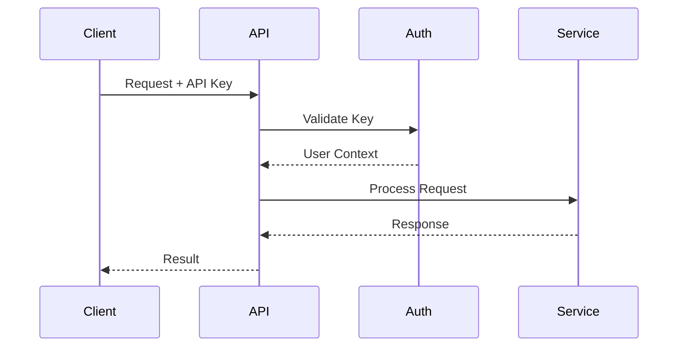
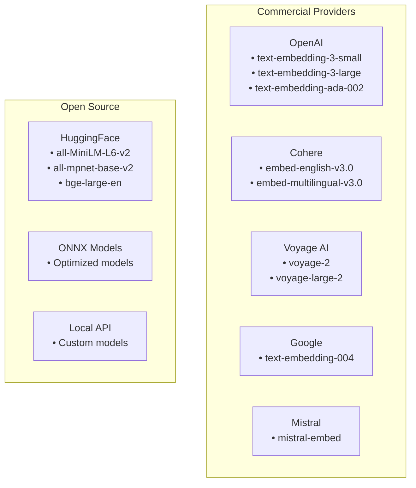

# Embeddings API Consumer Guide

## Table of Contents
1. [Quick Start](#quick-start)
2. [Authentication](#authentication)
3. [API Endpoints](#api-endpoints)
4. [Request/Response Format](#requestresponse-format)
5. [Providers & Models](#providers--models)
6. [Error Handling](#error-handling)
7. [Rate Limits & Quotas](#rate-limits--quotas)
8. [Code Examples](#code-examples)
9. [Best Practices](#best-practices)
10. [SDK Examples](#sdk-examples)

## Quick Start

### Basic Example

```bash
# Create embeddings using cURL
# Auth (choose ONE matching your deployment):
# - Single-user mode: use X-API-KEY header
# - Multi-user mode: use Authorization: Bearer <JWT>

# Single-user
curl -X POST "http://localhost:8000/api/v1/embeddings" \
  -H "Content-Type: application/json" \
  -H "X-API-KEY: $SINGLE_USER_API_KEY" \
  -d '{"input": "Transform this text into embeddings", "model": "text-embedding-3-small"}'

# Multi-user
curl -X POST "http://localhost:8000/api/v1/embeddings" \
  -H "Content-Type: application/json" \
  -H "Authorization: Bearer $JWT" \
  -d '{"input": "Transform this text into embeddings", "model": "text-embedding-3-small"}'
```

### Python Quick Start

```python
import requests

# Configuration
API_URL = "http://localhost:8000/api/v1/embeddings"
API_KEY = "your_api_key_or_jwt"

# Create embeddings
response = requests.post(
    API_URL,
headers={
        # For single-user mode:
        # "X-API-KEY": API_KEY,
        # For multi-user mode:
        # "Authorization": f"Bearer {API_KEY}",
        "Content-Type": "application/json"
    },
    json={
        "input": "Transform this text into embeddings",
        "model": "text-embedding-3-small"
    }
)

embeddings = response.json()["data"][0]["embedding"]
print(f"Embedding dimensions: {len(embeddings)}")
```

### JavaScript Quick Start

```javascript
// Create embeddings
const response = await fetch('http://localhost:8000/api/v1/embeddings', {
    method: 'POST',
headers: {
        // For single-user mode: 'X-API-KEY': YOUR_API_KEY
        // For multi-user mode:  'Authorization': 'Bearer YOUR_JWT'
        'Content-Type': 'application/json'
    },
    body: JSON.stringify({
        input: 'Transform this text into embeddings',
        model: 'text-embedding-3-small'
    })
});

const data = await response.json();
const embedding = data.data[0].embedding;
console.log(`Embedding dimensions: ${embedding.length}`);
```

## Authentication

### Auth Modes



#### Single-User Mode
Use the `X-API-KEY` header on every request. The `Authorization` header alone is not sufficient in this mode.

#### Multi-User Mode (JWT)
```python
from jose import jwt
from datetime import datetime, timedelta

# Generate JWT token
def generate_token(user_id: str, secret_key: str):
    payload = {
        "sub": user_id,
        "exp": datetime.utcnow() + timedelta(hours=24),
        "iat": datetime.utcnow()
    }
    return jwt.encode(payload, secret_key, algorithm="HS256")

# Use token
token = generate_token("user123", "secret")
headers = {
    "Authorization": f"Bearer {token}",
    # Optionally include X-API-KEY if your deployment requires it
}
```

## API Endpoints

### Synchronous Embeddings API

#### Create Embeddings
```http
POST /api/v1/embeddings
```

Create embedding vectors for input text.

**Request Body:**
```json
{
    "input": "string or array of strings",
    "model": "text-embedding-3-small",
    "encoding_format": "float",  // optional: "float" or "base64"
    "dimensions": 1536,  // optional; OpenAI supports natively; server can apply post-process policy across providers
    "user": "user-123"  // optional: for tracking
}
```

**Response:**
```json
{
    "object": "list",
    "data": [
        {
            "object": "embedding",
            "index": 0,
            "embedding": [0.1, 0.2, ...]
        }
    ],
    "model": "text-embedding-3-small",
    "usage": {
        "prompt_tokens": 8,
        "total_tokens": 8
    }
}
```

#### Batch Embeddings
```http
POST /api/v1/embeddings/batch
```

Create embeddings for a batch of texts (strings only; for token arrays use the standard endpoint).

**Request Body:**
```json
{
  "texts": ["First request text", "Second"],
  "model": "text-embedding-3-small",
  "provider": "openai",
  "dimensions": 512
}
```

**Response:**
```json
{
  "embeddings": [[0.1, 0.2, ...], [0.05, -0.12, ...]],
  "model": "text-embedding-3-small",
  "provider": "openai",
  "count": 2
}
```

#### List Available Models
```http
GET /api/v1/embeddings/models
```

List known models (from static table + defaults) with allowlist and default flags. Some providers listed may be planned but not fully wired in the engine yet.

**Response:**
```json
{
  "data": [
    { "provider": "openai", "model": "text-embedding-3-small", "allowed": true, "default": true },
    { "provider": "openai", "model": "text-embedding-3-large", "allowed": true, "default": false },
    { "provider": "huggingface", "model": "sentence-transformers/all-MiniLM-L6-v2", "allowed": true, "default": false }
  ],
  "allowed_providers": null,
  "allowed_models": null
}
```

#### Health Check
```http
GET /api/v1/embeddings/health
```

Check service health status.

**Response:**
```json
{
  "status": "healthy",
  "service": "embeddings_v5_production_enhanced",
  "timestamp": "2024-01-01T12:00:00Z",
  "cache_stats": { "size": 150, "max_size": 5000, "ttl_seconds": 3600 },
  "active_requests": 2,
  "circuit_breakers": { "openai": { "state": "closed", "failure_count": 0 } }
}
```
Note: When the embeddings implementation is unavailable (e.g., optional dependencies not installed), this endpoint responds with HTTP 503 and `status: "degraded"`.

### Admin & Management (admin-only in multi-user; single-user acts as admin)

- `GET /api/v1/embeddings/providers-config` - List configured providers/models
- `GET /api/v1/embeddings/models` - List available models
- `GET /api/v1/embeddings/models/{model_id}` - Model metadata
- `POST /api/v1/embeddings/models/warmup` - Preload a model
- `POST /api/v1/embeddings/models/download` - Prepare/download a model
- `GET /api/v1/embeddings/circuit-breakers` - Check provider breaker states
- `POST /api/v1/embeddings/circuit-breakers/{provider}/reset` - Reset a breaker
- `GET /api/v1/embeddings/metrics` - Embeddings metrics summary

### Media Embeddings API (Chunk and store document vectors)

Use the media-specific endpoints to generate and persist embeddings for an ingested media item’s text content.

#### Start Embedding for a Media Item
```http
POST /api/v1/media/{media_id}/embeddings
```

Body (optional overrides):
```json
{ "embedding_model": "sentence-transformers/all-MiniLM-L6-v2", "embedding_provider": "huggingface", "chunk_size": 1000, "chunk_overlap": 200 }
```

Response:
```json
{ "media_id": 123, "status": "accepted", "message": "Embedding generation started", "job_id": "mej_..." }
```

#### Check Media Embeddings Status
```http
GET /api/v1/media/{media_id}/embeddings/status
```

#### Media Embedding Jobs
```http
GET /api/v1/media/embeddings/jobs/{job_id}
GET /api/v1/media/embeddings/jobs?status=completed&limit=50&offset=0
```

## Request/Response Format

### Input Formats

#### Single Text Input
```json
{
    "input": "This is a single text to embed",
    "model": "text-embedding-3-small"
}
```

#### Multiple Text Inputs
```json
{
    "input": [
        "First text to embed",
        "Second text to embed",
        "Third text to embed"
    ],
    "model": "text-embedding-3-small"
}
```

Notes:
- Maximum 2048 items in the input array.
- The input list cannot be empty.

Token-array inputs are supported on the standard create endpoint. If `input` is a token array (`List[int]`) or a batch of token arrays (`List[List[int]]`), the server decodes tokens to text using the model’s tokenizer when available, or a sensible default (`cl100k_base`) as a fallback. Token usage is counted from the supplied token arrays. The batch endpoint accepts strings only.

### Output Formats

#### Standard Float Format
```json
{
    "data": [{
        "embedding": [0.0123, -0.0456, 0.0789, ...],
        "index": 0
    }]
}
```

Note: For non-OpenAI providers, the response `model` value is prefixed with the provider (e.g., `"huggingface:sentence-transformers/all-MiniLM-L6-v2"`).

#### Base64 Encoded Format
```json
{
    "data": [{
        "embedding": "AAAAfD8AAIA/AAAAgD8=",
        "index": 0
    }]
}
```

### Provider Selection & Fallback

#### Method 1: Header-based
```http
POST /api/v1/embeddings
x-provider: huggingface
```

#### Method 2: Model Prefix
```json
{
    "input": "text",
    "model": "huggingface:sentence-transformers/all-MiniLM-L6-v2"
}
```

#### Method 3: Default Provider
```json
{
    "input": "text",
    "model": "text-embedding-3-small"  // Uses default provider (OpenAI)
}
```

#### Provider Fallback
- If the chosen provider is temporarily unavailable, the service can fall back to others.
- Configure `EMBEDDINGS_FALLBACK_CHAIN` (settings) to control order, or rely on defaults:
  - `openai` → `huggingface` → `onnx` → `local_api`
  - `huggingface` → `onnx` → `local_api`
  - `onnx` → `huggingface` → `local_api`
  - `local_api` → `huggingface`

Prometheus counters:
- `embedding_provider_failures_total{provider,model,reason}`
- `embedding_fallbacks_total{from_provider,to_provider}`

Response headers:
- `X-Embeddings-Provider`: the provider that fulfilled the request
- `X-Embeddings-Fallback-From`: the originally requested provider if fallback was used
- `X-Embeddings-Dimensions-Policy`: dimension policy applied when `dimensions` is set (`reduce`, `pad`, or `ignore`)

## Providers & Models {#providers--models}

### Available Providers



### Model Comparison

| Provider | Model | Dimensions | Speed | Quality | Cost |
|----------|-------|------------|-------|---------|------|
| OpenAI | text-embedding-3-small | 1536 | Fast | High | $$ |
| OpenAI | text-embedding-3-large | 3072 | Medium | Very High | $$$ |
| HuggingFace | all-MiniLM-L6-v2 | 384 | Very Fast | Medium | Free |
| HuggingFace | all-mpnet-base-v2 | 768 | Fast | High | Free |
| Cohere | embed-english-v3.0 | 1024 | Fast | High | $$ |

Note: Some commercial providers shown here may be planned or partially integrated; the OpenAI, HuggingFace, ONNX, and Local API paths are fully supported.
Providers such as Cohere/Voyage/Google/Mistral appear in examples for illustration but may require additional wiring before use.

### Choosing a Provider

```python
def select_provider(requirements):
    """Select best provider based on requirements"""

    if requirements["cost"] == "free":
        return "huggingface", "sentence-transformers/all-MiniLM-L6-v2"

    if requirements["quality"] == "highest":
        return "openai", "text-embedding-3-large"

    if requirements["speed"] == "fastest":
        return "huggingface", "all-MiniLM-L6-v2"

    if requirements["multilingual"]:
        # If a commercial multilingual provider isn't wired, prefer open-source multilingual models
        return "huggingface", "intfloat/multilingual-e5-large"

    # Default balanced option
    return "openai", "text-embedding-3-small"
```

## Rate Limits & Quotas {#rate-limits--quotas}

The embeddings endpoint participates in the global rate limiter configured via AuthNZ. Defaults (typical):
- Enabled: true (`RATE_LIMIT_ENABLED`)
- Requests/minute: 60 (`RATE_LIMIT_PER_MINUTE`)
- Burst: 10 (`RATE_LIMIT_BURST`)

Notes
- In single-user mode, the API key is treated as admin; adjust your reverse proxy limits as needed.
- Per-provider/model throttling can be layered on top of global limits at the proxy or client.

Client handling example (JS):
```js
async function withBackoff(fn, retries = 3) {
  for (let i = 0; i < retries; i++) {
    const res = await fn();
    if (res.status !== 429) return res;
    await new Promise(r => setTimeout(r, Math.pow(2, i) * 1000));
  }
}
```

## Error Handling

### Error Response Format

```json
{
    "detail": "Invalid input: text cannot be empty"
}
```

Note: Some errors use an OpenAI-style envelope, but most validation errors are returned as `{ "detail": "..." }`. When inputs exceed the per-model token limit, the API returns a dedicated top-level error object:

```json
{
  "error": "input_too_long",
  "message": "One or more inputs exceed max tokens 8192 for model text-embedding-3-small",
  "details": [{ "index": 0, "tokens": 9000 }]
}
```

### Common Error Codes

| Status Code | Error Type | Description | Action |
|------------|------------|-------------|--------|
| 400 | Bad Request | Invalid input or parameters | Check request format |
| 401 | Unauthorized | Invalid or missing API key | Verify authentication |
| 403 | Forbidden | Admin required or policy denied (provider/model) | Check admin access or allowed providers/models |
| 429 | Rate Limited | Too many requests | Implement backoff |
| 500 | Server Error | Internal error | Retry with backoff |
| 503 | Service Unavailable | Service temporarily down | Retry later |

### Error Handling Examples

#### Python
```python
import time
from typing import Optional

def create_embeddings_with_retry(
    text: str,
    max_retries: int = 3,
    backoff_factor: float = 2.0
) -> Optional[list]:
    """Create embeddings with exponential backoff retry"""

    for attempt in range(max_retries):
        try:
            response = requests.post(
                API_URL,
                headers={"Authorization": f"Bearer {API_KEY}"},
                json={"input": text, "model": "text-embedding-3-small"}
            )

            if response.status_code == 200:
                return response.json()["data"][0]["embedding"]

            elif response.status_code == 429:
                # Rate limited - wait and retry
                wait_time = backoff_factor ** attempt
                print(f"Rate limited. Waiting {wait_time}s...")
                time.sleep(wait_time)

            elif response.status_code >= 500:
                # Server error - retry
                wait_time = backoff_factor ** attempt
                print(f"Server error. Retrying in {wait_time}s...")
                time.sleep(wait_time)

            else:
                # Client error - don't retry
                print(f"Error: {response.json()}")
                return None

        except requests.exceptions.RequestException as e:
            print(f"Network error: {e}")
            if attempt < max_retries - 1:
                time.sleep(backoff_factor ** attempt)

    return None
```

#### JavaScript
```javascript
async function createEmbeddingsWithRetry(
    text,
    maxRetries = 3,
    backoffFactor = 2
) {
    for (let attempt = 0; attempt < maxRetries; attempt++) {
        try {
            const response = await fetch(API_URL, {
                method: 'POST',
                headers: {
                    'Authorization': `Bearer ${API_KEY}`,
                    'Content-Type': 'application/json'
                },
                body: JSON.stringify({
                    input: text,
                    model: 'text-embedding-3-small'
                })
            });

            if (response.ok) {
                const data = await response.json();
                return data.data[0].embedding;
            }

            if (response.status === 429 || response.status >= 500) {
                // Retry with backoff
                const waitTime = Math.pow(backoffFactor, attempt) * 1000;
                console.log(`Retrying in ${waitTime}ms...`);
                await new Promise(resolve => setTimeout(resolve, waitTime));
            } else {
                // Client error - don't retry
                const error = await response.json();
                throw new Error(error.error.message);
            }

        } catch (error) {
            if (attempt === maxRetries - 1) throw error;

            const waitTime = Math.pow(backoffFactor, attempt) * 1000;
            await new Promise(resolve => setTimeout(resolve, waitTime));
        }
    }
}
```

## Rate Limiting

- Off by default. Enable with environment variable `EMBEDDINGS_RATE_LIMIT=on`.
- When enabled, requests may receive HTTP 429 depending on configured policy.

### Handling 429s (example)

```python
class RateLimitHandler:
    def __init__(self, requests_per_minute=60):
        self.requests_per_minute = requests_per_minute
        self.request_times = []

    def wait_if_needed(self):
        """Wait if rate limit would be exceeded"""
        now = time.time()
        minute_ago = now - 60

        # Remove old requests
        self.request_times = [t for t in self.request_times if t > minute_ago]

        if len(self.request_times) >= self.requests_per_minute:
            # Wait until oldest request is > 1 minute old
            wait_time = 60 - (now - self.request_times[0]) + 0.1
            time.sleep(wait_time)

        self.request_times.append(now)
```

## Code Examples

### Python SDK

```python
class EmbeddingsClient:
    """Python client for Embeddings API"""

    def __init__(self, api_url: str, api_key: str):
        self.api_url = api_url
        self.api_key = api_key
        self.session = requests.Session()
        self.session.headers.update({
            "Authorization": f"Bearer {api_key}",
            "Content-Type": "application/json"
        })

    def create_embedding(
        self,
        text: Union[str, List[str]],
        model: str = "text-embedding-3-small",
        provider: Optional[str] = None
    ) -> List[List[float]]:
        """Create embeddings for text"""

        headers = {}
        if provider:
            headers["x-provider"] = provider

        response = self.session.post(
            f"{self.api_url}/embeddings",
            headers=headers,
            json={
                "input": text,
                "model": model
            }
        )

        response.raise_for_status()
        data = response.json()

        return [item["embedding"] for item in data["data"]]

    # Media embeddings are exposed under /media, not generic /embeddings/jobs

# Usage
client = EmbeddingsClient(
    api_url="http://localhost:8000/api/v1",
    api_key="your_api_key"
)

# Single embedding
embedding = client.create_embedding("Hello world")

# Batch embeddings
embeddings = client.create_embedding([
    "First text",
    "Second text",
    "Third text"
])

# For media/document chunk embeddings, use the /api/v1/media endpoints
```

### JavaScript/TypeScript SDK

```typescript
interface EmbeddingResponse {
    data: Array<{
        embedding: number[];
        index: number;
    }>;
    model: string;
    usage: {
        prompt_tokens: number;
        total_tokens: number;
    };
}

class EmbeddingsClient {
    private apiUrl: string;
    private apiKey: string;

    constructor(apiUrl: string, apiKey: string) {
        this.apiUrl = apiUrl;
        this.apiKey = apiKey;
    }

    async createEmbedding(
        input: string | string[],
        model: string = 'text-embedding-3-small',
        provider?: string
    ): Promise<number[][]> {
        const headers: HeadersInit = {
            'Authorization': `Bearer ${this.apiKey}`,
            'Content-Type': 'application/json'
        };

        if (provider) {
            headers['x-provider'] = provider;
        }

        const response = await fetch(`${this.apiUrl}/embeddings`, {
            method: 'POST',
            headers,
            body: JSON.stringify({ input, model })
        });

        if (!response.ok) {
            throw new Error(`API error: ${response.statusText}`);
        }

        const data: EmbeddingResponse = await response.json();
        return data.data.map(item => item.embedding);
    }

    async *streamBatchEmbeddings(
        texts: string[],
        batchSize: number = 10
    ): AsyncGenerator<number[][]> {
        for (let i = 0; i < texts.length; i += batchSize) {
            const batch = texts.slice(i, i + batchSize);
            const embeddings = await this.createEmbedding(batch);
            yield embeddings;
        }
    }
}

// Usage
const client = new EmbeddingsClient(
    'http://localhost:8000/api/v1',
    'your_api_key'
);

// Single embedding
const embedding = await client.createEmbedding('Hello world');

// Batch with streaming
const texts = Array(100).fill('text');
for await (const batch of client.streamBatchEmbeddings(texts)) {
    console.log(`Processed ${batch.length} embeddings`);
}
```

### cURL Examples

```bash
# Basic embedding
curl -X POST "http://localhost:8000/api/v1/embeddings" \
  -H "Content-Type: application/json" \
  -H "Authorization: Bearer $JWT_OR_API_KEY" \
  -H "X-API-KEY: $API_KEY_IF_SINGLE_USER" \
  -d '{
    "input": "Hello world",
    "model": "text-embedding-3-small"
  }'

# With specific provider
curl -X POST "http://localhost:8000/api/v1/embeddings" \
  -H "Content-Type: application/json" \
  -H "Authorization: Bearer $JWT_OR_API_KEY" \
  -H "X-API-KEY: $API_KEY_IF_SINGLE_USER" \
  -H "x-provider: huggingface" \
  -d '{
    "input": "Hello world",
    "model": "sentence-transformers/all-MiniLM-L6-v2"
  }'

# Batch processing (strings only)
curl -X POST "http://localhost:8000/api/v1/embeddings/batch" \
  -H "Content-Type: application/json" \
  -H "Authorization: Bearer $JWT_OR_API_KEY" \
  -H "X-API-KEY: $API_KEY_IF_SINGLE_USER" \
  -d '{
    "texts": ["Text 1", "Text 2", "Text 3"],
    "model": "text-embedding-3-small"
  }'

# With dimensions (OpenAI supports natively; server applies policy across providers)
curl -X POST "http://localhost:8000/api/v1/embeddings" \
  -H "Content-Type: application/json" \
  -H "Authorization: Bearer $JWT_OR_API_KEY" \
  -H "X-API-KEY: $API_KEY_IF_SINGLE_USER" \
  -d '{
    "input": "Hello world",
    "model": "text-embedding-3-large",
    "dimensions": 1024
  }'

# Base64 encoding
curl -X POST "http://localhost:8000/api/v1/embeddings" \
  -H "Content-Type: application/json" \
  -H "Authorization: Bearer $JWT_OR_API_KEY" \
  -H "X-API-KEY: $API_KEY_IF_SINGLE_USER" \
  -d '{
    "input": "Hello world",
    "model": "text-embedding-3-small",
    "encoding_format": "base64"
  }'
```

## Best Practices

### 1. Batch Processing

```python
def process_large_dataset(texts: List[str], batch_size: int = 100):
    """Process large dataset efficiently"""

    all_embeddings = []

    for i in range(0, len(texts), batch_size):
        batch = texts[i:i + batch_size]

        # Process batch
        embeddings = client.create_embedding(batch)
        all_embeddings.extend(embeddings)

        # Progress tracking
        progress = (i + len(batch)) / len(texts) * 100
        print(f"Progress: {progress:.1f}%")

    return all_embeddings
```

### 2. Caching Strategy

```python
import hashlib
import json
from functools import lru_cache

class EmbeddingCache:
    def __init__(self, cache_dir: str = ".embedding_cache"):
        self.cache_dir = Path(cache_dir)
        self.cache_dir.mkdir(exist_ok=True)

    def _get_cache_key(self, text: str, model: str) -> str:
        """Generate cache key for text and model"""
        content = f"{text}:{model}"
        return hashlib.sha256(content.encode()).hexdigest()

    def get(self, text: str, model: str) -> Optional[List[float]]:
        """Get cached embedding"""
        key = self._get_cache_key(text, model)
        cache_file = self.cache_dir / f"{key}.json"

        if cache_file.exists():
            with open(cache_file, 'r') as f:
                return json.load(f)
        return None

    def set(self, text: str, model: str, embedding: List[float]):
        """Cache embedding"""
        key = self._get_cache_key(text, model)
        cache_file = self.cache_dir / f"{key}.json"

        with open(cache_file, 'w') as f:
            json.dump(embedding, f)

# Use with client
cache = EmbeddingCache()

def get_embedding_cached(text: str, model: str) -> List[float]:
    # Check cache
    embedding = cache.get(text, model)
    if embedding:
        return embedding

    # Create and cache
    embedding = client.create_embedding(text, model)[0]
    cache.set(text, model, embedding)
    return embedding
```

### 3. Parallel Processing

```python
import asyncio
import aiohttp

async def create_embedding_async(
    session: aiohttp.ClientSession,
    text: str
) -> List[float]:
    """Async embedding creation"""

    async with session.post(
        f"{API_URL}/embeddings",
        json={"input": text, "model": "text-embedding-3-small"}
    ) as response:
        data = await response.json()
        return data["data"][0]["embedding"]

async def process_parallel(texts: List[str], max_concurrent: int = 10):
    """Process embeddings in parallel"""

    headers = {"Authorization": f"Bearer {API_KEY}"}

    async with aiohttp.ClientSession(headers=headers) as session:
        semaphore = asyncio.Semaphore(max_concurrent)

        async def bounded_create(text):
            async with semaphore:
                return await create_embedding_async(session, text)

        tasks = [bounded_create(text) for text in texts]
        return await asyncio.gather(*tasks)

# Use
embeddings = asyncio.run(process_parallel(texts, max_concurrent=10))
```

### 4. Cost Optimization

```python
def optimize_for_cost(texts: List[str]):
    """Choose most cost-effective approach"""

    total_chars = sum(len(text) for text in texts)

    # Estimate tokens (rough approximation)
    estimated_tokens = total_chars / 4

    # Cost per 1K tokens (example rates)
    costs = {
        "text-embedding-3-small": 0.00002,
        "text-embedding-3-large": 0.00013,
        "huggingface": 0  # Free
    }

    # Choose based on requirements
    if estimated_tokens < 10000:
        # Small batch - use best quality
        return "text-embedding-3-large"
    elif estimated_tokens < 100000:
        # Medium batch - balance quality/cost
        return "text-embedding-3-small"
    else:
        # Large batch - minimize cost
        return "huggingface"
```

### 5. Monitoring Usage

```python
class UsageTracker:
    def __init__(self):
        self.requests = []
        self.tokens = 0
        self.errors = []

    def track_request(self, response: dict):
        """Track API usage"""
        self.requests.append({
            "timestamp": datetime.now(),
            "model": response.get("model"),
            "tokens": response.get("usage", {}).get("total_tokens", 0)
        })
        self.tokens += response.get("usage", {}).get("total_tokens", 0)

    def track_error(self, error: str):
        """Track errors"""
        self.errors.append({
            "timestamp": datetime.now(),
            "error": error
        })

    def get_stats(self) -> dict:
        """Get usage statistics"""
        return {
            "total_requests": len(self.requests),
            "total_tokens": self.tokens,
            "total_errors": len(self.errors),
            "success_rate": len(self.requests) / (len(self.requests) + len(self.errors))
        }

# Use with client
tracker = UsageTracker()

try:
    response = client.create_embedding("text")
    tracker.track_request(response)
except Exception as e:
    tracker.track_error(str(e))

print(tracker.get_stats())
```

## SDK Examples

### OpenAI SDK Compatibility

```python
# This API is OpenAI-compatible
from openai import OpenAI

client = OpenAI(
    api_key="your_api_key",
    base_url="http://localhost:8000/api/v1"
)

# Create embedding
response = client.embeddings.create(
    input="Your text here",
    model="text-embedding-3-small"
)

embedding = response.data[0].embedding
```

### LangChain Integration

```python
import requests
from langchain.embeddings.base import Embeddings
from typing import List

class TLDWEmbeddings(Embeddings):
    """Custom LangChain embeddings using TLDW API"""

    def __init__(self, api_url: str, api_key: str, model: str = "text-embedding-3-small"):
        self.api_url = api_url
        self.api_key = api_key
        self.model = model

    def embed_documents(self, texts: List[str]) -> List[List[float]]:
        """Embed documents"""
        response = requests.post(
            f"{self.api_url}/embeddings",
            headers={"Authorization": f"Bearer {self.api_key}"},
            json={"input": texts, "model": self.model}
        )
        data = response.json()
        return [item["embedding"] for item in data["data"]]

    def embed_query(self, text: str) -> List[float]:
        """Embed query text"""
        return self.embed_documents([text])[0]

# Use with LangChain
embeddings = TLDWEmbeddings(
    api_url="http://localhost:8000/api/v1",
    api_key="your_api_key"
)

# With vector store
from langchain.vectorstores import Chroma

vectorstore = Chroma.from_documents(
    documents=documents,
    embedding=embeddings
)
```

### LlamaIndex Integration

```python
from llama_index.embeddings.base import BaseEmbedding
from typing import List

class TLDWEmbedding(BaseEmbedding):
    """LlamaIndex embedding using TLDW API"""

    def __init__(self, api_url: str, api_key: str, model: str = "text-embedding-3-small"):
        super().__init__()
        self.api_url = api_url
        self.api_key = api_key
        self.model = model

    def _get_embedding(self, text: str) -> List[float]:
        """Get embedding for text"""
        response = requests.post(
            f"{self.api_url}/embeddings",
            headers={"Authorization": f"Bearer {self.api_key}"},
            json={"input": text, "model": self.model}
        )
        return response.json()["data"][0]["embedding"]

    def _get_text_embedding(self, text: str) -> List[float]:
        """Required by LlamaIndex"""
        return self._get_embedding(text)

    def _get_query_embedding(self, query: str) -> List[float]:
        """Required by LlamaIndex"""
        return self._get_embedding(query)

# Use with LlamaIndex
from llama_index import VectorStoreIndex, SimpleDirectoryReader

embedding = TLDWEmbedding(
    api_url="http://localhost:8000/api/v1",
    api_key="your_api_key"
)

documents = SimpleDirectoryReader("data").load_data()
index = VectorStoreIndex.from_documents(
    documents,
    embed_model=embedding
)
```

## Troubleshooting

### Common Issues

#### 1. Empty Embeddings
```python
# Problem: Getting empty or zero embeddings
# Solution: Check input text is not empty
if not text or not text.strip():
    raise ValueError("Input text cannot be empty")
```

#### 2. Dimension Mismatch
```python
# Problem: Embeddings have unexpected dimensions
# Solution: Verify model and dimensions parameter
assert len(embedding) == expected_dimensions, \
    f"Expected {expected_dimensions} dimensions, got {len(embedding)}"
```

#### 3. Rate Limiting
```python
# Problem: Getting 429 errors
# Solution: Implement exponential backoff
time.sleep(min(2 ** attempt, 60))
```

#### 4. Connection Errors
```python
# Problem: Connection refused
# Solution: Check service is running
try:
    response = requests.get(f"{API_URL}/health")
    assert response.status_code == 200
except:
    print("Service is not available")
```

---

For more information:
- [Developer Notes](../Code_Documentation/Embeddings-Documentation.md)
- API Reference (local): http://127.0.0.1:8000/docs
> Note (Auth): In single-user mode you must use `X-API-KEY: <API_KEY>`. Including `Authorization: Bearer <...>` is optional, but the `X-API-KEY` header is required. In multi-user mode, use `Authorization: Bearer <JWT>`.

Alt cURL (single-user X-API-KEY):
```bash
curl -X POST "http://localhost:8000/api/v1/embeddings" \
  -H "X-API-KEY: YOUR_API_KEY" \
  -H "Content-Type: application/json" \
  -d '{"input": "Transform this text into embeddings", "model": "text-embedding-3-small"}'
```
