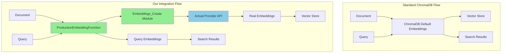
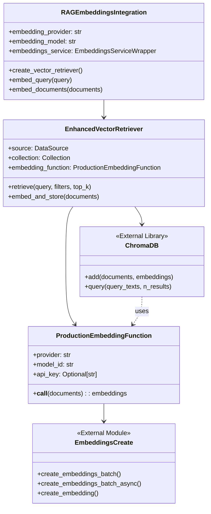
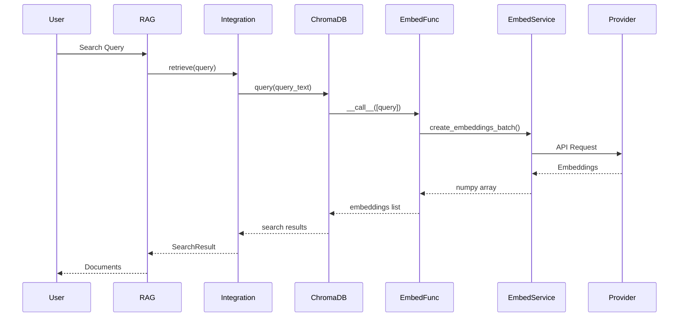

# RAG-Embeddings Integration Guide

## Table of Contents
1. [Overview](#overview)
2. [How It Works](#how-it-works)
3. [Architecture](#architecture)
4. [Implementation Details](#implementation-details)
5. [Usage Guide](#usage-guide)
6. [Configuration](#configuration)
7. [Testing](#testing)
8. [Troubleshooting](#troubleshooting)

## Overview

The RAG-Embeddings Integration ensures that the Retrieval-Augmented Generation (RAG) system uses actual production embeddings throughout the pipeline, with no mocking or placeholder implementations. This integration provides consistency, quality, and reliability for all embedding operations.

### Key Principles
- **No Mocking**: All embeddings are generated using the actual production service
- **Provider Flexibility**: Supports multiple embedding providers (OpenAI, HuggingFace, Cohere, etc.)
- **ChromaDB Integration**: Replaces ChromaDB's default embeddings with our production service
- **Production Ready**: Full error handling, metrics, and monitoring

## How It Works

### 1. The Problem
By default, ChromaDB uses its own embedding functions which may not align with your production embedding service. This can lead to:
- Inconsistent embeddings between indexing and querying
- Different quality levels between development and production
- Inability to use custom or fine-tuned models
- Lack of control over embedding generation

### 2. The Solution
Our integration provides a custom embedding function that ChromaDB uses for all operations:



### 3. Step-by-Step Process

#### Document Indexing
1. **Document Input**: RAG system receives documents to index
2. **ChromaDB Call**: ChromaDB's `add()` method is called with documents
3. **Custom Embedding Function**: ChromaDB calls our `ProductionEmbeddingFunction`
4. **Real Service Call**: Function calls `create_embeddings_batch()` from production service
5. **Provider API**: Production service calls actual provider (OpenAI, HuggingFace, etc.)
6. **Embeddings Return**: Real embeddings are returned to ChromaDB
7. **Storage**: ChromaDB stores documents with real embeddings

#### Query Processing
1. **Query Input**: User submits a search query
2. **ChromaDB Query**: ChromaDB's `query()` method is called
3. **Query Embedding**: Same `ProductionEmbeddingFunction` generates query embedding
4. **Vector Search**: ChromaDB performs similarity search with consistent embeddings
5. **Results**: Relevant documents are retrieved with accurate similarity scores

## Architecture

### Component Hierarchy



### Data Flow



## Implementation Details

### 1. ProductionEmbeddingFunction

This class implements ChromaDB's `EmbeddingFunction` interface but uses our production service:

```python
class ProductionEmbeddingFunction(EmbeddingFunction):
    def __call__(self, input: Documents) -> Embeddings:
        # Called by ChromaDB for any embedding operation
        embeddings = create_embeddings_batch(
            texts=input,
            provider=self.provider,
            model_id=self.model_id,
            api_key=self.api_key
        )
        return embeddings.tolist()
```

**Key Points:**
- Implements ChromaDB's required interface
- Internally uses `create_embeddings_batch()` from production service
- Handles both sync and async operations
- Converts numpy arrays to lists for ChromaDB compatibility

### 2. EnhancedVectorRetriever

Manages vector storage and retrieval with production embeddings:

```python
class EnhancedVectorRetriever:
    def __init__(self, ...):
        # Create embedding function with production service
        self.embedding_function = ProductionEmbeddingFunction(...)

        # Initialize ChromaDB with our embedding function
        self.collection = chroma_client.create_collection(
            name=collection_name,
            embedding_function=self.embedding_function  # Key: Use our function
        )
```

**Key Features:**
- Ensures all ChromaDB operations use production embeddings
- Provides consistent interface for RAG operations
- Tracks embedding provider in metadata
- Handles filters and search parameters

### 3. RAGEmbeddingsIntegration

High-level integration manager:

```python
class RAGEmbeddingsIntegration:
    def __init__(self, ...):
        # Initialize embeddings service wrapper
        self.embeddings_service = EmbeddingsServiceWrapper(...)

    def create_vector_retriever(self, ...):
        # Creates retriever with production embeddings
        return EnhancedVectorRetriever(...)
```

**Responsibilities:**
- Manages embedding service lifecycle
- Creates configured retrievers
- Provides direct embedding generation methods
- Collects and reports metrics

## Usage Guide

### Basic Setup

```python
from tldw_Server_API.app.core.RAG.rag_embeddings_integration import (
    create_rag_embeddings_integration,
    RAGEmbeddingsIntegration
)

# Create integration
integration = create_rag_embeddings_integration(
    provider="openai",
    model="text-embedding-3-small",
    api_key="your-api-key"  # Optional, uses env var if not provided
)
```

### Creating a Vector Retriever

```python
from pathlib import Path
from tldw_Server_API.app.core.RAG.rag_service.types import DataSource

# Create retriever with production embeddings
retriever = integration.create_vector_retriever(
    source=DataSource.MEDIA_DB,
    chroma_path=Path("/path/to/chroma/storage"),
    collection_name="my_documents"
)
```

### Indexing Documents

```python
from tldw_Server_API.app.core.RAG.rag_service.types import Document

# Create documents
documents = [
    Document(
        id="doc1",
        content="Your document content here",
        metadata={"source": "file.pdf", "page": 1},
        source=DataSource.MEDIA_DB,
        score=0.0
    )
]

# Store with production embeddings
await retriever.embed_and_store(documents)
```

### Searching

```python
# Search using production embeddings
results = await retriever.retrieve(
    query="search query",
    filters={"source": "file.pdf"},
    top_k=5
)

for doc in results.documents:
    print(f"Score: {doc.score:.3f}, Content: {doc.content[:100]}...")
```

### Direct Embedding Generation

```python
# Generate query embedding
query_embedding = await integration.embed_query("What is machine learning?")

# Generate document embeddings
doc_embeddings = await integration.embed_documents([
    "Document 1 content",
    "Document 2 content"
])
```

## Configuration

### Environment Variables

```bash
# Embedding provider settings
EMBEDDING_PROVIDER=openai
EMBEDDING_MODEL=text-embedding-3-small

# API Keys (provider-specific)
OPENAI_API_KEY=your-key
ANTHROPIC_API_KEY=your-key
COHERE_API_KEY=your-key

# Custom endpoints
OPENAI_API_BASE=https://your-custom-endpoint.com/v1

# Performance settings
EMBEDDING_BATCH_SIZE=100
EMBEDDING_CACHE_SIZE=1000
EMBEDDING_TIMEOUT=30
```

### Provider Configuration

#### OpenAI
```python
integration = create_rag_embeddings_integration(
    provider="openai",
    model="text-embedding-3-small",  # or text-embedding-3-large
    api_key=os.getenv("OPENAI_API_KEY")
)
```

#### HuggingFace (Local)
```python
integration = create_rag_embeddings_integration(
    provider="huggingface",
    model="sentence-transformers/all-MiniLM-L6-v2"
    # No API key needed for local models
)
```

#### Cohere
```python
integration = create_rag_embeddings_integration(
    provider="cohere",
    model="embed-english-v3.0",
    api_key=os.getenv("COHERE_API_KEY")
)
```

#### Custom OpenAI-Compatible
```python
integration = create_rag_embeddings_integration(
    provider="openai",
    model="custom-model",
    api_url="http://localhost:8080/v1",
    api_key="local-key"
)
```

## Testing

### Unit Testing

```python
def test_embedding_function():
    """Test that embedding function uses real service."""
    func = ProductionEmbeddingFunction(
        provider="huggingface",
        model_id="sentence-transformers/all-MiniLM-L6-v2"
    )

    # Generate embeddings
    embeddings = func(["test document"])

    # Verify real embeddings (not mocked)
    assert len(embeddings) == 1
    assert len(embeddings[0]) == 384  # MiniLM dimension
    assert not all(e == 0 for e in embeddings[0])  # Not zeros
```

### Integration Testing

```python
async def test_end_to_end_flow():
    """Test complete RAG flow with real embeddings."""
    integration = create_rag_embeddings_integration(
        provider="huggingface",
        model="sentence-transformers/all-MiniLM-L6-v2"
    )

    retriever = integration.create_vector_retriever(...)

    # Index documents
    await retriever.embed_and_store(documents)

    # Search
    results = await retriever.retrieve("query")

    # Verify results use real embeddings
    assert results.metadata["embedding_provider"] == "huggingface"
```

### Verification Checklist

- [ ] Embeddings have correct dimensions for the model
- [ ] Different texts produce different embeddings
- [ ] Embeddings are deterministic for same input
- [ ] Search results are semantically relevant
- [ ] No mock/fake embeddings in production logs
- [ ] Metrics show actual API calls to providers

## Troubleshooting

### Common Issues

#### 1. Import Errors
```python
ModuleNotFoundError: No module named 'prometheus_client'
```
**Solution**: Install required dependencies
```bash
pip install prometheus-client
```

#### 2. API Key Issues
```python
RuntimeError: API key not found for provider openai
```
**Solution**: Set API key in environment or pass directly
```bash
export OPENAI_API_KEY=your-key
# or
integration = create_rag_embeddings_integration(api_key="your-key")
```

#### 3. Dimension Mismatch
```python
ValueError: Embedding dimension mismatch: expected 1536, got 384
```
**Solution**: Ensure consistent model throughout pipeline
- Check model name in initialization
- Verify ChromaDB collection uses same model
- Clear and rebuild index if model changed

#### 4. ChromaDB Collection Conflicts
```python
ValueError: Collection already exists with different embedding function
```
**Solution**: Either use existing collection or delete and recreate
```python
# Option 1: Use existing
collection = chroma_client.get_collection(name, embedding_function=func)

# Option 2: Delete and recreate
chroma_client.delete_collection(name)
collection = chroma_client.create_collection(name, embedding_function=func)
```

### Performance Optimization

#### Batch Processing
```python
# Process in batches for better performance
batch_size = 100
for i in range(0, len(documents), batch_size):
    batch = documents[i:i + batch_size]
    await retriever.embed_and_store(batch)
```

#### Connection Pooling
```python
# Reuse integration instance for multiple operations
integration = create_rag_embeddings_integration(...)

# Use same instance for all retrievers
retriever1 = integration.create_vector_retriever(...)
retriever2 = integration.create_vector_retriever(...)
```

#### Caching
```python
# Enable caching in integration
integration = RAGEmbeddingsIntegration(
    cache_embeddings=True  # Cache repeated embeddings
)
```

### Monitoring

#### Check Metrics
```python
metrics = integration.get_metrics()
print(f"Total embeddings created: {metrics['total_texts_processed']}")
print(f"Cache hit rate: {metrics['cache_hit_rate']:.2%}")
print(f"Error rate: {metrics['error_rate']:.2%}")
```

#### Verify Provider Usage
```python
stats = retriever.get_embedding_stats()
print(f"Using provider: {stats['embedding_provider']}")
print(f"Model: {stats['embedding_model']}")
print(f"Documents indexed: {stats['document_count']}")
```

## Best Practices

1. **Consistent Models**: Use the same embedding model for indexing and querying
2. **Error Handling**: Always wrap operations in try-catch blocks
3. **Resource Management**: Use context managers or explicitly close integrations
4. **Batch Operations**: Process documents in batches for efficiency
5. **Monitor Metrics**: Track embedding generation performance and errors
6. **Test Thoroughly**: Verify embeddings are real, not mocked
7. **Document Provider**: Store embedding provider/model in metadata

## Summary

The RAG-Embeddings Integration ensures that:
- All embeddings are generated using production services (no mocking)
- ChromaDB uses our custom embedding function for all operations
- The system supports multiple embedding providers
- Embeddings are consistent between indexing and querying
- Full metrics and monitoring are available
- The integration is production-ready with proper error handling

This architecture provides a robust, reliable, and consistent embedding pipeline for the RAG system.
